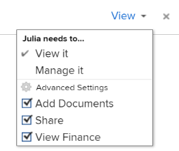

# Sharing a template

As an Adobe Workfront administrator, you can grant users access to view or edit templates when you assign their access level. A user must have a Plan license to have access to Edit templates.

For more information about granting access to templates, see [Grant access to templates](../../administration-and-setup/add-users/configure-and-grant-access/grant-access-templates.md).

Along with the access level that you grant, a user can also receive permissions to View or Manage specific templates from other users who share them .

>[!NOTE]
>
>Permission levels work within Access levels. For example, a user cannot receive permissions to Manage a template, if their access level only allows them to View templates.

Permissions are specific to one item in Workfront and define what actions one can take on that item.

## Considerations when sharing a template

<ul> 
 <li>In addition to the considerations below, also see <a href="../../workfront-basics/grant-and-request-access-to-objects/sharing-permissions-on-objects-overview.md" class="MCXref xref">Overview of sharing permissions on objects in Adobe Workfront</a>.</li> 
 <li>The creator of a template, as well as the Template Owner have Manage permissions to the template, by default. For information about designating a user as the Template Owner, see <a href="../../manage-work/projects/create-and-manage-templates/edit-templates.md" class="MCXref xref">Edit project templates</a>.</li> 
 <li> 
You can share the following when sharing a template:
 
  <ul> 
   <li> 
The template
 
For more information about how to share a template, see <a href="../../manage-work/projects/create-and-manage-templates/share-project-template.md" class="MCXref xref">Share project templates</a>.
 
You can grant the following permissions to a template:
 
    <ul> 
     <li> 
View
 
  
 </li> 
     <li> 
Manage
 
  
 </li> 
    </ul> </li> 
   <li> 
The future projects which are created using the template. You can give the same levels of permissions to projects created from a template as you would an individual project.&nbsp;
 
For information about how to share a project from a template at the template level, see <a href="../../manage-work/projects/create-and-manage-templates/share-project-template.md" class="MCXref xref">Share project templates</a>. 
 </li> 
  </ul> </li> 
 <li> 
When you share a template or a project which is created from the template, users inherit the same permissions to all the children objects associated with the template or the project, by default.
 
For more information about the hierarchy of objects in Workfront, see&nbsp;<a href="../../workfront-basics/navigate-workfront/workfront-navigation/understand-objects.md" class="MCXref xref">Understand objects in Adobe Workfront</a>.
 </li> 
 <li> 
When you share a template, all the template tasks and documents, as well as the issues on the future project created from the template inherit the same permissions, unless otherwise specified.
 
For information about managing the access to template tasks and issues on the project based on a user's permissions to the project, see the <a href="../../manage-work/projects/create-and-manage-templates/edit-templates.md#access" class="MCXref xref">Access</a> section in the article <a href="../../manage-work/projects/create-and-manage-templates/edit-templates.md" class="MCXref xref">Edit project templates</a>.
 </li> 
 
The Workfront administrator can specify whether documents should inherit permissions from higher objects in the user's access level. For more information about restricting inherited permissions on documents, see <a href="../../administration-and-setup/add-users/configure-and-grant-access/create-modify-access-levels.md" class="MCXref xref">Create or modify custom access levels</a>.
 
</ul>

<!--
Share a template Go to the template you want to share with other entities, click Template Actions, then Template Sharing. Or Navigate to a list of templates, and select multiple templates from the list, then click Share Template. Note: If you select multiple templates, you cannot view who already has permissions to the individual templates. Start typing the name of a user, group, team, job role, or company that you want to share the template with in the Give template access to or Edit template access for fields. Select them when they appear in the list. Tip: You can share an object only with active users, teams, roles, or companies. From the drop-down menu, select which level of permissions you want to grant: View it: Users with these permissions are able to view the template and create a project using it, or attach it to an existing project. Manage it: Users with these permissions are able to edit or delete the template. (Optional) Click Advanced Settings to fine-tune your settings for each level of permissions. Click Save. Share a project at the template level You can share the future projects that are created using a template with users at the template level. Go to the template whose future projects you want to share with other entities, click Template Actions, then Project Sharing. Or Navigate to a list of templates, and select multiple templates from the list, then click Share Project. Note: If you select multiple templates, you cannot view who already has project permissions to the individual templates. Start typing and then select the name of a user, group, team, job role, or company with whom you want to share future projects created from the template in the Give project access to or Edit template access for fields. Tip: You can share an object only with active users, teams, roles, or companies. From the drop-down menu, select which level of permissions you want to grant. Select from the following: No access: You can specify which users will not have any access to the template. This option is available only when bulk sharing projects from templates. View: Users with these permissions can view projects created from the template. Contribute: Users with these permissions can contribute to projects created from the template Manage: Users with these permissions can manage or delete projects created from this template. (Optional) Click Advanced Settings to fine-tune your settings for each level of permissions. Click Save.
-->

## Advanced Settings for template sharing

The following table displays what permissions you can grant users when allowing them to View or Manage a template. For the instructions on sharing a template, see the section [Share a template](../../manage-work/projects/create-and-manage-templates/share-project-template.md#share) in the article [Share project templates](../../manage-work/projects/create-and-manage-templates/share-project-template.md).

| Actions |Manage |View |
|---|---|---|
| Copy |✓ |&nbsp; |
| Delete |✓ |&nbsp; |
| Edit Template Details |✓ |&nbsp; |
| View Template |✓ |✓ |
| Share |✓ |✓ |
| Share System-wide |&nbsp; |✓ |

To understand the permissions you are granting users to projects that are created from a template, see [Share a project in Adobe Workfront](../../workfront-basics/grant-and-request-access-to-objects/share-a-project.md).
