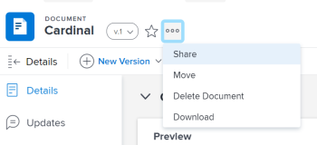
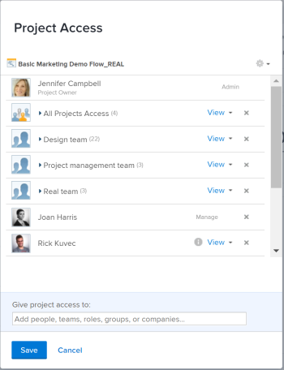
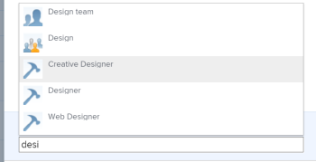
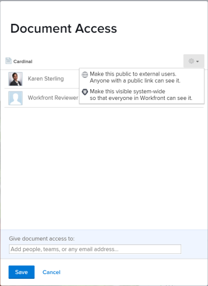
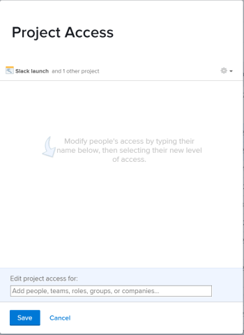

# Share an object in *Adobe Workfront*

Your *Adobe Workfront administrator* grants users access to view or edit objects when they assign access levels. For more information about granting access to objects, see [Create or modify custom access levels](../../administration-and-setup/add-users/configure-and-grant-access/create-modify-access-levels.md).

Along with the access level that users are granted, you can also grant them permissions to view or edit specific objects that you created or have access to share. For more information about access levels and permissions, see [How access levels and permissions work together](../../administration-and-setup/add-users/access-levels-and-object-permissions/how-access-levels-permissions-work-together.md).

Permissions are specific to one item in *Workfront* and define what actions one can take on that item.

For information about sharing permissions on objects, see [Overview of sharing permissions on objects in Adobe Workfront](../../workfront-basics/grant-and-request-access-to-objects/sharing-permissions-on-objects-overview.md).

>[!NOTE]
>
>A *Workfront administrator* can add or remove permissions to any items in the system, for all users, without being the owner of those items.

This article describes how to share the following objects for which sharing is identical:&nbsp;

* Projects, tasks, issues
* Portfolios, programs
* Documents

For information about how to share all other objects in *Workfront*, also see the following articles:

* For templates, see [Share project templates](../../manage-work/projects/create-and-manage-templates/share-project-template.md).
* For proofs, see [Share a Proof in Workfront Proof](../../workfront-proof/wp-work-proofsfiles/share-proofs-and-files/share-proof.md).
* For reports, dashboards, and calendars, see the following articles:

  * [Share a report in Adobe Workfront](../../reports-and-dashboards/reports/creating-and-managing-reports/share-report.md)
  * [Share a dashboard in Adobe Workfront](../../reports-and-dashboards/dashboards/creating-and-managing-dashboards/share-dashboard.md)
  * [Share a calendar report](../../reports-and-dashboards/reports/calendars/share-a-calendar-report.md)

  Additionally, see [Share reports, dashboards, and calendars in Adobe Workfront](../../workfront-basics/grant-and-request-access-to-objects/permissions-reports-dashboards-calendars.md) for general information about sharing reports, dashboards, and calendars.&nbsp;

* For filters, views, and groupings, see [Share a filter, view, or grouping in Adobe Workfront](../../reports-and-dashboards/reports/reporting-elements/share-filter-view-grouping.md).

  <!--
  <li data-mc-conditions="QuicksilverOrClassic.Quicksilver"> 
For plans, see <a href="../../scenario-planner/share-a-plan.md" class="MCXref xref">Share a plan in the Adobe Workfront Scenario Planner</a>. 
 
This requires an additional license.  
 </li>
  -->

* `For plans, see [Share a plan in the Adobe Workfront Scenario Planner](../../scenario-planner/share-a-plan.md).`

  `This requires an additional license.` 

* 

  <!--
  
 For goals, see <a href="../../workfront-goals/workfront-goals-settings/share-a-goal.md" class="MCXref xref">Share a goal in Adobe Workfront Goals</a>. This requires an additional license. 

  -->

  For goals, see [Share a goal in Adobe Workfront Goals](../../workfront-goals/workfront-goals-settings/share-a-goal.md). This requires an additional license.

## Access requirements

You must have the following to share objects:

<table cellspacing="0"> 
 <col> 
 <col> 
 <tbody> 
  <tr> 
   <td role="rowheader"><em>Adobe Workfront</em> plan*</td> 
   <td> 
Any 
 </td> 
  </tr> 
  <tr> 
   <td role="rowheader"><em>Adobe Workfront</em> license*</td> 
   <td> 
<em>Work</em> or higher
 </td> 
  </tr> 
  <tr> 
   <td role="rowheader">Access level configurations*</td> 
   <td> 
View access or higher to the objects you want to share
 
Note: If you still don't have access, ask your <em>Workfront administrator</em> if they set additional restrictions in your access level. For information on how a <em>Workfront administrator</em> can modify your access level, see <a href="../../administration-and-setup/add-users/configure-and-grant-access/create-modify-access-levels.md" class="MCXref xref">Create or modify custom access levels</a>.
 </td> 
  </tr> 
  <tr> 
   <td role="rowheader">Object permissions</td> 
   <td> 
View permissions or higher to the objects you want to share
 
For information on requesting additional access, see <a href="../../workfront-basics/grant-and-request-access-to-objects/request-access.md" class="MCXref xref">Request access to objects in Adobe Workfront</a>.
 </td> 
  </tr> 
 </tbody> 
</table>

&#42;To find out what plan, license type, or access you have, contact your *Workfront administrator*.

## Share a single object

<ol> 
 <li value="1">Go to the object you want to share. 
For information about which objects can be shared, see <a href="../../workfront-basics/grant-and-request-access-to-objects/sharing-permissions-on-objects-overview.md" class="MCXref xref">Overview of sharing permissions on objects in Adobe Workfront</a>.
</li> <draft-comment>
  <li value="2" data-mc-conditions="QuicksilverOrClassic.Quicksilver"> 
Click the More iconnext to the object name, then click&nbsp;Sharing or Share.
 
  
 </li>
 </draft-comment>
 <li value="2" data-mc-conditions="QuicksilverOrClassic.Quicksilver"> 
Click the More iconnext to the object name, then click&nbsp;Sharing or Share.
 
  
 </li> 
 <li value="3"> 
In the Give <Object Name> access to field, begin typing the name of the user, team, role, group, or company with whom you want to share the object, then click the name when it appears in the drop-down list.
 
For example, if you are sharing a project, use the Give project access to field.
 <note type="tip">
   You can share an object only with active users, teams, 
   roles, or companies.
  </note> 
 <draft-comment>
    
   </draft-comment> 
 
 
   
Tip: </b>">
    <b>Tip: </b> 
    
If you have multiple entities named similarly, they are all listed under their type. The names of the entities appear in alphabetical order. However, the order in which the entity types appear is random.
 
    
  
 
   
 
 </li> 
 <li value="4"> 
(Optional) Repeat step 3 for each user, team, role, or group to whom you want to grant access to the object.
 </li> 
 <li value="5">Specify the permissions for each user, team, role,&nbsp;group, or company that you added in Step 3 by clicking&nbsp;the drop-down menu, then selecting the permission level that you want to grant.
The following options are available:

  <ul>
   <li>
View:&nbsp;Users can&nbsp;review and share&nbsp;the item.&nbsp;
</li>
   <li>
Contribute:&nbsp;Users can&nbsp;make&nbsp;updates, log&nbsp;information, make minor edits, and share, plus all View permissions. 

    
Tip: </b>">
     <b>Tip: </b>
     
You can grant Contribute permissions only to the following objects:&nbsp;

     <ul>
      <li>Projects</li>
      <li>Tasks</li>
      <li>Issues</li>
     </ul>
    
</li>
   <li>
Manage:&nbsp;Users&nbsp;have full access to the object without administrative&nbsp;rights, which are granted at the access level, plus all View and Contribute permissions. <note type="note">
      &nbsp;The 
      <em>Workfront administrator</em> or the object creator has the ability to remove permissions from these entities.
     </note>

&nbsp;

</li>
  </ul></li> 
 <li value="6">(Optional) Click Advanced Options&nbsp;to configure specific permissions&nbsp;on the object.
View, Manage and Contribute have different advanced options depending on the selected object. For more information about the permissions levels, see <a href="../../workfront-basics/grant-and-request-access-to-objects/sharing-permissions-on-objects-overview.md" class="MCXref xref">Overview of sharing permissions on objects in Adobe Workfront</a>. 

</li> 
 <li value="7">(Optional)&nbsp;To make this object available to all users in the system, click the Gear icon , then in the drop-down menu click Make this visible system-wide.
All users can&nbsp;see the object based on the permissions that you set.
</li> 
 <li value="8">(Optional and conditional) When sharing a project, click the Gear icon , then in the drop-down menu click Set as my project access template&nbsp;to set the permissions as a template. After you have defined permissions on one project, these same permissions are automatically applied the next time you create a project from scratch. <note type="note">
    The project access template overrides the sharing defaults granted to you by the 
   <em>Workfront administrator</em> in your Access Level. 
    For more information about specifying sharing defaults for projects in the Access Level, see 
   <a href="../../administration-and-setup/add-users/configure-and-grant-access/grant-access-projects.md" class="MCXref xref">Grant access to projects</a>&nbsp;
  </note>You can specify permissions on the projects that will be created from a template when you share the template.&nbsp;For more information, see <a href="../../manage-work/projects/create-and-manage-templates/share-project-template.md" class="MCXref xref">Share project templates</a>.</li> 
 <li value="9"> 
(Optional) To make the object public, click Make this public to external users.
 <note type="tip">
   This option is not available for all objects. 
  </note> 
 <draft-comment>
    
   </draft-comment> 
 </li> 
 <li value="10"> 
(Conditional) If you made the object public to external users, click copy link,&nbsp;then distribute the link to external users. Any users with the link are able to view the object.
 
Warning: </b>"><b>Warning: </b>We recommend that you use caution when sharing an object containing confidential information with external users. This allows them to view information without being a <em>Workfront</em> user or part of your organization. 
 </li> 
 <li value="11">Click Save.</li> 
</ol>

## Share objects in bulk

From a list of objects, you can share multiple objects at one time with other users, teams, groups, job roles, or companies.

>[!IMPORTANT]
>
>When you share objects in bulk, the names of the entities that have permissions to the individual objects do not display. When sharing objects in bulk, the entities you add to the sharing list are added to the selected objects. They do not override the entities associated with the individual objects.&nbsp;

To share objects in bulk:

<ol> 
 <li value="1">Navigate to a list of objects.</li> 
 <li value="2">Select&nbsp;two or more objects in the list.</li> 
 <li value="3"> <draft-comment>
   <MadCap:conditionalText data-mc-conditions="QuicksilverOrClassic.Quicksilver">
    Click the 
    Share icon 
    . 
   </MadCap:conditionalText>
  </draft-comment><MadCap:conditionalText data-mc-conditions="QuicksilverOrClassic.Quicksilver">
   Click the 
   Share icon 
   . 
  </MadCap:conditionalText> Users who already have access to the object&nbsp;are not listed as available when bulk sharing. <note type="note">
    If you do not have permissions to share an object that you selected, the 
   Share button is not visible.
  </note></li> 
 <li value="4"> 
In the Edit <Object Name> access for field, start typing the name of a user, team, group, job role, or company to which you want to grant permissions.
 
For example, if you are sharing a project, use the Give project access for&nbsp;field.
 
 <draft-comment>
    
   </draft-comment>   
 </li> 
 <li value="5">Continue sharing the selected objects as described in steps 4-9 in the section <a href="#share" class="MCXref xref">Share a single object</a> in this article. </li> 
 <li value="6">Click Save.</li> 
</ol>

