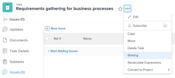
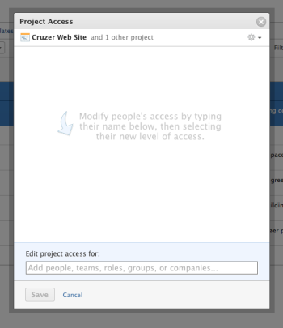

# Overview of sharing permissions on objects in *Adobe Workfront*

The highlighted information on this page refers to functionality available only in the new Workfront experience beta.

You do not have to be an *Adobe Workfront administrator* to share permissions on objects that you have access to, but permissions on objects work within the access levels set by the *Workfront administrator*.

For more information about access levels and permissions, see [How access levels and permissions work together](../../administration-and-setup/add-users/access-levels-and-object-permissions/how-access-levels-permissions-work-together.md).

You can share or remove permissions to an object you created or an object that was shared with you. When you are not the creator of the object, you must have Share access on the object that you want to share in your access level in addition to Share permissions on the object. For information about access levels, see [Access levels overview](../../administration-and-setup/add-users/access-levels-and-object-permissions/access-levels-overview.md).

>[!NOTE]
>
>A *Workfront administrator* can add or remove permissions to any items in the system, for all users, without being the owner of those items.

## Objects that you can share in *Workfront*

You can share the following objects in&nbsp;*Workfront* with other users:

* `Projects`: For more information, see [Share a project in Adobe Workfront](../../workfront-basics/grant-and-request-access-to-objects/share-a-project.md).

* `Templates`: For more information, see [Share project templates](../../manage-work/projects/create-and-manage-templates/share-project-template.md).

* `Portfolios`: For more information, see [Share a portfolio in Adobe Workfront](../../workfront-basics/grant-and-request-access-to-objects/share-a-portfolio..md).

* `Programs`: For information, see [Share a program in Adobe Workfront](../../workfront-basics/grant-and-request-access-to-objects/share-a-program.md) .

* `Tasks`: For information, see [Share a task in Adobe Workfront](../../workfront-basics/grant-and-request-access-to-objects/share-a-task.md).

* `Issues`: For information, see [Share an issue in Adobe Workfront](../../workfront-basics/grant-and-request-access-to-objects/share-an-issue.md).

* `Documents`: For information, see [Share a document in Adobe Workfront](../../workfront-basics/grant-and-request-access-to-objects/document-permissions.md).

* **Document Folders**: For information, see [Share a document folder](../../workfront-basics/grant-and-request-access-to-objects/share-a-document-folder.md).

* **Proofs**: For information, see [Share a Proof in Workfront Proof](../../workfront-proof/wp-work-proofsfiles/share-proofs-and-files/share-proof.md). 

* `Reports, dashboards, and calendars`: For information, see [Share reports, dashboards, and calendars in Adobe Workfront](../../workfront-basics/grant-and-request-access-to-objects/permissions-reports-dashboards-calendars.md).&nbsp;Additionally, see the following articles:

  * [Share a report in Adobe Workfront](../../reports-and-dashboards/reports/creating-and-managing-reports/share-report.md)
  * [Share a dashboard in Adobe Workfront](../../reports-and-dashboards/dashboards/creating-and-managing-dashboards/share-dashboard.md)
  * [Share a calendar report](../../reports-and-dashboards/reports/calendars/share-a-calendar-report.md)

* **Filters, views, and groupings**: For information, see [Share a filter, view, or grouping in Adobe Workfront](../../reports-and-dashboards/reports/reporting-elements/share-filter-view-grouping.md).

  <!--
  <li data-mc-conditions="QuicksilverOrClassic.Quicksilver"> 
Plans: For information, see <a href="../../scenario-planner/share-a-plan.md" class="MCXref xref">Share a plan in the Adobe Workfront Scenario Planner</a>. 
 
This requires an additional license.  
 </li>
  -->

* ` `Plans`: For information, see [Share a plan in the Adobe Workfront Scenario Planner](../../scenario-planner/share-a-plan.md).`

  `This requires an additional license.` 

* 

  <!--
  
<b>Goals</b>: For information, see <a href="../../workfront-goals/workfront-goals-settings/share-a-goal.md" class="MCXref xref">Share a goal in Adobe Workfront Goals</a>. 

  -->

  **Goals**: For information, see [Share a goal in Adobe Workfront Goals](../../workfront-goals/workfront-goals-settings/share-a-goal.md).

  <!--
  
This requires an additional license.

  -->

  This requires an additional license.

## Considerations about sharing objects

<ul> 
 <li> 
 You can share only the same level or a lower level of permissions you have on the object.
 
For example, if you have Contribute permissions on the object, you cannot grant another user Manage permissions on that object.
 </li> 
 <li> 
You cannot share an object with a permission level higher than the access level of a user.&nbsp;For example, if a user has View access to Projects in their access level, you cannot give them Manage permissions on a project. 
 </li> 
 <li> 
A user with permissions to at least View an object can share that object with someone else.
 </li> 
 <li> 
You can share objects with active users, job roles, teams, groups, or companies.
 <note type="note"> 
   
 &nbsp;You can share a plan or a goal only with other active users. This requires additional licenses.
 
   
For more information see: 
 
   <ul> 
    <li> 
<a href="../../scenario-planner/share-a-plan.md" class="MCXref xref">Share a plan in the Adobe Workfront Scenario Planner</a> 
 </li> 
    <li> 
<a href="../../workfront-goals/workfront-goals-settings/share-a-goal.md" class="MCXref xref">Share a goal in Adobe Workfront Goals</a> 
 </li> 
   </ul> 
  </note> </li> 
</ul>

## Share limitations

You can share an object with up to 100 entities (users, teams, groups, job roles, companies). We recommend that you share objects with groups, teams, or companies rather than with individual users, to avoid this limitation.

## Share permissions for objects

The following table illustrates the level of permissions that you can select when sharing an object. Not all objects have all these settings available. You can grant another entity permissions to View or Manage an object. If you are sharing a project, task, or issue, you can also grant permissions to Contribute to it.

<table cellspacing="0"> 
 <col> 
 <col> 
 <tbody> 
  <tr> 
   <td role="rowheader">View</td> 
   <td> 
You can perform the following actions on the object:
 
    <ul> 
     <li>View the object</li> 
     <li>Add documents to the object</li> 
     <li>View Finance information about the object</li> 
     <li> 
Share the object 
 
When you share the object, you can grant other users the same permission level you have only on the object, not a higher level.
 </li> 
    </ul> </td> 
  </tr> 
  <tr> 
   <td role="rowheader">Contribute</td> 
   <td> 
You can perform the following actions on the object:
 
    <ul> 
     <li>View it</li> 
     <li>All the actions included with the View permission.</li> 
     <li>Add Expenses to it</li> 
     <li>Add issues to it (if it is a task or a project)</li> 
     <li>Add tasks to it (if it is a project)</li> 
     <li>Edit Custom Forms on it</li> 
     <li>Log Hours on the object</li> 
     <li>Make assignments in it</li> 
    </ul> </td> 
  </tr> 
  <tr> 
   <td role="rowheader">Manage</td> 
   <td> 
You can perform the following actions on the object:
 
    <ul> 
     <li>View it</li> 
     <li>All the actions included with the View and Contribute permissions</li> 
     <li>Delete it</li> 
     <li>Manage Finance information in it</li> 
    </ul> </td> 
  </tr> 
  <tr> 
   <td role="rowheader">Make this public to external users</td> 
   <td> 
Anyone without a <em>Workfront</em> account can view the object by clicking a link to it. This is not available for all objects.
 </td> 
  </tr> 
  <tr> 
   <td role="rowheader">Make this visible system-wide</td> 
   <td> 
The object can be found in searches and viewed by anyone with a <em>Workfront</em> account.
 </td> 
  </tr> 
 </tbody> 
</table>

##

<!--

<h2> </h2>
<h2>Share an object</h2>

Sharing objects is identical for all the objects that can be shared<draft-comment>
<MadCap:conditionalText data-mc-conditions="QuicksilverOrClassic.Quicksilver">
, except for plans in the
<em>Workfront Scenario Planner</em> and goals in
<em>Workfront Goals</em>
</MadCap:conditionalText>
</draft-comment><MadCap:conditionalText data-mc-conditions="QuicksilverOrClassic.Quicksilver">
, except for plans in the
<em>Workfront Scenario Planner</em> and goals in
<em>Workfront Goals</em>
</MadCap:conditionalText>. 

 <draft-comment>
<MadCap:conditionalText data-mc-conditions="QuicksilverOrClassic.Quicksilver">
For more information about sharing plans and goals, see:
</MadCap:conditionalText>
</draft-comment><MadCap:conditionalText data-mc-conditions="QuicksilverOrClassic.Quicksilver">
For more information about sharing plans and goals, see:
</MadCap:conditionalText> 
 <draft-comment>
<ul data-mc-conditions="QuicksilverOrClassic.Quicksilver">
<li><a href="../../scenario-planner/share-a-plan.md" class="MCXref xref">Share a plan in the Adobe Workfront Scenario Planner</a> </li>
<li><a href="../../workfront-goals/workfront-goals-settings/share-a-goal.md" class="MCXref xref">Share a goal in Adobe Workfront Goals</a> </li>
</ul>
</draft-comment>
<ul data-mc-conditions="QuicksilverOrClassic.Quicksilver">
<li><a href="../../scenario-planner/share-a-plan.md" class="MCXref xref">Share a plan in the Adobe Workfront Scenario Planner</a> </li>
<li><a href="../../workfront-goals/workfront-goals-settings/share-a-goal.md" class="MCXref xref">Share a goal in Adobe Workfront Goals</a> </li>
</ul>
<ol>
<li value="1">Go to the object you want to share. 
For information about which objects can be shared, see the <a href="#sharing" class="MCXref xref">Share limitations</a> section this article. 
</li>
<li value="2">Do either&nbsp;of the following, depending on the type of object you are sharing: 
<ul>
<draft-comment>
<li data-mc-conditions="QuicksilverOrClassic.Quicksilver">When sharing a project, task, issue, portfolio, program, template, report, dashboard, or calendar, click the More icon, then click&nbsp;Sharing. </li>
</draft-comment>
<li data-mc-conditions="QuicksilverOrClassic.Quicksilver">When sharing a project, task, issue, portfolio, program, template, report, dashboard, or calendar, click the More icon, then click&nbsp;Sharing. </li>
<li>When sharing a document that does not contain a <em>proof</em>, select the document that you want to share, then click Share&nbsp;> Document. <note type="tip">
You can share multiple documents at the same time by holding the Shift key to select multiple documents, then clicking
Share.
</note> <draft-comment>

</draft-comment></li>
<li>When sharing a <em>proof</em> link, select the document that contains the <em>proof</em>, then click Share > Proof Link. For more information about sharing a <em>proof</em> (either by sharing a link or by adding users to a <em>proof</em>), see <a href="../../review-and-approve-work/proofing/managing-proofs-within-workfront/share-a-proof-in-workfront.md" class="MCXref xref">Share a proof within Adobe Workfront</a>.</li>
</ul></li>
<li value="3"> 
In the Give <Object&nbsp;Name> access to&nbsp;field, begin typing the name of the user, team, role, group, or company with whom you want to share the object, then click the name when it appears in the drop-down list. 
 
For example, if you are sharing a project, use the Give project access to&nbsp;field. If you have multiple entities named similarly, they should all be listed under their type. The names of the entities appear in alphabetical order. However, the order in which the entity types appear is random. Select the one with which you want to share the project.&nbsp;
 <note type="tip">
You can share an object only with active users, teams,
roles, or companies.
</note> </li>
<li value="4"> 
(Optional) Repeat step 3 for each user, team, role, or group who you want to grant access to the object. 
 <draft-comment>

  

</draft-comment>
  
 </li>
<li value="5">Specify the permissions for each user, team, role,&nbsp;group, or company that you added in Step 3 by clicking&nbsp;the drop-down menu, then selecting the permission level that you want to grant. 
The following options are available:

<ul>
<li>
View:&nbsp;Users can&nbsp;review and share&nbsp;the item.&nbsp;
</li>
<li>
Contribute:&nbsp;Users can&nbsp;make&nbsp;updates, log&nbsp;information, make minor edits, and share, plus all View permissions. 
<note type="note">

You cannot grant Contribute permissions to the following objects:&nbsp;

<ul>
<li>
Template
</li>
<li>
Documents
</li>
<li>
Reports
</li>
<li>
Dashboards
</li>
<li>
Calendars
</li>
<li>
Filters
</li>
<li>
Views
</li>
<li>
Groupings
</li>
</ul>
</note></li>
<li>
Manage:&nbsp;Users&nbsp;have full access to the object, minus administrative&nbsp;rights which are granted at the access level, plus all View and Contribute permissions. <note type="note">
&nbsp;The
<em>Workfront administrator</em> or the creator of the object has the ability to remove permissions from these entities.
</note>

&nbsp;

&nbsp;
</li>
</ul></li>
<li value="6">(Optional) Click Advanced Options&nbsp;to configure specific permissions&nbsp;on the object. 
View, Manage and Contribute have different advanced options depending on the the object and permission selected. For more information about the permissions levels, see the <a href="#sharing" class="MCXref xref">Share limitations</a> section in this article. 

</li>
<li value="7">(Optional)&nbsp;To make this object available to all users in the system, click the Gear icon , then in the drop-down menu click Make this visible system-wide. 
All users can&nbsp;see the object based on the permissions that you set.
</li>
<li value="8">(Optional) When sharing a project, click the Gear icon , then in the drop-down menu click Set as my project access template&nbsp;to set the permissions as a template. After you have defined permissions on one project, these same permissions are automatically applied the next time you create a project from scratch. <note type="note">
The project access template overrides the sharing defaults granted to you by the
<em>Workfront administrator</em> in your Access Level.
 For more information about specifying sharing defaults for projects in the Access Level, see
<a href="../../administration-and-setup/add-users/configure-and-grant-access/grant-access-projects.md" class="MCXref xref">Grant access to projects</a>&nbsp;
</note> </li>
<li value="9">(Optional) To make the object public, click Make this public to external users.
<ol>
<li value="1">Click copy link,&nbsp;then distribute the link to external users at your discretion. Any users with the link are able to view the object.</li>
</ol></li>
<li value="10">Click Save.</li>
</ol>
<h2>Share objects in bulk</h2>

From a list of objects, you can share multiple objects at one time with other users, teams, groups, job roles, or companies.&nbsp;&nbsp;
 <note type="important">
When you share objects in bulk, the names of the entities that have permissions to the individual objects do not display. When sharing objects in bulk the entities you add to the sharing list are added to the objects selected. They do not override the entities associated with the individual objects.&nbsp;
</note>

To share objects in bulk:

<ol>
<li value="1">Navigate to a list of objects.</li>
<li value="2">Select&nbsp;two or more objects in the list.</li>
<li value="3">Click&nbsp;Share. Users who already have access to the object&nbsp;are not listed as available when bulk sharing. <note type="note">
If you do not have permissions to share an object that you selected, the
Share button is not visible.
</note></li>
<li value="4">In the Edit <Object Name> access for field, start typing the name of a user, team, group, job role, or company to which you want to grant permissions. If you have multiple entities named similarly, they should all be listed under their type. The names of the entities appear in alphabetical order. However, the order in which the entity types appear is random. Select the one with which you want to share the project. </li>
<li value="5">(Optional) Click the gear icon, then click Make this available system-wide&nbsp;to make the objects selected available to all <em>Workfront</em> users.</li>
<li value="6">Click Save.</li>
</ol>

-->

##

## Share an object

Sharing objects is identical for all the objects that can be shared`<MadCap:conditionalText data-mc-conditions="QuicksilverOrClassic.Quicksilver"> , except for plans in the  <em>Workfront Scenario Planner</em> and goals in  <em>Workfront Goals</em></MadCap:conditionalText>`.

`<MadCap:conditionalText data-mc-conditions="QuicksilverOrClassic.Quicksilver"> For more information about sharing plans and goals, see: </MadCap:conditionalText>`

* [Share a plan in the Adobe Workfront Scenario Planner](../../scenario-planner/share-a-plan.md) 
* [Share a goal in Adobe Workfront Goals](../../workfront-goals/workfront-goals-settings/share-a-goal.md)

<ol> 
 <li value="1">Go to the object you want to share. 
For information about which objects can be shared, see the <a href="#sharing" class="MCXref xref">Share limitations</a> section this article. 
</li> 
 <li value="2">Do either&nbsp;of the following, depending on the type of object you are sharing: 
  <ul>
   <li data-mc-conditions="QuicksilverOrClassic.Quicksilver">When sharing a project, task, issue, portfolio, program, template, report, dashboard, or calendar, click the More icon, then click&nbsp;Sharing. </li>
   <li>When sharing a document that does not contain a <em>proof</em>, select the document that you want to share, then click Share&nbsp;> Document. <note type="tip">
      You can share multiple documents at the same time by holding the Shift key to select multiple documents, then clicking 
     Share.
    </note> </li>
   <li>When sharing a <em>proof</em> link, select the document that contains the <em>proof</em>, then click Share > Proof Link. For more information about sharing a <em>proof</em> (either by sharing a link or by adding users to a <em>proof</em>), see <a href="../../review-and-approve-work/proofing/managing-proofs-within-workfront/share-a-proof-in-workfront.md" class="MCXref xref">Share a proof within Adobe Workfront</a>.</li>
  </ul></li> 
 <li value="3"> 
In the Give <Object&nbsp;Name> access to&nbsp;field, begin typing the name of the user, team, role, group, or company with whom you want to share the object, then click the name when it appears in the drop-down list. 
 
For example, if you are sharing a project, use the Give project access to&nbsp;field. If you have multiple entities named similarly, they should all be listed under their type. The names of the entities appear in alphabetical order. However, the order in which the entity types appear is random. Select the one with which you want to share the project.&nbsp;
 <note type="tip">
   You can share an object only with active users, teams, 
   roles, or companies.
  </note> </li> 
 <li value="4"> 
(Optional) Repeat step 3 for each user, team, role, or group who you want to grant access to the object. 
 
  
 </li> 
 <li value="5">Specify the permissions for each user, team, role,&nbsp;group, or company that you added in Step 3 by clicking&nbsp;the drop-down menu, then selecting the permission level that you want to grant. 
The following options are available:

  <ul>
   <li>
View:&nbsp;Users can&nbsp;review and share&nbsp;the item.&nbsp;
</li>
   <li>
Contribute:&nbsp;Users can&nbsp;make&nbsp;updates, log&nbsp;information, make minor edits, and share, plus all View permissions. 
<note type="note">
     
You cannot grant Contribute permissions to the following objects:&nbsp;

     <ul>
      <li>
Template
</li>
      <li>
Documents
</li>
      <li>
Reports
</li>
      <li>
Dashboards
</li>
      <li>
Calendars
</li>
      <li>
Filters
</li>
      <li>
Views
</li>
      <li>
Groupings
</li>
     </ul>
    </note></li>
   <li>
Manage:&nbsp;Users&nbsp;have full access to the object, minus administrative&nbsp;rights which are granted at the access level, plus all View and Contribute permissions. <note type="note">
      &nbsp;The 
      <em>Workfront administrator</em> or the creator of the object has the ability to remove permissions from these entities.
     </note>

&nbsp;

&nbsp;
</li>
  </ul></li> 
 <li value="6">(Optional) Click Advanced Options&nbsp;to configure specific permissions&nbsp;on the object. 
View, Manage and Contribute have different advanced options depending on the the object and permission selected. For more information about the permissions levels, see the <a href="#sharing" class="MCXref xref">Share limitations</a> section in this article. 

</li> 
 <li value="7">(Optional)&nbsp;To make this object available to all users in the system, click the Gear icon , then in the drop-down menu click Make this visible system-wide. 
All users can&nbsp;see the object based on the permissions that you set.
</li> 
 <li value="8">(Optional) When sharing a project, click the Gear icon , then in the drop-down menu click Set as my project access template&nbsp;to set the permissions as a template. After you have defined permissions on one project, these same permissions are automatically applied the next time you create a project from scratch. <note type="note">
    The project access template overrides the sharing defaults granted to you by the 
   <em>Workfront administrator</em> in your Access Level. 
    For more information about specifying sharing defaults for projects in the Access Level, see 
   <a href="../../administration-and-setup/add-users/configure-and-grant-access/grant-access-projects.md" class="MCXref xref">Grant access to projects</a>&nbsp;
  </note> </li> 
 <li value="9">(Optional) To make the object public, click Make this public to external users. 
  <ol>
   <li value="1">Click copy link,&nbsp;then distribute the link to external users at your discretion. Any users with the link are able to view the object.</li>
  </ol></li> 
 <li value="10">Click Save.</li> 
</ol>

## Share objects in bulk

From a list of objects, you can share multiple objects at one time with other users, teams, groups, job roles, or companies.&nbsp;&nbsp;

>[!IMPORTANT]
>
>When you share objects in bulk, the names of the entities that have permissions to the individual objects do not display. When sharing objects in bulk the entities you add to the sharing list are added to the objects selected. They do not override the entities associated with the individual objects.&nbsp;

To share objects in bulk:

<ol> 
 <li value="1">Navigate to a list of objects.</li> 
 <li value="2">Select&nbsp;two or more objects in the list.</li> 
 <li value="3">Click&nbsp;Share. Users who already have access to the object&nbsp;are not listed as available when bulk sharing. <note type="note">
    If you do not have permissions to share an object that you selected, the 
   Share button is not visible.
  </note></li> 
 <li value="4">In the Edit <Object Name> access for field, start typing the name of a user, team, group, job role, or company to which you want to grant permissions. If you have multiple entities named similarly, they should all be listed under their type. The names of the entities appear in alphabetical order. However, the order in which the entity types appear is random. Select the one with which you want to share the project. </li> 
 <li value="5">(Optional) Click the gear icon, then click Make this available system-wide&nbsp;to make the objects selected available to all <em>Workfront</em> users.</li> 
 <li value="6">Click Save.</li> 
</ol>

## Understand inherited permissions and the hierarchy of objects

* [Permissions inherited from parent objects](#inherited-permissions-from-higher-ranking-objects) 
* [Permissions acquired through organizational memberships](#permissions-acquired-via-memberships)&nbsp;

### Permissions inherited from parent objects

Permissions in *Workfront* are inherited hierarchically. This means that if you are granting permissions to a user on a parent object, they gain the same permissions on the children objects associated with it by default.

For example, if you give a user Contribute permissions to a project, the user has Contribute permissions to all tasks and issues (child objects) associated with that project.

Continuing with the example above, you cannot restrict permissions to child objects. If you do not want the user to have Contribute permissions to child objects associated with the project, you must manually remove the Inherited Permissions from the objects and then adjust the permissions for the individual user, including any Advanced Settings.&nbsp;

For more information about the hierarchy and interdependency of objects in *Workfront*, see the section [Interdependency and hierarchy of objects](../../workfront-basics/navigate-workfront/workfront-navigation/understand-objects.md#understanding-interdependency-and-hierarchy-of-objects) in the article [Understand objects in Adobe Workfront](../../workfront-basics/navigate-workfront/workfront-navigation/understand-objects.md).

>[!NOTE]
>
>Your *Workfront administrator* can disable inherited permissions for documents in your access level.&nbsp;For more information about disabling inherited permissions for documents in the access level, see [Create or modify custom access levels](../../administration-and-setup/add-users/configure-and-grant-access/create-modify-access-levels.md).

### Permissions acquired through organizational memberships&nbsp;

If you grant Manage permissions to a Group of users on an object, and you grant View permissions to an individual user in that Group on the same object, the user has the highest level of permissions (Manage) granted through the Group membership on the object.&nbsp;

If you want to grant lower permissions to a user who is already part of an organizational unit (Group, Team, Job Role, or Company) with a higher permission level, you must remove the permissions from the organizational unit, and add users individually with a lower level of permissions.&nbsp;&nbsp;

<!--

<h2>Remove permissions from objects</h2>

You can remove permissions from objects you have access to Share. Removing permissions from objects is identical for all objects that can be shared.&nbsp;
 <note type="note">
&nbsp;You cannot remove permissions when you share items in bulk. You can remove permissions only when selecting individual items.&nbsp;
</note>

To remove permissions from objects consider the following:&nbsp;

<ul>
<li><a href="#removing-entities-from-objects" class="MCXref xref">Remove entities from the sharing list of an object</a> </li>
<li><a href="#remove-inherited-permissions" class="MCXref xref">Remove inherited permissions</a> </li>
<li><a href="#making-an-object-private" class="MCXref xref">Make an object private</a> </li>
</ul>
<h3>Remove entities from the sharing list of an object</h3>

You can remove entities from the sharing list of an object to remove their permissions from the object.

To remove permissions from objects:&nbsp;

<ol>
<li value="1">Navigate to an object on which you want to modify the permissions.</li>
<li value="2">Click the Actions menu, then click Sharing. For example, on a project, click Project Actions, then Sharing.&nbsp;</li>
<li value="3">Click the x next to the name of a user, team, group, company, job role to remove them. </li>
<li value="4">In the <User Name>'s <em>Workfront</em> access will be removed from this drop-down menu, select whether you want their access to be removed just from the object you have selected, or from all children objects associated with it. The following scenarios exist:
<ul>
<li>If you remove the entity only from the object, that entity loses their permissions on the object, and their inherited permissions to the children objects. If they are granted permissions to the children items individually, they retain the same permissions on all children objects associated with it when you select this option.&nbsp;</li>
<li>If you remove the entity from the object and all the children objects, that entity loses their permissions to the object as well as all children objects, even when they have been given individual permission on each child object.&nbsp;</li>
</ul></li>
<li value="5">Click Save.</li>
</ol>

 <h3>Remove inherited permissions</h3> 

Inherited permissions can be removed from objects allowing for owners to specifically&nbsp;identify who will get access to children objects regardless of the access of a user to a parent object. Only users with Manage permission are able to remove inherited permissions.

To remove inherited permissions:

<ol>
<li value="1">Navigate to an object to which you have Manage permissions.  For example, navigate to a task.</li>
<li value="2">Go to the sharing list as described in the  section in this article. </li>
<li value="3">Select the X&nbsp;mark next to Inherited Permission&nbsp;on the sharing box to remove&nbsp;anyone listed there.  This ensures that no one who is granted permissions to the parent object (for example, the project) has permissions to this task by default. You must list&nbsp; individual entities in the sharing list of the task to grant permissions on the task. <note type="note">
You cannot remove individual entities from the Inherited Permissions list. You can only disable the Inherited Permissions for all entities listed.
</note></li>
<li value="4">Click Save.&nbsp;</li>
</ol>
<h3>Make an object private</h3>

If you have shared an object system-wide, or you have shared it with external uses by making it public, you can make it private again by removing the system-wide or public permissions.&nbsp;

For more information about making an object available system-wide, or publicly, see the section  in this article.

To make an object private:

<ol>
<li value="1">Go to the object you want to make private. For example, navigate to a report.</li>
<li value="2">Click Report Actions, then Sharing.  </li>
<li value="3">Click Remove public access to remove the access of external users to viewing the report.</li>
<li value="4">Click Remove system-wide access to stop sharing it with all <em>Workfront</em> users.&nbsp;</li>
<li value="5">Click Save.</li>
</ol>

-->

## Remove permissions from objects

You can remove permissions from objects you have access to Share. Removing permissions from objects is identical for all objects that can be shared.&nbsp;

>[!NOTE]
>
>&nbsp;You cannot remove permissions when you share items in bulk. You can remove permissions only when selecting individual items.&nbsp;

To remove permissions from objects consider the following:&nbsp;

* [Remove entities from the sharing list of an object](#removing-entities-from-objects) 
* [Remove inherited permissions](#remove-inherited-permissions) 
* [Make an object private](#making-an-object-private)

### Remove entities from the sharing list of an object

You can remove entities from the sharing list of an object to remove their permissions from the object.

To remove permissions from objects:&nbsp;

1. Navigate to an object on which you want to modify the permissions.
1. Click the `Actions` menu, then click `Sharing`.  
   For example, on a project, click `Project Actions`, then `Sharing`.&nbsp;

1. Click the `x` next to the name of a user, team, group, company, job role to remove them.  

1. In the `<User Name>'s *Workfront* access will be removed from this` drop-down menu, select whether you want their access to be removed just from the object you have selected, or from all children objects associated with it.  
   The following scenarios exist:

  * If you remove the entity only from the object, that entity loses their permissions on the object, and their inherited permissions to the children objects. If they are granted permissions to the children items individually, they retain the same permissions on all children objects associated with it when you select this option.&nbsp;
  * If you remove the entity from the object and all the children objects, that entity loses their permissions to the object as well as all children objects, even when they have been given individual permission on each child object.&nbsp;

1. Click `Save`.

### Remove inherited permissions

Inherited permissions can be removed from objects allowing for owners to specifically&nbsp;identify who will get access to children objects regardless of the access of a user to a parent object. Only users with Manage permission are able to remove inherited permissions.

To remove inherited permissions:

<ol> 
 <li value="1">Navigate to an object to which you have Manage permissions.  For example, navigate to a task.</li> 
 <li value="2">Go to the sharing list as described in the  section in this article. </li> 
 <li value="3">Select the X&nbsp;mark next to Inherited Permission&nbsp;on the sharing box to remove&nbsp;anyone listed there.  This ensures that no one who is granted permissions to the parent object (for example, the project) has permissions to this task by default. You must list&nbsp; individual entities in the sharing list of the task to grant permissions on the task. <note type="note">
    You cannot remove individual entities from the Inherited Permissions list. You can only disable the Inherited Permissions for all entities listed.
  </note></li> 
 <li value="4">Click Save.&nbsp;</li> 
</ol>

### Make an object private

If you have shared an object system-wide, or you have shared it with external uses by making it public, you can make it private again by removing the system-wide or public permissions.&nbsp;

For more information about making an object available system-wide, or publicly, see the section  in this article.

To make an object private:

1. Go to the object you want to make private.  
   For example, navigate to a report.
1. Click `Report Actions`, then `Sharing`.

1. Click `Remove public access` to remove the access of external users to viewing the report.
1. Click `Remove system-wide access` to stop sharing it with all *Workfront* users.&nbsp;

1. Click `Save`.

## Share an object

For information about how to share objects, see [Share an object in Adobe Workfront](../../workfront-basics/grant-and-request-access-to-objects/share-an-object.md).

## Remove permissions from objects

For information about how to remove permissions from objects, see [Remove permissions from objects in Adobe Workfront](../../workfront-basics/grant-and-request-access-to-objects/remove-permissions-from-objects.md).

## Request permissions to objects

When someone sends you a link to an object which you do not have permissions to View, or when you have lower permissions on an object and you want to request a higher level of permissions, you can request permissions on the object.&nbsp;

You can request access to an object from anyone who has Share permission to the object.&nbsp;

For more information about requesting permissions to objects, see [Request access to objects in Adobe Workfront](../../workfront-basics/grant-and-request-access-to-objects/request-access.md).
