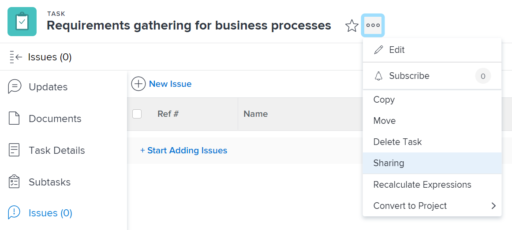
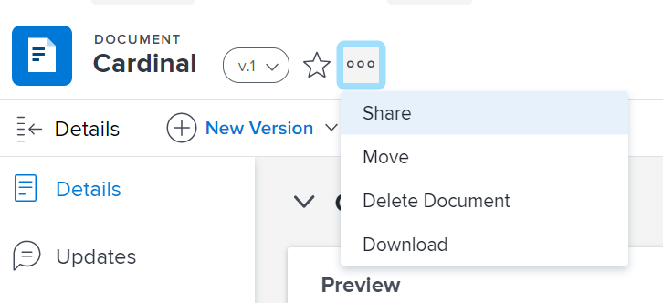
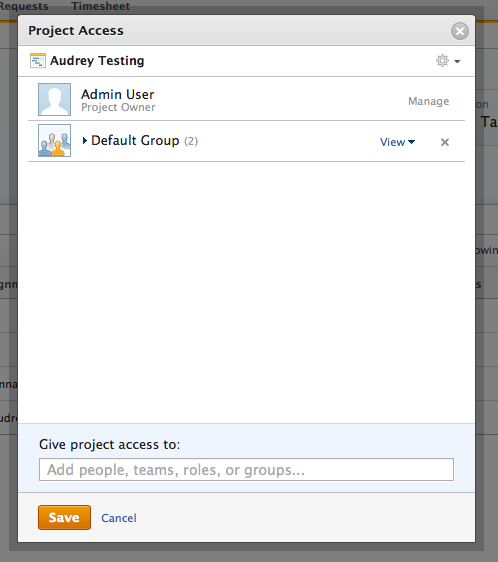
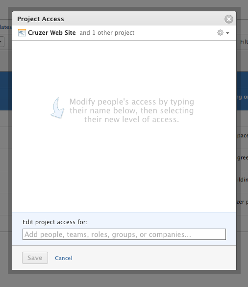

# Share Permissions on objects {#share-permissions-on-objects}

You do not have to be a `Workfront administrator` to share permissions on objects that you have access to, but permissions on objects work within access levels set by the `Workfront administrator`. A user cannot be given permission to do something that is beyond their access level.

For example, a user cannot create a task on a project if the `Workfront administrator` has not granted the user access to create tasks in `Workfront` in their access level.

For more information about permissions in the Access Model, see [Permissions in the access model](permissions-in-the-access model.md).

As an object owner, you can set permissions for the object that you create. As the creator of an object, you have&nbsp;manage permissions on the object by default.&nbsp;

Consider the following when sharing an object with other users:

* You can share only the same level or a lower level of permissions you have on the object.  
  For example, if you have Contribute permissions on the object, you cannot grant another user Manage permissions on that object.&nbsp;
* Unless otherwise specifically configured, when you share an object with another user, the lower items associated with the object also inherit the same permissions level as they are given on the project.  
  For more information about the hierarchy and interdependency of objects in `Workfront`, see the "Understanding the Interdependency and Hierarchy of Objects" section in [Understand objects](understand-objects.md).

## Share an object {#share-an-object}

1. Go to the object you want to share. 

   For information about which objects can be shared, see "Understanding Permissions Levels" in [Permissions in the access model](permissions-in-the-access model.md).
1. Do either&nbsp;of the following, depending on the type of object you are sharing:  

    
    
    * **When sharing a project, task, issue, report, dashboard, **or** Calendar:**&nbsp;Click the **More** icon , then click&nbsp;**Sharing.**  
          
    
    
    * **When sharing a document that does not contain a `proof`:** Select the document that you want to share, then click **Share**&nbsp;> **Document**.  
    
    
      >[!TIP] {type="tip"}
      >
      >You can share multiple documents at the same time by holding the Shift key to select multiple documents, then clicking **Share**.
    
    
  
          
    
    
    * **When sharing a `proof` link:** Select the document that contains the `proof`, then click **Share** > **Proof Link**.  
      For more information about sharing a `proof` (either by sharing a link or by adding users to a `proof`), see [Share a proof within Workfront](share-a-proof-in-workfront.md).
    
    
    

1. &nbsp;In the **Give <Object&nbsp;Name> access to**&nbsp;field, begin typing the name of the user, team, role, group, or company with whom you want to share the object, then click the name when it appears in the drop-down list.   
   For example, if you are sharing a project, use the **Give project access to**&nbsp;field.  
   If you have multiple entities named similarly, they should all be listed under their type. The names of the entities appear in alphabetical order. However, the order in which the entity types appear is random. Select the one with which you want to share the project.&nbsp;

1. (Optional) Repeat step 3 for each user, team, role, or group who you want to grant access to the object. 

   &nbsp;
1. Specify the permissions for each user, team, role,&nbsp;group, or company that you added in Step 3 by clicking&nbsp;the drop-down menu, then selecting the permission level that you want to grant. 

   The following options are available:

    
    
    * **View:**&nbsp;Users can&nbsp;review and share&nbsp;the item.&nbsp;
    * **Contribute****:**&nbsp;Users can&nbsp;make&nbsp;updates, log&nbsp;information, make minor edits, and share, plus all View permissions.
    * **Manage:&nbsp;**Users&nbsp;have full access to the object, minus administrative&nbsp;rights which are granted at the access level, plus all View and Contribute permissions.  
    
    
      >[!NOTE]
      >
      >The `Workfront administrator` or the creator of the object has the ability to remove permissions from these entities.
    
    

    
    
      &nbsp;
    
    
          
    

    
    
      &nbsp;
    
    
    

1. (Optional) Click **Advanced Options**&nbsp;to configure specific permissions&nbsp;on the object. 

   View, Manage and Contribute have different advanced options depending on the the object and permission selected.  
   For more information about the permissions levels, see [Permissions in the access model](permissions-in-the-access model.md).

   

1. (Optional) Click the gear icon, then in the drop-down menu click **Make this visible system-wide** to make the object available to all `Workfront` users. 

   All users can&nbsp;see the object based on the permissions that you set.

1. (Optional) When sharing a project, click the gear icon, then in the drop-down menu click **Set as my project access template**&nbsp;to set the permissions as a template.  
   After you have defined permissions on one project, these same permissions are automatically applied the next time you create a project from scratch.  

   >[!NOTE]
   >
   >The project access template overrides the sharing defaults granted to you by the `Workfront administrator` in your Access Level.   
   >For more information about specifying sharing defaults for projects in the Access Level, see [Grant access to projects](grant-access-projects.md)&nbsp;

  

1. (Optional) To make the object public, click **Make this public to external users**. 
    
    
    1. Click **copy link,**&nbsp;then distribute the link to external users at your discretion.  
       Any users with the link are able to view the object.&nbsp;
    
    
    

1.  &nbsp;(Optional) To make this object available to all users in the system, click **Make this visible system-wide**.&nbsp;
1. Click **Save**.

## Share objects in bulk {#share-objects-in-bulk}

From a list of objects, you can share multiple objects at one time with other users, teams, groups, job roles, or companies.&nbsp;&nbsp;

>[!IMPORTANT] {type="important"}
>
>When you share objects in bulk, the names of the entities that have permissions to the individual objects are not displayed. When sharing objects in bulk the entities you add to the sharing list are added to the objects selected. They do not override the entities associated with the individual objects.&nbsp;

To share objects in bulk:

1. Navigate to a list of objects.
1. Select&nbsp;two or more objects in the list.
1. Click&nbsp;**Share**.  
   Users who already have access to the object&nbsp;are not listed as available when bulk sharing.  

   >[!NOTE]
   >
   >If you do not have permissions to share an object that you selected, the **Share** button is not visible.

1. In the **Edit <Object Name> access for** field, start typing the name of a user, team, group, job role, or company to which you want to grant permissions.  
   If you have multiple entities named similarly, they should all be listed under their type. The names of the entities appear in alphabetical order. However, the order in which the entity types appear is random. Select the one with which you want to share the project.  
   

1. (Optional) Click the gear icon, then click **Make this available system-wide **to make the objects selected available to all `Workfront` users.

1. Click **Save**.

## Understand inherited Permissions {#understand-inherited-permissions}

* [Permissions Inherited from Parent Objects](#inherited-permissions-from-higher-ranking-objects) 
* [Permissions Acquired Through Organizational Memberships](#permissions-acquired-via-memberships)&nbsp;

### Permissions Inherited from Parent Objects {#permissions-inherited-from-parent-objects}

Permissions in `Workfront` are inherited hierarchically. This means that if you are granting permissions to a user on a parent object, they gain the same permissions on the children objects associated with it by default.

For example, if you give a user Contribute permissions to a project, the user has Contribute permissions to all tasks and issues (child objects) associated with that project.

Continuing with the example above, you cannot restrict permissions to child objects. If you do not want the user to have Contribute permissions to child objects associated with the project, you must manually remove the Inherited Permissions from the objects and then adjust the permissions for the individual user, including any Advanced Settings.&nbsp;

>[!NOTE]
>
>Your `Workfront administrator` can disable inherited permissions for documents in your access level.&nbsp;For more information about disabling inherited permissions for documents in the access level, see [Create or modify access levels](create-modify-access-levels.md).

### Permissions Acquired Through Organizational Memberships&nbsp; {#permissions-acquired-through-organizational-memberships}

If you grant Manage permissions to a Group of users on an object, and you grant View permissions to an individual user in that Group on the same object, the user has the highest level of permissions (Manage) granted through the Group membership on the object.&nbsp;

If you want to grant lower permissions to a user who is already part of an organizational unit (Group, Team, Job Role, or Company) with a higher permission level, you must remove the permissions from the organizational unit, and add users individually with a lower level of permissions.&nbsp;&nbsp;

For more information about the hierarchy of objects in `Workfront`, see the "Understanding the Interdependency and Hierarchy of Objects" section in [Understand objects](understand-objects.md).

## Remove Permission from objects {#remove-permission-from-objects}

You can remove permissions from objects you have access to Share. Removing permissions from objects is identical for all objects that can be shared.&nbsp;

>[!NOTE]
>
>&nbsp;You cannot remove permissions when you share items in bulk. You can remove permissions only when selecting individual items.&nbsp;

To remove permissions from objects consider the following:&nbsp;

* [Remove entities from the sharing list of an object](#removing-entities-from-objects) 
* [Remove inherited Permissions](#remove-inherited-permissions) 
* [Make an object private](#making-an-object-private) 

### Remove entities from the sharing list of an object {#remove-entities-from-the-sharing-list-of-an-object}

You can remove entities from the sharing list of an object to remove their permissions from the object.

To remove permissions from objects:&nbsp;

1. Navigate to an object on which you want to modify the permissions.
1. Click the **Actions** menu, then click **Sharing**.  
   For example, on a project, click **Project Actions**, then **Sharing**.&nbsp;

1. Click the **x** next to the name of a user, team, group, company, job role to remove them.  

1. In the **<User Name>'s `Workfront` access will be removed from this** drop-down menu, select whether you want their access to be removed just from the object you have selected, or from all children objects associated with it.  
   The following scenarios exist: 
    
    
    * If you remove the entity only from the object, that entity loses their permissions on the object, and their inherited permissions to the children objects. If they are granted permissions to the children items individually, they retain the same permissions on all children objects associated with it when you select this option.&nbsp;
    * If you remove the entity from the object and all the children objects, that entity loses their permissions to the object as well as all children objects, even when they have been given individual permission on each child object.&nbsp;
    
    

1. Click **Save**.

### Remove inherited Permissions {#remove-inherited-permissions}

Inherited permissions can be removed from objects allowing for owners to specifically&nbsp;identify who will get access to children objects regardless of the access of a user to a parent object. Only users with Manage permission are able to remove inherited permissions.

To remove inherited permissions:

1. Navigate to an object to which you have Manage permissions.   
   For example, navigate to a task.
1. Go to the sharing list as described in [Share an object](#sharing-an-object).
1. Select the **X**&nbsp;mark next to **Inherited Permission**&nbsp;on the sharing box to remove&nbsp;anyone listed there.  
  
   This ensures that no one who is granted permissions to the parent object (for example, the project) has permissions to this task by default. You must list&nbsp; individual entities in the sharing list of the task to grant permissions on the task.  

   >[!NOTE]
   >
   >You cannot remove individual entities from the Inherited Permissions list. You can only disable the Inherited Permissions for all entities listed.

1. Click **Save**.&nbsp;

### Make an object private {#make-an-object-private}

If you have shared an object system-wide, or you have shared it with external uses by making it public, you can make it private again by removing the system-wide or public permissions.&nbsp;

For more information about making an object available system-wide, or publicly, see [Share an object](#sharing-an-object).

To make an object private:

1. Go to the object you want to make private.  
   For example, navigate to a report.
1. Click **Report Actions**, then **Sharing**.  
  

1. Click **Remove public access** to remove the access of external users to viewing the report.
1. Click **Remove system-wide access** to stop sharing it with all `Workfront` users.&nbsp;

1. Click **Save**.

## Request Permissions to objects {#request-permissions-to-objects}

When someone sends you a link to an object which you do not have permissions to View, or when you have lower permissions on an object and you want to request a higher level of permissions, you can request permissions on the object.&nbsp;

You can request access to an object from anyone who has Share permission to the object.&nbsp;

For more information about requesting permissions to objects, see [Request Access to objects](request-access.md).

## Share limitations {#share-limitations}

You can share an object with up to 100 entities (Users, Teams, Groups, Job Roles, Companies). We recommend that you share objects with Groups, Teams, or Companies rather than with individual users, to avoid this limitation.&nbsp;
