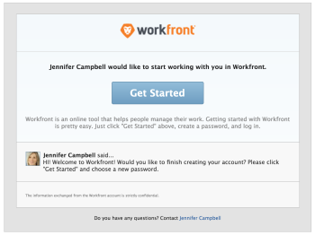
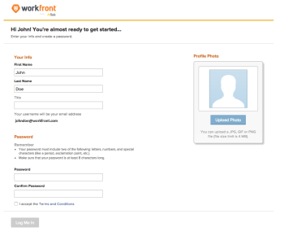

# Receive email invitations and create a password for Adobe Workfront

## Access requirements

You must have the following access to perform the steps in this article:

<table cellspacing="0"> 
 <col> 
 </col> 
 <col> 
 </col> 
 <tbody> 
  <tr> 
   <td role="rowheader">Adobe Workfront plan*</td> 
   <td> 
Any
 </td> 
  </tr> 
  <tr> 
   <td role="rowheader">Adobe Workfront license*</td> 
   <td> 
Request or higher
 </td> 
  </tr> 
 </tbody> 
</table>

&#42;To find out what plan or license type you have, contact your Workfront administrator.

## Receive email invitations

When a Workfront administrator creates a new user and chooses to send the user an email invitation, the new user receives an invitation email, which&nbsp;looks similar to the following:  

For more information about how a Workfront administrator sends email invitations&nbsp;while creating new users, see [Generate email invitations](../../../administration-and-setup/manage-workfront/emails/manage-email-invitations.md#generating-email-invitations).

For more information about how a Workfront administrator adds new users to Adobe Workfront, see [Add users](../../../administration-and-setup/add-users/create-and-manage-users/add-users.md).

## Create a password for Workfront

As a new user, after you&nbsp;receive the invitation email, you&nbsp;can follow the link in the email invitation and finish creating your Workfront account by choosing a password.&nbsp;

>[!NOTE]
>
>The link in the email is valid only the amount of days specified in the general options area of the Invitations page&nbsp;by your Workfront administrator.&nbsp;

To create a password for Workfront using the invitation email:

<ol> 
 <li value="1">Click Get Started in the invitation email from Workfront.  For more information about receiving an invitation email, see <a href="#receiving-email-invitations" class="MCXref xref">Receive email invitations</a>. </li> 
 <li value="2">Specify the following information: First Name: Your first name (it should be prefilled). Last Name: Your last name (it should be prefilled). Title: Your title in your organization. Password: Choose a password to log in to Workfront. Confirm Password: Confirm your Workfront password.&nbsp;</li> 
 <li value="3">Select I accept the Terms and Conditions.</li> 
 <li value="4">Click Log Me In. This completes the creation of your user account in Workfront.&nbsp;</li> 
</ol>

