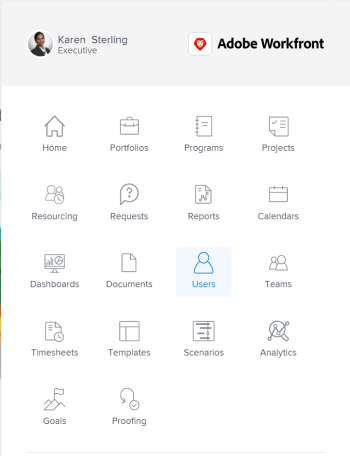
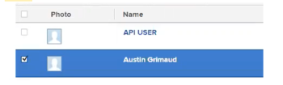

# Reset a user's password with Enhanced Authentication

When Enhanced Authentication (eAuth) is enabled for your Workfront Environment, a *Workfront administrator* can’t reset login credentials for another user. This differs from Workfront environments without eAuth or those environments for which Single Sign On (SSO) is enabled.

## Access requirements

You must have the following access to perform the steps in this article:

<table cellspacing="0"> 
 <col> 
 <col> 
 <tbody> 
  <tr> 
   <td role="rowheader"><em>Adobe Workfront</em> plan</td> 
   <td> 
 Any
 </td> 
  </tr> 
  <tr> 
   <td role="rowheader"><em>Adobe Workfront</em> license</td> 
   <td> 
Plan
 </td> 
  </tr> 
  <tr> 
   <td role="rowheader">Access level configurations</td> 
   <td> 
System administrator 
 </td> 
  </tr> 
 </tbody> 
</table>

## Reset a user’s password in an eAuth enabled environment

<ol> 
 <li value="1"> <draft-comment>
   <MadCap:conditionalText data-mc-conditions="QuicksilverOrClassic.Quicksilver">
    Click the 
    Main Menu icon 
     in the upper-right corner of 
    <em>Workfront</em>, then click 
    Users 
    . 
   </MadCap:conditionalText>
  </draft-comment><MadCap:conditionalText data-mc-conditions="QuicksilverOrClassic.Quicksilver">
   Click the 
   Main Menu icon 
    in the upper-right corner of 
   <em>Workfront</em>, then click 
   Users 
   . 
  </MadCap:conditionalText></li> 
 
 <draft-comment>
   
  </draft-comment> 
 
 <li value="2"> <draft-comment>
   <MadCap:conditionalText data-mc-conditions="QuicksilverOrClassic.Quicksilver">
    Select the 
    User that requires a password reset.
   </MadCap:conditionalText>
  </draft-comment><MadCap:conditionalText data-mc-conditions="QuicksilverOrClassic.Quicksilver">
   Select the 
   User that requires a password reset.
  </MadCap:conditionalText></li> 
 
  
 
 <li value="3">Click the More button that appears after you've chosen the desired User and select the Send Forgot Password Email option from the drop-down menu.</li> 
 
  
 
</ol>

After selecting the `Send Forgot Password Email` option, an email is sent to the selected user that contains instructions for them to change their own password.

