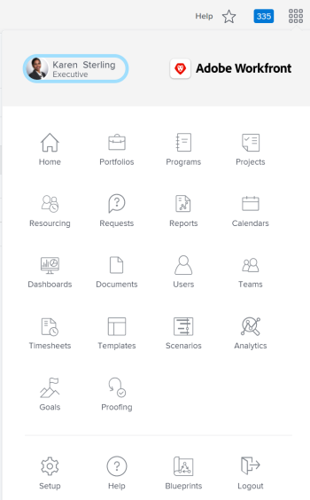
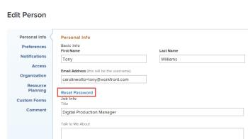

# Reset your password

You can reset your *Adobe Workfront* password. As an important security measure, we recommend that you do this regularly.

>[!NOTE]
>
>A *Workfront administrator* can configure custom password restrictions, as explained in&nbsp; [Configure system security preferences](../../../administration-and-setup/manage-workfront/security/configure-security-preferences.md) and [Configure password policies for authentication](../../../administration-and-setup/manage-workfront/security/configure-password-policies-authentication.md).
>
>A *Workfront administrator* can also reset your password in an Enhanced Authentication enabled environment. For more information, see [Reset a user's password with Enhanced Authentication](../../../workfront-basics/manage-your-account-and-profile/managing-your-workfront-account/reset-user-password-eauth.md).

## Access requirements

You must have the following access to perform the steps in this article:

<table cellspacing="0"> 
 <col> 
 </col> 
 <col> 
 </col> 
 <tbody> 
  <tr> 
   <td role="rowheader"><em>Adobe Workfront</em> plan*</td> 
   <td> 
Any
 </td> 
  </tr> 
  <tr> 
   <td role="rowheader"><em>Adobe Workfront</em> license*</td> 
   <td> 
<em>Request</em> or higher
 </td> 
  </tr> 
 </tbody> 
</table>

&#42;To find out what plan or license type you have, contact your *Workfront administrator*.

## Reset your password in *Adobe Workfront*

<ol> 
 <li value="1"> 
 Click the Main Menu icon  in the upper-right corner of <em>Adobe Workfront</em>, then click your user name next to your profile picture.
 <draft-comment>
   
  

  </draft-comment>
  
 </li> 
 <li value="2">Click <draft-comment>
   <MadCap:conditionalText data-mc-conditions="QuicksilverOrClassic.Quicksilver">
    the 
    More menu 
    , then click 
    Edit
   </MadCap:conditionalText>
  </draft-comment><MadCap:conditionalText data-mc-conditions="QuicksilverOrClassic.Quicksilver">
   the 
   More menu 
   , then click 
   Edit
  </MadCap:conditionalText>.</li> 
 <li value="3"> 
In the<draft-comment>
    Edit Person
   </draft-comment>Edit Person box that displays, under Personal Info, click Reset Password.
 <draft-comment>
   
  

  </draft-comment>
  
 
If your organization has integrated <em>Workfront</em> with an SSO solution, you may be routed to reset your passwords through your SSO&nbsp;system when you click Reset Password.&nbsp;This resets your SSO password which affects logging in to all your other applications inside your organization.
 </li> 
 <li value="4"> 
Type your old password, then type the new password you want twice.
 
Your password must be at least 8 characters and contain two of the following types of characters:
 
  <ul> 
   <li> 
Letters
 </li> 
   <li> 
Numbers
 </li> 
   <li> 
Special characters (i.e. ! @ # $ % etc.)
 </li> 
  </ul> 
Password rules might be more strict than this, depending on configuration settings set by your <em>Workfront administrator</em>.
 </li> 
 <li value="5">Click Save Changes.</li> 
</ol>

