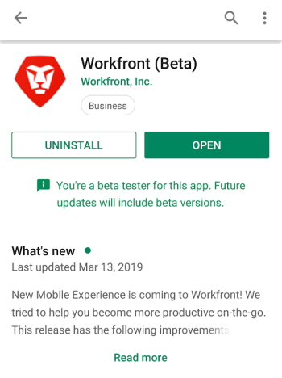
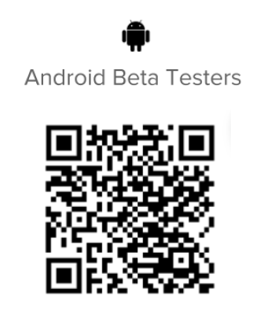

# Be an Android beta tester

## Download the beta app

There are a couple of ways to become a beta tester for the *Adobe Workfront* app:

### Google Play Store

You can use the Google Play Store to find and download the app:

<ol> 
 <li value="1">Access the Play Store app on your device.</li> 
 <li value="2"> 
Search for Workfront, then tap it when it appears in the list.
You need to install the Workfront app before you join the beta.</li> 
 <li value="3">Install and open the Workfront app if you haven't done so already.</li> 
 <li value="4">Scroll towards the middle of the page, then tap Join now in the Become a beta tester section.</li> 
 <li value="5">Tap Join to confirm that you want to be a beta tester. It takes a few minutes to be acknowledged as a beta user. You may have to reopen the Play Store to see the changes.</li> 
 <li value="6">After the progress completes, you receive a confirmation that you are now a beta user. The word "Beta" appears after the name of your app in the Play Store indicating that you are using the beta version of the app. </li> 
</ol>

### QR code

You can also scan the QR Code below to sign up for the beta and download the app:

## Let us know how we're doing

To provide feedback about the beta app or to report a problem:

1. Tap `More` in the bottom Navigation bar.
1. Tap your name, then `Submit Feedback`.
1. Choose `Start Survey` to provide general feedback about the app.  
   or  
   Choose `Report a Problem` to submit a ticket to the *Workfront* Customer Care Team.

## Opt out of beta testing

To stop beta testing the *Workfront* app:

1. Access the Play Store app on your device.
1. Search for Workfront, then tap it when it appears in the list.
1. Scroll down to the `You're a beta tester` section, then tap `Leave`.  
   It takes a few minutes to be removed as a beta tester. You may have to reopen the Play Store to see the changes.

