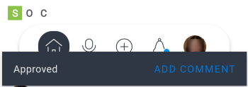

# Approvals in the *Adobe Workfront* mobile app

You can manage approvals assigned or delegated to you from the Approvals area in the *Adobe Workfront* mobile app. From the approvals area, you can approve:

<table> 
 <col> 
 <col> 
 <tbody> 
  <tr> 
   <td> 
    <ul> 
     <li>Work (Tasks and Issues)</li> 
     <li>Documents</li> 
     <li><em>Proofs</em> </li> 
    </ul> </td> 
   <td> 
    <ul> 
     <li>Timesheets</li> 
     <li>Access Requests</li> 
    </ul> </td> 
  </tr> 
 </tbody> 
</table>

*Proofs* follow a separate approval process. You cannot approve a proof from a work item or document approval. For information on reviewing and approving *proofs*, see [Review and make decisions on proofs in the Adobe Workfront mobile app](../../../workfront-basics/mobile-apps/using-the-workfront-mobile-app/work-with-proofs-in-mobile-app.md).

## Review an approval

<ol> 
 <li value="1"> 
Select Show all approvals in the Approvals area of My Work.
 
For information about My&nbsp;Work in the mobile app, see <a href="../../../workfront-basics/mobile-apps/using-the-workfront-mobile-app/my-work-section-mobile.md" class="MCXref xref">My Work section in the mobile app</a>.
 </li> 
 <li value="2"> 
Select an approval in the list.
 
  
 </li> 
 <li value="3"> 
Review the information associated with the approval, such as updates, documents, and details.
 
This example shows a task approval. Other approval types might contain different information.
 
  
 </li> 
</ol>

## Make a decision on an approval

<ol> 
 <li value="1"> 
Open the approval.
 </li> 
 <li value="2"> 
Select a decision. The list of decision options depends on the type of approval you are viewing.
 
  <table cellspacing="0"> 
   <col> 
   <col> 
   <tbody> 
    <tr> 
     <td role="rowheader">  </td> 
     <td>Approve</td> 
    </tr> 
    <tr> 
     <td role="rowheader">  </td> 
     <td>Approve with changes (only available for documents)</td> 
    </tr> 
    <tr> 
     <td role="rowheader">  </td> 
     <td>Reject</td> 
    </tr> 
   </tbody> 
  </table> </li> 
 <li value="3"> 
(Optional) Select Add comment on the confirmation message at the bottom of the screen to add comments to the decision. These comments appear in the updates for the approval.  Or Select the arrow on the top left of the approval to go back to the Approvals page.
 </li> 
</ol>

