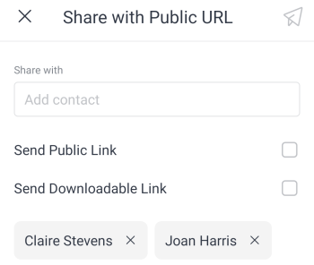

# Share and download `proofs` in the `Adobe Workfront` mobile app

You can share a `proof` document with internal and external recipients directly from the mobile app. You can also download a `proof` document to your mobile device.

>[!NOTE]
>
>All recipients must have access in `Workfront` to review `proofs`. For information about licenses and access levels, see [Access to proofing functionality in Workfront](../../../administration-and-setup/manage-workfront/configure-proofing/access-to-proofing-functionality.md).

## Share the `proof`

This option sends an email with a unique `proof` link to a contact from `Workfront Proof`. You can add a new contact if needed.

<ol> 
 <li value="1"> 
Open the document proof and select the More menu  on the top right of the document. Then, select More.
 </li> 
 <li value="2"> 
Select Share.
 </li> 
 <li value="3"> 
Begin typing the contact name in the Share with box, and select the contact from the list. If the person is not listed, type their email address in the Share with box and select Add Recipient to add them.
 </li> 
 <li value="4"> 
Select the Proof Role for the recipient. For information on proof roles, see <a href="../../../review-and-approve-work/proofing/proofing-overview/proof-roles.md" xmlns:MadCap="http://www.madcapsoftware.com/Schemas/MadCap.xsd" class="MCXref xref">Proof Roles overview</a>.
 </li> 
 <li value="5"> 
Select the Email Alerts the recipient should receive. For information on email alerts for proofs, see <a href="../../../workfront-proof/wp-emailsntfctns/email-alerts/change-email-alert-settings-wp.md" xmlns:MadCap="http://www.madcapsoftware.com/Schemas/MadCap.xsd" class="MCXref xref">Change email alert settings for a proof in Workfront Proof</a> and <a href="../../../workfront-proof/wp-emailsntfctns/email-alerts/config-email-notification-settings-wp.md" xmlns:MadCap="http://www.madcapsoftware.com/Schemas/MadCap.xsd" class="MCXref xref">Configure email notification settings in Workfront Proof</a>.
 
  </img> 
 </li> 
 <li value="6"> 
To add another recipient, repeat from step 3.
 </li> 
 <li value="7"> 
To choose a due date for all of the recipients to review the proof, select Set deadline for new contacts. Then, select a date on the calendar.
 </li> 
 <li value="8"> 
Select  to send the email to the recipients.
 </li> 
</ol>

## Send a copy of the `proof`

This option copies a link to your clipboard that you can paste into an email. Then, you can send the email with the `proof` link to an internal or external recipient.

<ol> 
 <li value="1"> 
Open the document proof and select the More menu  on the top right of the document. Then, select More.
 </li> 
 <li value="2"> 
Select Send Copy.
 </li> 
 <li value="3"> 
Select Copy to clipboard.
 </li> 
 <li value="4"> 
Open your email program and paste the proof link in the body of the email.
 </li> 
 <li value="5"> 
Send the email to the recipients you want to share the proof with.
 </li> 
</ol>

## Share the `proof` with a public URL

This option sends an email with a public `proof` link to a contact from `Workfront Proof`. You can add a new contact if needed. You can choose to send a public URL, a downloadable link, or both.

<ol> 
 <li value="1"> 
Open the document proof and select the More menu  on the top right of the document. Then, select More.
 </li> 
 <li value="2"> 
Select Share with Public URL.
 </li> 
 <li value="3"> 
Begin typing the contact name in the Share with box, and select the contact from the list. If the person is not listed, type their email address in the Share with box and select Add Recipient to add them. Repeat this step to add another recipient. 
 </li> 
 <li value="4"> 
Select Send Public Link to allow recipients to open the proof document in Workfront Proof.
 </li> 
 <li value="5"> 
Select Send Downloadable Link to allow recipients to download the proof document.
 
  </img> 
 </li> 
 <li value="6"> 
Select  to send the email to the recipients.
 </li> 
</ol>

## Download the `proof`

You can download a copy of the `proof` document to your mobile device.

<ol> 
 <li value="1"> 
Open the document proof and select the More menu  on the top right of the document. Then, select More.
 </li> 
 <li value="2"> 
Select Download.
 </li> 
 <li value="3"> 
Follow your device prompts to complete the download and open the document file.
 </li> 
</ol>

