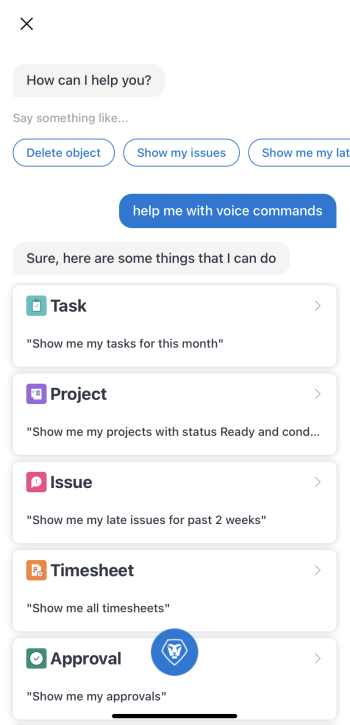
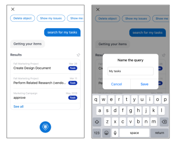

# *`Adobe Workfront`* mobile app virtual assistant {#adobe-workfront-mobile-app-virtual-assistant}

Use the *`Adobe Workfront`* mobile app virtual assistant to locate, delete, and search for information inside of Workfront. In addition, you can pin virtual assistant commands and queries to access the results at any time.

## Available commands {#available-commands}

Use the following voice commands to manage work in the mobile app:

* [Show me, Find, Search for](#show) 
* [Delete](#delete) 
* [Help me with commands](#help) 

### Show me, Find, Search for {#show-me-find-search-for}

* [Examples](#exampl) 

Use the show me command to see information about the following objects:

<table style="mc-table-style: url('../../../Resources/TableStyles/TableStyle-HeaderRow.css');width: 902px;" class="TableStyle-TableStyle-HeaderRow" cellspacing="15"> 
 <col style="width: 200px;" class="TableStyle-TableStyle-HeaderRow-Column-Column1"> 
 <col class="TableStyle-TableStyle-HeaderRow-Column-Column1" style="width: 200px;"> 
 <col class="TableStyle-TableStyle-HeaderRow-Column-Column1" style="width: 200px;"> 
 <col class="TableStyle-TableStyle-HeaderRow-Column-Column1" style="width: 200px;"> 
 <tbody> 
  <tr class="TableStyle-TableStyle-HeaderRow-Body-LightGray"> 
   <td class="TableStyle-TableStyle-HeaderRow-BodyE-Column1-LightGray">&nbsp;</td> 
   <td class="TableStyle-TableStyle-HeaderRow-BodyE-Column1-LightGray">Date</td> 
   <td class="TableStyle-TableStyle-HeaderRow-BodyE-Column1-LightGray">Status</td> 
   <td class="TableStyle-TableStyle-HeaderRow-BodyD-Column1-LightGray">Condition</td> 
  </tr> 
  <tr class="TableStyle-TableStyle-HeaderRow-Body-MediumGray"> 
   <td class="TableStyle-TableStyle-HeaderRow-BodyE-Column1-MediumGray"> 
Task
 </td> 
   <td class="TableStyle-TableStyle-HeaderRow-BodyE-Column1-MediumGray" style="text-align: center;background-color: #8fbc8b;">Yes</td> 
   <td class="TableStyle-TableStyle-HeaderRow-BodyE-Column1-MediumGray" style="text-align: center;background-color: #8fbc8b;">Yes</td> 
   <td class="TableStyle-TableStyle-HeaderRow-BodyD-Column1-MediumGray" style="text-align: center;background-color: #8fbc8b;">Yes</td> 
  </tr> 
  <tr class="TableStyle-TableStyle-HeaderRow-Body-LightGray"> 
   <td class="TableStyle-TableStyle-HeaderRow-BodyE-Column1-LightGray">Issue</td> 
   <td class="TableStyle-TableStyle-HeaderRow-BodyE-Column1-LightGray" style="text-align: center;background-color: #8fbc8b;">Yes</td> 
   <td class="TableStyle-TableStyle-HeaderRow-BodyE-Column1-LightGray" style="text-align: center;background-color: #8fbc8b;">Yes</td> 
   <td class="TableStyle-TableStyle-HeaderRow-BodyD-Column1-LightGray" style="text-align: center;background-color: #8fbc8b;">Yes</td> 
  </tr> 
  <tr class="TableStyle-TableStyle-HeaderRow-Body-MediumGray"> 
   <td class="TableStyle-TableStyle-HeaderRow-BodyE-Column1-MediumGray">Project</td> 
   <td class="TableStyle-TableStyle-HeaderRow-BodyE-Column1-MediumGray" style="text-align: center;background-color: #8fbc8b;">Yes</td> 
   <td class="TableStyle-TableStyle-HeaderRow-BodyE-Column1-MediumGray" style="text-align: center;background-color: #8fbc8b;">Yes</td> 
   <td class="TableStyle-TableStyle-HeaderRow-BodyD-Column1-MediumGray" style="text-align: center;background-color: #8fbc8b;">Yes</td> 
  </tr> 
  <tr class="TableStyle-TableStyle-HeaderRow-Body-LightGray"> 
   <td class="TableStyle-TableStyle-HeaderRow-BodyE-Column1-LightGray">Timesheet</td> 
   <td class="TableStyle-TableStyle-HeaderRow-BodyE-Column1-LightGray" style="text-align: center;background-color: #8fbc8b;">Yes</td> 
   <td class="TableStyle-TableStyle-HeaderRow-BodyE-Column1-LightGray" style="text-align: center;background-color: #8fbc8b;">Yes</td> 
   <td class="TableStyle-TableStyle-HeaderRow-BodyD-Column1-LightGray" style="text-align: center;background-color: #cd5c5c;">No</td> 
  </tr> 
  <tr class="TableStyle-TableStyle-HeaderRow-Body-MediumGray"> 
   <td class="TableStyle-TableStyle-HeaderRow-BodyE-Column1-MediumGray">Team</td> 
   <td class="TableStyle-TableStyle-HeaderRow-BodyE-Column1-MediumGray" style="text-align: center;background-color: #cd5c5c;">No</td> 
   <td class="TableStyle-TableStyle-HeaderRow-BodyE-Column1-MediumGray" style="text-align: center;background-color: #cd5c5c;">No</td> 
   <td class="TableStyle-TableStyle-HeaderRow-BodyD-Column1-MediumGray" style="text-align: center;background-color: #cd5c5c;">No</td> 
  </tr> 
  <tr class="TableStyle-TableStyle-HeaderRow-Body-LightGray"> 
   <td class="TableStyle-TableStyle-HeaderRow-BodyE-Column1-LightGray">Approval</td> 
   <td class="TableStyle-TableStyle-HeaderRow-BodyE-Column1-LightGray" style="text-align: center;background-color: #8fbc8b;">Yes</td> 
   <td class="TableStyle-TableStyle-HeaderRow-BodyE-Column1-LightGray" style="text-align: center;background-color: #cd5c5c;">No</td> 
   <td class="TableStyle-TableStyle-HeaderRow-BodyD-Column1-LightGray" style="text-align: center;background-color: #cd5c5c;">No</td> 
  </tr> 
  <tr class="TableStyle-TableStyle-HeaderRow-Body-MediumGray"> 
   <td class="TableStyle-TableStyle-HeaderRow-BodyE-Column1-MediumGray">Program</td> 
   <td class="TableStyle-TableStyle-HeaderRow-BodyE-Column1-MediumGray" style="text-align: center;background-color: #8fbc8b;">Yes</td> 
   <td class="TableStyle-TableStyle-HeaderRow-BodyE-Column1-MediumGray" style="text-align: center;background-color: #cd5c5c;">No</td> 
   <td class="TableStyle-TableStyle-HeaderRow-BodyD-Column1-MediumGray" style="text-align: center;background-color: #cd5c5c;">No</td> 
  </tr> 
  <tr class="TableStyle-TableStyle-HeaderRow-Body-LightGray"> 
   <td class="TableStyle-TableStyle-HeaderRow-BodyE-Column1-LightGray">Portfolio</td> 
   <td class="TableStyle-TableStyle-HeaderRow-BodyE-Column1-LightGray" style="text-align: center;background-color: #8fbc8b;">Yes</td> 
   <td class="TableStyle-TableStyle-HeaderRow-BodyE-Column1-LightGray" style="text-align: center;background-color: #cd5c5c;">No</td> 
   <td class="TableStyle-TableStyle-HeaderRow-BodyD-Column1-LightGray" style="text-align: center;background-color: #cd5c5c;">No</td> 
  </tr> 
  <tr class="TableStyle-TableStyle-HeaderRow-Body-MediumGray"> 
   <td class="TableStyle-TableStyle-HeaderRow-BodyE-Column1-MediumGray">Report</td> 
   <td class="TableStyle-TableStyle-HeaderRow-BodyE-Column1-MediumGray" style="text-align: center;background-color: #8fbc8b;">Yes</td> 
   <td class="TableStyle-TableStyle-HeaderRow-BodyE-Column1-MediumGray" style="text-align: center;background-color: #cd5c5c;">No</td> 
   <td class="TableStyle-TableStyle-HeaderRow-BodyD-Column1-MediumGray" style="text-align: center;background-color: #cd5c5c;">No</td> 
  </tr> 
  <tr class="TableStyle-TableStyle-HeaderRow-Body-LightGray"> 
   <td class="TableStyle-TableStyle-HeaderRow-BodyB-Column1-LightGray">Dashboard</td> 
   <td class="TableStyle-TableStyle-HeaderRow-BodyB-Column1-LightGray" style="text-align: center;background-color: #8fbc8b;">Yes</td> 
   <td class="TableStyle-TableStyle-HeaderRow-BodyB-Column1-LightGray" style="text-align: center;background-color: #cd5c5c;">No</td> 
   <td class="TableStyle-TableStyle-HeaderRow-BodyA-Column1-LightGray" style="text-align: center;background-color: #cd5c5c;">No</td> 
  </tr> 
 </tbody> 
</table>

#### &nbsp; Examples {#examples}

<table style="width: 100%;"> 
 <col> 
 <col> 
 <tbody> 
  <tr> 
   <td colspan="2">Search my objects </td> 
  </tr> 
  <tr> 
   <td> 
    <ul> 
     <li>Show me my tasks</li> 
     <li> Show me my issues </li> 
     <li>Show me my teams </li> 
     <li>Show me my tasks for last two weeks </li> 
     <li>Show me my projects for 2020</li> 
     <li> Show me my issues for April 1st </li> 
     <li>Show me my timesheets for August </li> 
    </ul> </td> 
   <td> 
    <ul> 
     <li>Show me my tasks with status In Progress </li> 
     <li>Show me my issues with condition Some Concerns </li> 
     <li>Show me my projects with status Planning and condition On Target </li> 
     <li>Show me my issues with status New and In Progress </li> 
     <li>Show me my timesheets with status Open for 2019 </li> 
     <li>Show me my projects with status On Hold and condition At Risk for this month </li> 
    </ul> </td> 
  </tr> 
  <tr> 
   <td colspan="2">Search Projects I Own/Projects I'm On </td> 
  </tr> 
  <tr> 
   <td> 
    <ul> 
     <li>Show me projects I own </li> 
     <li>Show me projects I’m on </li> 
     <li>Show me projects I own with status Planning </li> 
    </ul> </td> 
   <td> 
    <ul> 
     <li>Show me projects I’m on with condition On Target </li> 
     <li>Show me projects I own for last week </li> 
     <li>Show me projects I’m on with condition On Target for last March </li> 
    </ul> </td> 
  </tr> 
  <tr> 
   <td colspan="2" style="font-weight: bold;">Search my personal tasks</td> 
  </tr> 
  <tr> 
   <td> 
    <ul> 
     <li>Show me my personal tasks </li> 
     <li>Show me my personal tasks with status In Progress </li> 
    </ul> </td> 
   <td> 
    <ul> 
     <li>Show me my personal tasks with condition Going Smoothly </li> 
     <li>Show me my personal tasks with status In Progress on 26th of April </li> 
    </ul> </td> 
  </tr> 
  <tr> 
   <td style="font-weight: bold;" colspan="2">Search my late items</td> 
  </tr> 
  <tr> 
   <td> 
    <ul> 
     <li>Show me my late items </li> 
     <li>Show me my late items for August 2020 </li> 
     <li>Show me my late tasks Show me my late issues </li> 
    </ul> </td> 
   <td> 
    <ul> 
     <li>Show me my late tasks with status New </li> 
     <li>Show me my late issues with status In Progress </li> 
     <li>Show me my late issues with condition Going Smoothly for last 2 days </li> 
     <li>Show me my late tasks status Complete for March 26th </li> 
    </ul> </td> 
  </tr> 
  <tr> 
   <td colspan="2" style="font-weight: bold;">Search for objects by assignee (Person/Team). Available only on iOS devices.</td> 
  </tr> 
  <tr> 
   <td> 
    <ul> 
     <li>Show me issues assigned to me </li> 
     <li>Show me issues assigned to Helen </li> 
     <li>Show me issues assigned to Android team </li> 
     <li>Show me tasks assigned to "Helen" </li> 
     <li>Show me tasks assigned to "Android" team </li> 
    </ul> </td> 
   <td> 
    <ul> 
     <li>Show me projects assigned to Helen </li> 
     <li>Show me projects assigned to Android team </li> 
     <li>Show me project/task/issue Android team is currently working on </li> 
     <li>Show me program/portfolio assigned/owned by Helen </li> 
     <li>Show me users/people/members of Android team </li> 
    </ul> </td> 
  </tr> 
 </tbody> 
</table>

### Delete  {#delete}

* [Examples](#examples) 

Use the delete command to delete the following object types: 

* Task
* Issue
* Document
* Timesheet

#### Examples {#examples-1}

<table style="width: 100%;"> 
 <col> 
 <col> 
 <tbody> 
  <tr> 
   <td colspan="2" style="font-weight: bold;">Delete object</td> 
  </tr> 
  <tr> 
   <td> 
    <ul> 
     <li>Delete object</li> 
     <li>Delete Task</li> 
     <li>Delete current object* *available only from the Details screen</li> 
    </ul> </td> 
   <td> 
    <ul> 
     <li>Delete object with name Marketing</li> 
     <li>Delete Task with name design review</li> 
    </ul> </td> 
  </tr> 
 </tbody> 
</table>

### Help me with commands {#help-me-with-commands}

Use the help command to view a list of available commands directly in the mobile app.

## Pin commands {#pin-commands}

Use the pin feature to access saved virtual assistant commands as well as pins from your web browser. Once you pin a command, you can access it any time from the Pin area.

* [Virtual assistant (VA)](#virtual) 
* [Web browser](#web) 

### Virtual assistant (VA) {#virtual-assistant-va}

The VA section of the Pin page lets you save voice commands to access at a later time. 

To pin a command:

1. State your command, then tap the `Pin` icon on the Results page. 

### Web browser {#web-browser}

The Web section of the Pin page lets you access objects you've pinned in your web browser. If the pinned object is supported in the mobile app, it opens there first. If it is not supported, it launches a web browser.
