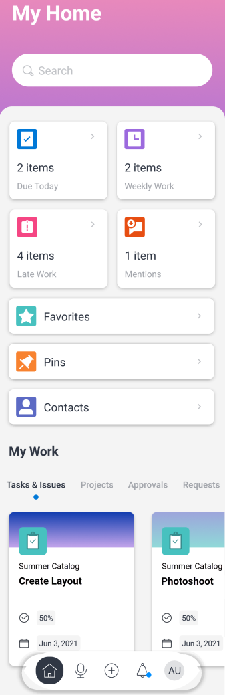
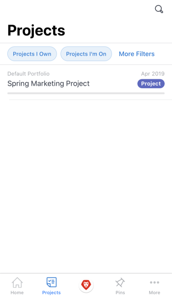
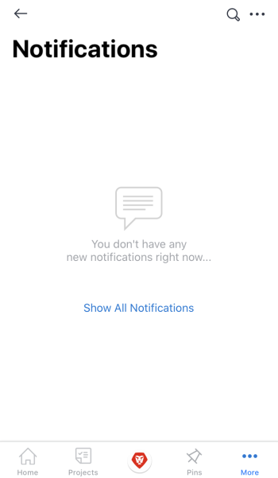
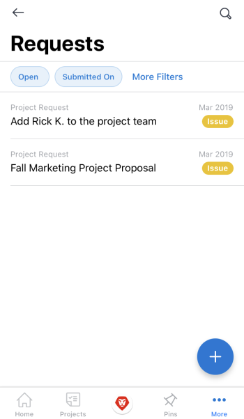
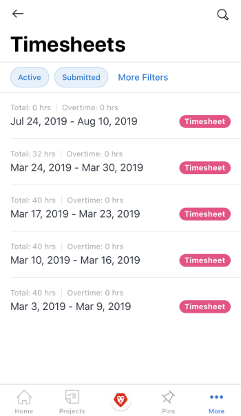
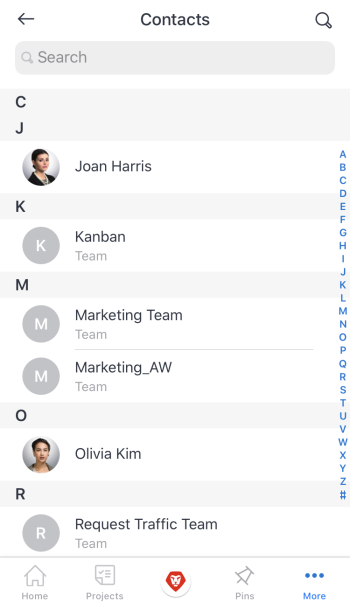
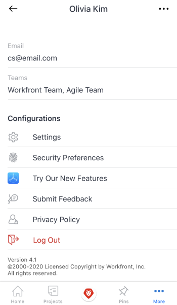

# *`Adobe Workfront`* for iOS {#adobe-workfront-for-ios}

The *`Adobe Workfront`* app allows you to access your work on any iOS device. You can install and use the Workfront mobile app on phones and tablets running iOS 10 or later. A dedicated Workfront mobile app is available for both the iPhone and the iPad.

For information about logging in to the mobile app, see the section [Log in to the Workfront mobile app](log-in-to-workfront.md#log) in the article [Log in to Adobe Workfront](log-in-to-workfront.md).

## Home {#home}

The Home area allows you to work directly on tasks, issues, and approvals assigned to you. From the Home area of the app, you can:

<table style="width: 100%;"> 
 <col style="width: 322px;"> 
 <col style="width: 1492px;"> 
 <tbody> 
  <tr> 
   <td> 
    <ul> 
     <li>Start working on tasks and issues</li> 
     <li>Mark tasks and issues as Done</li> 
     <li>Reassign tasks and issues</li> 
     <li>Change the Commit Date</li> 
    </ul> </td> 
   <td> 
    <ul> 
     <li>Update task and issue statuses</li> 
     <li>Post in the Updates area</li> 
     <li>View documents</li> 
     <li>Attach photos</li> 
     <li> 
Create a request or a quick task
 
Note: Quick tasks created in home are personal tasks, unless you choose to assign a project.
 </li> 
    </ul> </td> 
  </tr> 
 </tbody> 
</table>

For more information, see [Home area widgets](home-area-widgets-mobile.md) and [My Work section in the mobile app](my-work-section-mobile.md).

## Projects {#projects}

The Projects area allows you to interact with and manage projects you own and projects you’re on. From the projects area of the app, you can:

<table style="width: 100%;"> 
 <col style="width: 255px;"> 
 <col> 
 <tbody> 
  <tr> 
   <td> 
    <ul> 
     <li>Update project status</li> 
     <li>View important project details</li> 
     <li>Post in the Updates area</li> 
     <li>Convert tasks, issues, and requests to projects</li> 
    </ul> </td> 
   <td> 
    <ul> 
     <li>Interact with project tasks and issues</li> 
     <li>View documents</li> 
     <li>Attach photos</li> 
     <li> 
Create a quick task
 
Note: Tasks created in a project are automatically assigned to the project you're in. 
 </li> 
    </ul> </td> 
  </tr> 
 </tbody> 
</table>

## Approvals {#approvals}

The Approvals area allows you to view and approve approvals assigned or delegated to you. From the approvals area, you can approve:

<table style="width: 100%;"> 
 <col style="width: 166px;"> 
 <col> 
 <tbody> 
  <tr> 
   <td> 
    <ul> 
     <li>Work (Tasks and Issues)</li> 
     <li>Documents</li> 
     <li>Proofs </li> 
    </ul> </td> 
   <td> 
    <ul> 
     <li>Timesheets</li> 
     <li>Access Requests</li> 
    </ul> </td> 
  </tr> 
 </tbody> 
</table>

For more information on approvals, see [Approvals in the Adobe Workfront mobile app](approvals-in-mobile-app.md).

For information on reviewing and approving *`proofs`*, see [Review and make decisions on proofs in the Adobe Workfront mobile app](work-with-proofs-in-mobile-app.md).

## Notifications {#notifications}

The Notifications area allows you to view and respond to in-app notifications for your work. 

## Requests {#requests}

The Requests area allows you to view details about requests. From the Requests area of the app, you can:

<table style="width: 100%;"> 
 <col style="width: 250px;"> 
 <col> 
 <tbody> 
  <tr> 
   <td> 
    <ul> 
     <li>Reassign the request</li> 
     <li>Update the status</li> 
     <li>Adjust the priority</li> 
    </ul> </td> 
   <td> 
    <ul> 
     <li>Post in the Updates area</li> 
     <li>View documents</li> 
     <li>Attach photos</li> 
     <li>Save a request as a draft</li> 
    </ul> </td> 
  </tr> 
 </tbody> 
</table>

## Timesheets {#timesheets}

The timesheets area allows you to view details about your timesheets. In the Timesheets area of the app, you can: 

* Post in the Updates area
* Adjust hour types
* Change the time you've logged
* Enter comments on your timesheet
* Close your timesheet

## Favorites {#favorites}

You can access existing items from the Favorites menu and add new items to the Favorites menu.

## Contacts {#contacts}

The Contacts area allows you to view the contact information for all users in your company.

## Configuration {#configuration}

The Configuration area allows you to:

* Manage your settings
* View assigned teams
* Set up security preferences
* Submit Feedback
* Access Help content
* Log out  

## Virtual Assistant {#virtual-assistant}

The virtual assistant allows you to perform the following tasks via voice command:

* Show me
* Delete
* Search for 
* Help me with commands

For more information on the Virtual assistant, see [Adobe Workfront mobile app virtual assistant](wf-mobile-virtual-assistant.md).

## Pin {#pin}

The Pin area allows you to access saved virtual assistant commands as well as pins from your web browser. 

For more information on the Virtual assistant, see [Adobe Workfront mobile app virtual assistant](wf-mobile-virtual-assistant.md).
