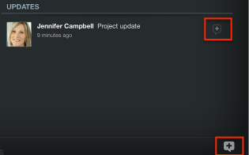

# Add updates in *Adobe Workfront* View

You can review and add updates to projects you are reviewing in the *Adobe Workfront* View app.

You cannot add updates to tasks or issues in *Workfront* View.

## Access requirements

You must have the following access in *Workfront* to perform the steps in this article:

<table cellspacing="0"> 
 <col> 
 </col> 
 <col> 
 </col> 
 <tbody> 
  <tr> 
   <td role="rowheader"><em>Adobe Workfront</em> plan*</td> 
   <td> 
Any
 </td> 
  </tr> 
  <tr> 
   <td role="rowheader"><em>Adobe Workfront</em> license*</td> 
   <td> 
<em>Review</em> or higher
 </td> 
  </tr> 
 </tbody> 
</table>

&#42;To find out what plan, license type, or access you have, contact your *Workfront administrator*.

## Add updates to a project in *Workfront* View

<ol> 
 <li value="1">From the home page of <em>Workfront</em> View, tap a project to access it.</li> 
 <li value="2">(Optional) Add the Updates widget to your view. For more information about adding widgets to your project view, see <a href="../../../workfront-basics/mobile-apps/using-workfront-view/update-widgets-in-workfront-view.md" class="MCXref xref">Update widgets in the Project Details view</a>.</li> 
 <li value="3">Tap the Updates icon (bottom right) or (conditional) the [+] icon on an update in the Updates widget. </li> 
 <li value="4">Type in an update.</li> 
 <li value="5">(Optional) Include others in the update by tapping the people icon and specifying the name of another user. </li> 
 <li value="6">Tap Post. The update appears on the project, in the Updates widget.</li> 
</ol>

