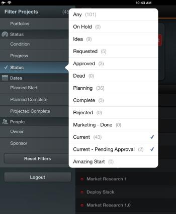

# Filter project lists in Adobe Workfront View

By default, Adobe Workfront View displays the All Projects list in Workfront, so all the projects you have access to View are listed, regardless of their status.&nbsp;

You can filter the list of projects in Workfront View to only display projects that are relevant to you.&nbsp;After applying the filters, the project list remains filtered until the next time you login or until&nbsp;they are changed.

## Access requirements

You must have the following access in Workfront to perform the steps in this article:

<table cellspacing="0"> 
 <col> 
 </col> 
 <col> 
 </col> 
 <tbody> 
  <tr> 
   <td role="rowheader">Adobe Workfront plan*</td> 
   <td> 
Any
 </td> 
  </tr> 
  <tr> 
   <td role="rowheader">Adobe Workfront license*</td> 
   <td> 
Review or higher
 </td> 
  </tr> 
 </tbody> 
</table>

&#42;To find out what plan, license type, or access you have, contact your Workfront administrator.

## Filter the projects list in Workfront View

<ol> 
 <li value="1">Go to the list of projects in the Workfront View mobile app.</li> 
 <li value="2">Tap the list icon in the upper left of the list. The list of available filters is displayed. </li> 
 <li value="3">Select from the following filters:
  <ul>
   <li>Portfolios: Select specific portfolios whose projects you want to display.</li>
   <li>Condition: Select to display only projects with a specific Condition.</li>
   <li>Progress: Select to display only projects in a specific Progress Status.</li>
   <li>Status: Select to display only projects in specific Statuses.</li>
   <li>Planned Start: Select to display only projects with the Planned Start Date in the following time frames:
    <ul>
     <li>Past 3 Months</li>
     <li>Past 2 Months</li>
     <li>Past Month</li>
     <li>Past Two Weeks</li>
    </ul></li>
   <li>Planned Complete: Select to display only projects with the Planned Completion Date in the following upcoming time frames:
    <ul>
     <li>Two Weeks</li>
     <li>One Month</li>
     <li>Two Months</li>
     <li>Three Months</li>
    </ul></li>
   <li>Projected Complete:&nbsp;Select to display only projects with the Projected Completion Date in the following upcoming time frames:
    <ul>
     <li>Two Weeks</li>
     <li>One Month</li>
     <li>Two Months</li>
     <li>Three Months</li>
    </ul></li>
   <li>Owner: Select to display projects that are assigned to specific Owners.</li>
   <li>Sponsor: Select to display projects that are assigned to a specific Sponsor.</li>
  </ul></li> 
 <li value="4">Tap anywhere on the list of projects to close the list icon.</li> 
</ol>

