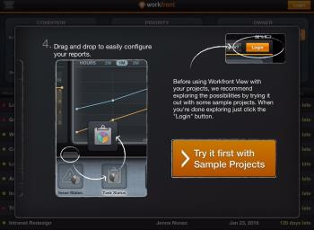

# Get started with *Adobe Workfront* View

You can keep track of the progress on your projects when you are on the go by using the *Adobe Workfront* View mobile app.

*Workfront* View is a reporting tool. You cannot make changes or complete work using the *Workfront* View app. You can only view the status of your projects. It is intended for Project or Portfolio Managers, and other project stakeholders to connect to a high level interface for monitoring their projects.

If you must complete work, you must use the *Workfront* mobile app which is available on iOS and Android phones.

## Supported devices and access levels

The *Workfront* View app is supported only for iPads.

You must have the following access in *Workfront* to access information in *Workfront* View and perform the steps in this article:

<table cellspacing="0"> 
 <col> 
 </col> 
 <col> 
 </col> 
 <tbody> 
  <tr> 
   <td role="rowheader"><em>Adobe Workfront</em> plan*</td> 
   <td> 
Any
 </td> 
  </tr> 
  <tr> 
   <td role="rowheader"><em>Adobe Workfront</em> license*</td> 
   <td> 
<em>Review</em> or higher
 </td> 
  </tr> 
 </tbody> 
</table>

Users with Requestor and External licenses cannot access *Workfront* using the *Workfront* View mobile app.

&#42;To find out what plan, license type, or access you have, contact your *Workfront administrator*.

## Download the *Workfront* View app

You must have an Apple Cloud account to be able to install applications on an iPad.

1. Go to the App Store on your iPad.
1. Search for `*Workfront* View`, then tap it when it appears on the list.
1. Tap the download from the cloud icon to install the app, then follow the steps to complete the installation.
1. Tap `Open` to open the app.

## Log in to *Workfront* View

<ol> 
 <li value="1">Go to the <em>Workfront</em> View app on your iPad. </li> 
 <li value="2">(Optional) Tap Try the demo to take a brief demo of the app. The demo shows sample projects, not the projects in your <em>Workfront</em> system. </li> 
 <li value="3">Specify your <em>Workfront</em> Username.</li> 
 <li value="4">Specify your <em>Workfront</em> Password.</li> 
 <li value="5">Specify the <em>Workfront</em> URL of your company. The URL should be in this format: yourCompanyDomain.my.workfront.com</li> 
 <li value="6">Tap LOG IN.</li> 
</ol>

