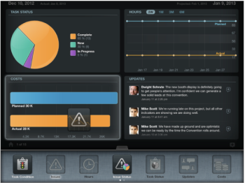

# Update widgets in the Project Details view

You can view additional information about the project after you have accessed it from the project list by adding widgets to your Project Details screen. Each user can customize their own widgets.

## Access requirements

You must have the following access in Workfront to perform the steps in this article:

<table cellspacing="0"> 
 <col> 
 </col> 
 <col> 
 </col> 
 <tbody> 
  <tr> 
   <td role="rowheader">Adobe Workfront plan*</td> 
   <td> 
Any
 </td> 
  </tr> 
  <tr> 
   <td role="rowheader">Adobe Workfront license*</td> 
   <td> 
Review or higher
 </td> 
  </tr> 
 </tbody> 
</table>

&#42;To find out what plan, license type, or access you have, contact your Workfront administrator.

## Update the widgets in the Project Details view

<ol> 
 <li value="1">From the Adobe Workfront View home page, navigate to a project by tapping its name.</li> 
 <li value="2">Tap the tab at the bottom in the middle of the screen. The widget area displays. Scroll through the widgets by swiping left to right. </li> 
 <li value="3">Drag and drop a widget to customize the layout of your project page. You can have up to four widgets display at one time. You can rearrange the widgets by dragging them and dropping them to another location. The widget arrangement is saved when you navigate between projects.</li> 
 <li value="4">Select from the following widgets:
  <ul>
   <li>Task Condition: Displays all the tasks in the project by Condition in a pie chart.</li>
   <li>Issues: Displays the timeline of all issues in a line chart. The number of open issues is indicated in parentheses.</li>
   <li>Hours: Displays the Actual and Planned Hours on the tasks of the project in a combined line chart.</li>
   <li>Issue Status: Displays all issues by Status in a pie chart.</li>
   <li>Updates: Displays all updates and comments on the project.</li>
   <li>Costs: Displays the Actual and the Planned Cost of the project in a combined bar chart.</li>
   <li>Revenue: Displays the Actual and the Planned Revenue of the project in a combined bar chart.</li>
   <li>Task Progress: Displays all the tasks in the project by Progress Status in a pie chart.</li>
   <li>
Upcoming Tasks: Displays up to 6 upcoming tasks.&nbsp;The widget sorts the project tasks in the following order:

    <ul>
     <li>first, by the Estimated Due Date</li>
     <li>
secondly, by Work Breakdown Structure
</li>
    </ul>
It displays the last two complete tasks (if applicable) and next 4 tasks. To understand what tasks will be displayed in the Workfront View mobile app, you can build a task report for the project you are viewing and sort it by the Estimated Due Date and then by the Workfront Breakdown Structure. The first 6 tasks will be the tasks listed in the Workfront View mobile app in the Upcoming Tasks widget.
</li>
   <li>Remaining Tasks: Displays the incomplete tasks in a line chart.</li>
   <li>Documents: Displays a list of documents attached to the project. You can open the following document formats with Workfront View:
    <ul>
     <li>all text files</li>
     <li>.pdf</li>
     <li>image files (.jpg, .jpeg, .png, etc)</li>
     <li>.xls&nbsp;</li>
    </ul></li>
   <li>Details: Displays the following details about the project: 
    <ul>
     <li>Project Name</li>
     <li>Name of the creator of the project</li>
     <li>Project Status</li>
     <li>Project Group</li>
     <li>Project Schedule</li>
    </ul></li>
   <li>Team: Displays the names of the users who are on the Project Team. For more information about project teams, see <a href="../../../manage-work/projects/planning-a-project/project-team-overview.md" class="MCXref xref">Project Team overview</a>.</li>
  </ul></li> 
</ol>

