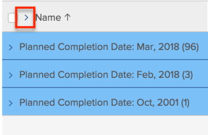
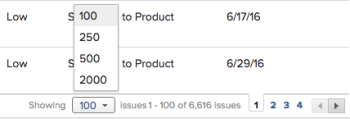

# Modify how a list displays

In *Adobe Workfront*, you can customize how a list displays for you. Other users who view the list do not see your changes.

You can make the following customizations:

* The number of items that display
* Column width or order
* Whether groupings are expanded or collapsed

>[!NOTE]
>
>The above display changes you make are reverted when you log out of *Workfront* or close your browser. These changes might also be reverted after a period of 8 hours.

In addition to the temporary customizations above, you can also adjust which columns the list sorts by, which *Workfront* retains even after you log out or close your browser. However, if someone edits the sorting options in a list's view, the previous sorting selection is not retained.

For information on modifying the information that displays in your list, see [Reporting elements: filters, views, and groupings](../../../reports-and-dashboards/reports/reporting-elements/reporting-elements-filters-views-groupings.md).

## Access requirements

You must have the following access to perform the steps in this article:

<table cellspacing="0"> 
 <col> 
 <col> 
 <tbody> 
  <tr> 
   <td role="rowheader"><em>Adobe Workfront</em> plan*</td> 
   <td> 
Any
 </td> 
  </tr> 
  <tr> 
   <td role="rowheader"><em>Adobe Workfront</em> license*</td> 
   <td> 
<em>Request</em> or higher
 </td> 
  </tr> 
  <tr> 
   <td role="rowheader">Access level configurations*</td> 
   <td> 
View access to the area the list is in
 
For example, to modify the view on a project, you need View access to Projects.
 
Note: If you still don't have access, ask your <em>Workfront administrator</em> if they set additional restrictions in your access level. For information on how a <em>Workfront administrator</em> can change your access level, see <a href="../../../administration-and-setup/add-users/configure-and-grant-access/create-modify-access-levels.md" class="MCXref xref">Create or modify custom access levels</a>.
 </td> 
  </tr> 
  <tr> 
   <td role="rowheader">Object permissions</td> 
   <td> 
View or higher permissions to the view applied to the list
 
For information on requesting additional access, see <a href="../../../workfront-basics/grant-and-request-access-to-objects/request-access.md" class="MCXref xref">Request access to objects in Adobe Workfront</a>.
 </td> 
  </tr> 
 </tbody> 
</table>

&#42;To find out what plan, license type, or access you have, contact your *Workfront administrator*.

## Modify how a list displays

<ol> 
 <li value="1"> 
Go to the list in <em>Workfront</em> that you want to modify.
 <draft-comment>
   
 <draft-comment>
     <MadCap:conditionalText data-mc-conditions="QuicksilverOrClassic.Draft mode">
      By default, groupings are collapsed.
     </MadCap:conditionalText>
    </draft-comment><MadCap:conditionalText data-mc-conditions="QuicksilverOrClassic.Draft mode">
     By default, groupings are collapsed.
    </MadCap:conditionalText>   

  </draft-comment>
 <MadCap:conditionalText data-mc-conditions="QuicksilverOrClassic.Draft mode">
    By default, groupings are collapsed.
   </MadCap:conditionalText>   
 </li> 
 <li value="2"> 
(Optional and conditional) If the groupings in the list are collapsed and you want to view more information, click the desired grouping to expand the list and display the information listed in it.
 
Or
 
To expand all groupings, click the arrow to the right of the check box in the column header.
 
  
 </li> 
 <li value="3"> 
(Optional and conditional) If you want to show a specific number of items on the screen, click the Showing drop-down menu in the lower-right corner of the screen, then select to display 100, 250, 500, All, or 2000 items.
 
  
 
  
Tip: </b>">
   <b>Tip: </b> 
   
By default, 2,000 items display for updated lists and 100 items display for legacy lists. If the list contains more than 2,000 items, you cannot display all the items on one page.
 
   
For the best performance in large lists where objects contain formatted text fields, we recommend limiting this number to 250.
 
   
For more information on the 2 list types, see the section <a href="../../../workfront-basics/navigate-workfront/use-lists/view-items-in-a-list.md#updated" class="MCXref xref">The difference between the updated and the legacy lists</a> in the article <a href="../../../workfront-basics/navigate-workfront/use-lists/view-items-in-a-list.md" class="MCXref xref">Get started with lists in&nbsp;Adobe Workfront</a>.
 
  
 
The results of your list are paginated to show the selected number of items per page. You can access the results on other pages by clicking the backward and forward arrows or selecting a specific page.
 </li> 
 <li value="4"> 
To resize a column's width, mouse over the line that separates 2 columns, then click to drag it to the desired width.
 
The column is resized until you clear your cache on the browser or until you manually resize it again.
 </li> 
 <li value="5"> 
To reorder the columns in a list, mouse over a column header to display the hand tool, then click to drag the column to where you want it to display.
 
The position of the column is saved until you refresh your page. For more information about customizing the width and the order of columns in a list, see the article <a href="../../../reports-and-dashboards/reports/reporting-elements/modify-column-width-order.md" class="MCXref xref">Modify column width and order</a>.
 </li> 
 <li value="6"> 
To adjust the sorting order of a list, click a column header to select it, then press and hold the CMD key (on Mac) or the CTRL key (on Windows) on your keyboard and select up to 2 additional column headers to sort by them.
 
The list is sorted by each of the selected columns in the order of your selection.
 
All modifications you make to the list save instantly.
 <note type="note">
   If you are sorting groups in the Groups area in Setup, the hierarchy view of groups and their subgroups does not break up when you change the way the list is sorted—subgroups stay with their parent groups. The list is sorted by top-level groups first. Then, under each parent group, the list of subgroups that are on the same level are sorted together. 
  </note> </li> 
</ol>

