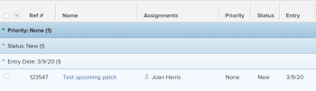
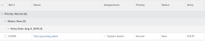

# Get started with lists in  *`Adobe Workfront`* {#get-started-with-lists-in-adobe-workfront}

Objects can be displayed in lists in *`Adobe Workfront`*. A list is a grid that contains a number of objects, information about them, or other objects referenced from them.

The following are some characteristics of lists in *`Workfront`*:

*  Lists are object specific: one list can reference only one type of object. Other objects that are directly connected to the object of the list can also be referenced in the same list.

  For example, a list of tasks includes task information like Assignments, Start and Due Date, but it can also include project information like Project Name or the name of the Project Owner.

*  Lists refresh automatically every 5 minutes to update information that other users in the system are updating elsewhere.
*  Some areas in *`Workfront`* are preconfigured with default lists of objects.

  You can customize most of these preconfigured lists.

*  A *`Workfront administrator`* can create custom lists to apply to various areas of *`Workfront`*.

  For more information about creating system-level lists, see the article [Create, edit, and share default filters, views, and groupings](create-and-share-default-fvgs.md).

Below are some types of object lists that you can find in *`Workfront`* and some of the areas where they display by default when you have rights to view an object.

>[!NOTE]
>
>This list is not comprehensive. Each of these object lists can also appear on a report or a dashboard.  
>For example, a Project report or a dashboard that contains a Project report also displays a list of projects.

<table style="width: 100%;mc-table-style: url('../../../Resources/TableStyles/TableStyle-HeaderRow.css');margin-left: 0;margin-right: auto;" class="TableStyle-TableStyle-HeaderRow" cellspacing="15"> 
 <col class="TableStyle-TableStyle-HeaderRow-Column-Column1"> 
 <col class="TableStyle-TableStyle-HeaderRow-Column-Column1"> 
 <thead> 
  <tr class="TableStyle-TableStyle-HeaderRow-Head-Header1"> 
   <th class="TableStyle-TableStyle-HeaderRow-HeadE-Column1-Header1">Workfront list</th> 
   <th class="TableStyle-TableStyle-HeaderRow-HeadD-Column1-Header1">Location of object list</th> 
  </tr> 
 </thead> 
 <tbody> 
  <tr class="TableStyle-TableStyle-HeaderRow-Body-LightGray"> 
   <td class="TableStyle-TableStyle-HeaderRow-BodyE-Column1-LightGray">List of portfolios</td> 
   <td class="TableStyle-TableStyle-HeaderRow-BodyD-Column1-LightGray"> 
    <ul> 
     <li> 
Portfolios
 </li> 
    </ul> </td> 
  </tr> 
  <tr class="TableStyle-TableStyle-HeaderRow-Body-MediumGray"> 
   <td class="TableStyle-TableStyle-HeaderRow-BodyE-Column1-MediumGray">List of programs</td> 
   <td class="TableStyle-TableStyle-HeaderRow-BodyD-Column1-MediumGray"> 
    <ul> 
     <li> 
Portfolios &gt; select a portfolio &gt; Programs
 </li> 
     <li data-mc-conditions="QuicksilverOrClassic.Quicksilver"> 
Programs
 </li> 
    </ul> </td> 
  </tr> 
  <tr class="TableStyle-TableStyle-HeaderRow-Body-LightGray"> 
   <td class="TableStyle-TableStyle-HeaderRow-BodyE-Column1-LightGray">List of projects</td> 
   <td class="TableStyle-TableStyle-HeaderRow-BodyD-Column1-LightGray"> 
    <ul> 
     <li> 
Projects
 </li> 
     <li> 
Portfolios &gt; select a portfolio &gt; Projects
 </li> 
     <li> 
Portfolios &gt; select a portfolio &gt; Programs &gt; select a program &gt; Projects
 </li> 
    </ul> </td> 
  </tr> 
  <tr class="TableStyle-TableStyle-HeaderRow-Body-MediumGray"> 
   <td class="TableStyle-TableStyle-HeaderRow-BodyE-Column1-MediumGray">List of tasks</td> 
   <td class="TableStyle-TableStyle-HeaderRow-BodyD-Column1-MediumGray"> 
    <ul> 
     <li> 
Projects &gt; select a project &gt;&nbsp;Tasks
 </li> 
     <li> 
Projects &gt; select a project &gt; Tasks &gt; select a task &gt; Subtasks
 </li> 
     <li> 
Projects &gt; select a project &gt; Tasks &gt; select a task &gt;&nbsp;Predecessors*
 </li> 
    </ul> </td> 
  </tr> 
  <tr class="TableStyle-TableStyle-HeaderRow-Body-LightGray"> 
   <td class="TableStyle-TableStyle-HeaderRow-BodyE-Column1-LightGray">List of issues</td> 
   <td class="TableStyle-TableStyle-HeaderRow-BodyD-Column1-LightGray"> 
    <ul> 
     <li> 
Projects &gt;&nbsp;select a project &gt; Issues
 </li> 
     <li> 
Projects &gt; select a project &gt; Tasks &gt; select a task &gt;&nbsp;Issues
 </li> 
     <li> 
Projects &gt; select a project &gt; Tasks &gt; select a task &gt; Subtasks &gt; select a task &gt;&nbsp;Issues
 </li> 
    </ul> </td> 
  </tr> 
  <tr class="TableStyle-TableStyle-HeaderRow-Body-MediumGray"> 
   <td class="TableStyle-TableStyle-HeaderRow-BodyE-Column1-MediumGray">List of reports</td> 
   <td class="TableStyle-TableStyle-HeaderRow-BodyD-Column1-MediumGray"> 
    <ul> 
     <li> 
 <MadCap:conditionalText data-mc-conditions="QuicksilverOrClassic.Quicksilver">
        Reports
       </MadCap:conditionalText> 
 </li> 
    </ul> </td> 
  </tr> 
  <tr class="TableStyle-TableStyle-HeaderRow-Body-LightGray"> 
   <td class="TableStyle-TableStyle-HeaderRow-BodyE-Column1-LightGray">List of dashboards</td> 
   <td class="TableStyle-TableStyle-HeaderRow-BodyD-Column1-LightGray"> 
    <ul> 
     <li> 
Dashboards
 </li> 
    </ul> </td> 
  </tr> 
  <tr class="TableStyle-TableStyle-HeaderRow-Body-MediumGray"> 
   <td class="TableStyle-TableStyle-HeaderRow-BodyE-Column1-MediumGray">List of iterations</td> 
   <td class="TableStyle-TableStyle-HeaderRow-BodyD-Column1-MediumGray"> 
    <ul> 
     <li> 
Teams &gt;&nbsp;Iterations
 </li> 
    </ul> </td> 
  </tr> 
  <tr class="TableStyle-TableStyle-HeaderRow-Body-LightGray"> 
   <td class="TableStyle-TableStyle-HeaderRow-BodyE-Column1-LightGray">List of users</td> 
   <td class="TableStyle-TableStyle-HeaderRow-BodyD-Column1-LightGray"> 
    <ul> 
     <li> 
Users
 </li> 
    </ul> </td> 
  </tr> 
  <tr class="TableStyle-TableStyle-HeaderRow-Body-MediumGray"> 
   <td class="TableStyle-TableStyle-HeaderRow-BodyE-Column1-MediumGray">List of documents</td> 
   <td class="TableStyle-TableStyle-HeaderRow-BodyD-Column1-MediumGray"> 
    <ul> 
     <li> 
Documents
 </li> 
     <li> 
Portfolios &gt; select a portfolio &gt;&nbsp;Documents
 </li> 
     <li> 
Portfolios &gt;&nbsp;select a portfolio &gt; Programs &gt; select a program &gt; Documents
 </li> 
     <li> 
Projects &gt; select a project &gt; Documents
 </li> 
     <li> 
Projects &gt; select a project &gt; Tasks &gt; select a task &gt;&nbsp;Documents
 </li> 
     <li> 
Projects &gt;&nbsp;select a project &gt;&nbsp;Issues &gt; select an issue &gt;&nbsp;Documents
 </li> 
    </ul> </td> 
  </tr> 
  <tr class="TableStyle-TableStyle-HeaderRow-Body-LightGray"> 
   <td class="TableStyle-TableStyle-HeaderRow-BodyE-Column1-LightGray">List of timesheets</td> 
   <td class="TableStyle-TableStyle-HeaderRow-BodyD-Column1-LightGray"> 
    <ul> 
     <li> 
Timesheet<MadCap:conditionalText data-mc-conditions="QuicksilverOrClassic.Quicksilver">
        s
       </MadCap:conditionalText> &gt;&nbsp;All Timesheets*
 </li> 
    </ul> </td> 
  </tr> 
  <tr class="TableStyle-TableStyle-HeaderRow-Body-MediumGray"> 
   <td class="TableStyle-TableStyle-HeaderRow-BodyE-Column1-MediumGray">List of billing rates</td> 
   <td class="TableStyle-TableStyle-HeaderRow-BodyD-Column1-MediumGray"> 
    <ul> 
     <li> 
Projects &gt; select a project &gt; Billing Rates*
 </li> 
    </ul> </td> 
  </tr> 
  <tr class="TableStyle-TableStyle-HeaderRow-Body-LightGray"> 
   <td class="TableStyle-TableStyle-HeaderRow-BodyE-Column1-LightGray">List of billing records</td> 
   <td class="TableStyle-TableStyle-HeaderRow-BodyD-Column1-LightGray"> 
    <ul> 
     <li> 
Projects &gt;&nbsp;select a project &gt;&nbsp;Billing Records
 </li> 
    </ul> </td> 
  </tr> 
  <tr class="TableStyle-TableStyle-HeaderRow-Body-MediumGray"> 
   <td class="TableStyle-TableStyle-HeaderRow-BodyE-Column1-MediumGray">List of risks</td> 
   <td class="TableStyle-TableStyle-HeaderRow-BodyD-Column1-MediumGray"> 
    <ul> 
     <li> 
Projects &gt; select a project &gt; Risks
 </li> 
    </ul> </td> 
  </tr> 
  <tr class="TableStyle-TableStyle-HeaderRow-Body-LightGray"> 
   <td class="TableStyle-TableStyle-HeaderRow-BodyE-Column1-LightGray">List of expenses</td> 
   <td class="TableStyle-TableStyle-HeaderRow-BodyD-Column1-LightGray"> 
    <ul> 
     <li> 
Projects &gt; select a project &gt; Expenses
 </li> 
     <li> 
Projects &gt;&nbsp;select a project &gt; Tasks &gt; select a task &gt; Expenses
 </li> 
    </ul> </td> 
  </tr> 
  <tr class="TableStyle-TableStyle-HeaderRow-Body-MediumGray"> 
   <td class="TableStyle-TableStyle-HeaderRow-BodyB-Column1-MediumGray">List of hour entries</td> 
   <td class="TableStyle-TableStyle-HeaderRow-BodyA-Column1-MediumGray"> 
    <ul> 
     <li> 
Projects &gt; select a project
 </li> 
     <li> 
Projects &gt; select a project &gt; Tasks &gt; select a task &gt; Hours
 </li> 
     <li> 
Projects &gt; select a project &gt; Issues &gt; select an issue &gt; Hours
 </li> 
    </ul> </td> 
  </tr> 
 </tbody> 
</table>

&#42;You cannot customize the list on the specified area. A *`Workfront administrator`* can build a customized list at the system level, or you can build a report for this object if your access level allows you have access to edit reports.

## List elements {#list-elements}

A list contains certain elements that define its format and the information that displays. You can find several system list elements that are available by default. You can also create custom elements to meet your needs.

>[!NOTE]
>
>When you select a new filter, view or grouping from a list, that selection is retained even if you log out of *`Workfront`* or close your browser.

The following are the elements of a list:

<table class="TableStyle-TableStyle-HeaderRow" style="mc-table-style: url('../../../Resources/TableStyles/TableStyle-HeaderRow.css');margin-left: 0;margin-right: auto;" cellspacing="15"> 
 <col class="TableStyle-TableStyle-HeaderRow-Column-Column1"> 
 <col class="TableStyle-TableStyle-HeaderRow-Column-Column1"> 
 <thead> 
  <tr class="TableStyle-TableStyle-HeaderRow-Head-Header1"> 
   <th class="TableStyle-TableStyle-HeaderRow-HeadE-Column1-Header1">Element</th> 
   <th class="TableStyle-TableStyle-HeaderRow-HeadD-Column1-Header1">Explanation</th> 
  </tr> 
 </thead> 
 <tbody> 
  <tr class="TableStyle-TableStyle-HeaderRow-Body-LightGray"> 
   <td class="TableStyle-TableStyle-HeaderRow-BodyE-Column1-LightGray">Filter </td> 
   <td class="TableStyle-TableStyle-HeaderRow-BodyD-Column1-LightGray"> 
Filters keep unnecessary information out of a list, based on the criteria that you specify. 
 
For more information, see <a href="filters-overview.md" class="MCXref xref">Filters overview in Adobe Workfront</a>.
 </td> 
  </tr> 
  <tr class="TableStyle-TableStyle-HeaderRow-Body-MediumGray"> 
   <td class="TableStyle-TableStyle-HeaderRow-BodyE-Column1-MediumGray">View </td> 
   <td class="TableStyle-TableStyle-HeaderRow-BodyD-Column1-MediumGray"> 
Views define which fields (columns) you display on the screen.
 
For more information, see <a href="views-overview.md" class="MCXref xref">Views overview in Adobe Workfront</a>.
 </td> 
  </tr> 
  <tr class="TableStyle-TableStyle-HeaderRow-Body-LightGray"> 
   <td class="TableStyle-TableStyle-HeaderRow-BodyB-Column1-LightGray">Grouping </td> 
   <td class="TableStyle-TableStyle-HeaderRow-BodyA-Column1-LightGray"> 
Groupings separate the objects on the list in areas based on the criteria that you specify.
 
For example, the issues in a list can display in sections by status or priority.
 
You can have up to 3 layers of groupings in a standard grouping, and you can add a 4th layer if you are configuring a grouping in text mode.
 
For more information about groupings, see <a href="groupings-overview.md" class="MCXref xref">Groupings overview in Adobe Workfront</a>.
 
For more information about text mode, see <a href="understand-text-mode.md" class="MCXref xref">Text Mode overview</a>.
 </td> 
  </tr> 
 </tbody> 
</table>

These elements display at the top of every list by default. They are sticky and do not move as you scroll through the list.`<MadCap:conditionalText data-mc-conditions="QuicksilverOrClassic.Quicksilver">  Mouse over the icon for each element to identify them.</MadCap:conditionalText>`

You can can customize list elements in the following areas and share them with other users:

*  Any system default list found in the section [Get started with lists in Adobe Workfront](#default-workfront-lists) in this article
*  Any report that is shared with you

The building elements for lists are the same as the building elements for reports.

For more information about creating and customizing the building elements of lists and reports, see [Reporting elements: filters, views, and groupings](reporting-elements-filters-views-groupings.md).

## The difference between the updated and the legacy lists {#the-difference-between-the-updated-and-the-legacy-lists}

There are 2 types of lists in *`Workfront`*:

*  Legacy lists

  

*  Updated lists

  

Both types of lists appear in  *`the new Adobe Workfront experience`*.

All lists and reports in *`the new Adobe Workfront experience`* are updated lists, except for the following:

* Lists in the Setup area
* Lists in the Reports area
* Documents lists

The following table shows some of the differences between the legacy and updated lists in *`Workfront`*:

<table style="width: 100%;mc-table-style: url('../../../Resources/TableStyles/TableStyle-HeaderRow.css');" class="TableStyle-TableStyle-HeaderRow" cellspacing="15"> 
 <col class="TableStyle-TableStyle-HeaderRow-Column-Column1"> 
 <col class="TableStyle-TableStyle-HeaderRow-Column-Column1"> 
 <tbody> 
  <tr class="TableStyle-TableStyle-HeaderRow-Body-LightGray"> 
   <td class="TableStyle-TableStyle-HeaderRow-BodyE-Column1-LightGray" style="font-weight: bold;">Legacy lists</td> 
   <td class="TableStyle-TableStyle-HeaderRow-BodyD-Column1-LightGray" style="font-weight: bold;">Updated lists</td> 
  </tr> 
  <tr class="TableStyle-TableStyle-HeaderRow-Body-MediumGray"> 
   <td class="TableStyle-TableStyle-HeaderRow-BodyE-Column1-MediumGray"> 
Legacy fonts, column headers, blue grouping color scheme
 </td> 
   <td class="TableStyle-TableStyle-HeaderRow-BodyD-Column1-MediumGray"> 
Updated fonts, column headers, gray grouping color scheme
 </td> 
  </tr> 
  <tr class="TableStyle-TableStyle-HeaderRow-Body-LightGray"> 
   <td class="TableStyle-TableStyle-HeaderRow-BodyE-Column1-LightGray"> 
Slower inline editing
 </td> 
   <td class="TableStyle-TableStyle-HeaderRow-BodyD-Column1-LightGray"> 
Faster inline editing
 </td> 
  </tr> 
  <tr class="TableStyle-TableStyle-HeaderRow-Body-MediumGray"> 
   <td class="TableStyle-TableStyle-HeaderRow-BodyE-Column1-MediumGray"> 
Display 100 items by default
 </td> 
   <td class="TableStyle-TableStyle-HeaderRow-BodyD-Column1-MediumGray"> 
Display All or up to 2000 items by default
 </td> 
  </tr> 
  <tr class="TableStyle-TableStyle-HeaderRow-Body-LightGray"> 
   <td class="TableStyle-TableStyle-HeaderRow-BodyE-Column1-LightGray"> 
Use CTRL+F to find items in a list
 </td> 
   <td class="TableStyle-TableStyle-HeaderRow-BodyD-Column1-LightGray"> 
Use quick filters to quickly find information in a large list
 
For information about using quick filters in lists, see <a href="apply-quick-filter-list.md" class="MCXref xref">Apply the quick filter to a list</a>.
 </td> 
  </tr> 
  <tr class="TableStyle-TableStyle-HeaderRow-Body-MediumGray"> 
   <td class="TableStyle-TableStyle-HeaderRow-BodyE-Column1-MediumGray">You can't inline edit custom fields with rich text formatting.</td> 
   <td class="TableStyle-TableStyle-HeaderRow-BodyD-Column1-MediumGray"> 
Text in custom fields with formatting can be configured to allow bold, italics, underline, bullets, numbering, hyperlinks, and block quotes.
 
For more information, see <a href="create-or-edit-a-custom-form.md" class="MCXref xref">Create or edit a custom form</a>.
 </td> 
  </tr> 
  <tr class="TableStyle-TableStyle-HeaderRow-Body-LightGray"> 
   <td class="TableStyle-TableStyle-HeaderRow-BodyB-Column1-LightGray">Conditional formatting can change the text color of links in a list</td> 
   <td class="TableStyle-TableStyle-HeaderRow-BodyA-Column1-LightGray">Cannot apply text color changes to links in a list</td> 
  </tr> 
 </tbody> 
</table>

## The difference between lists and reports {#the-difference-between-lists-and-reports}

Both lists and reports are grids that contain information about a type of object.

The following table outlines the similarities and differences between lists and reports:

<table style="mc-table-style: url('../../../Resources/TableStyles/TableStyle-HeaderRow.css');margin-left: 0;margin-right: auto;width: 100%;" class="TableStyle-TableStyle-HeaderRow" cellspacing="15"> 
 <col class="TableStyle-TableStyle-HeaderRow-Column-Column1"> 
 <col class="TableStyle-TableStyle-HeaderRow-Column-Column1"> 
 <col class="TableStyle-TableStyle-HeaderRow-Column-Column1"> 
 <thead> 
  <tr class="TableStyle-TableStyle-HeaderRow-Head-Header1"> 
   <th class="TableStyle-TableStyle-HeaderRow-HeadE-Column1-Header1">Functionality </th> 
   <th class="TableStyle-TableStyle-HeaderRow-HeadE-Column1-Header1">List </th> 
   <th class="TableStyle-TableStyle-HeaderRow-HeadD-Column1-Header1">Report </th> 
  </tr> 
 </thead> 
 <tbody> 
  <tr class="TableStyle-TableStyle-HeaderRow-Body-LightGray"> 
   <td class="TableStyle-TableStyle-HeaderRow-BodyE-Column1-LightGray"> 
Anyone can create them
 </td> 
   <td class="TableStyle-TableStyle-HeaderRow-BodyE-Column1-LightGray" style="text-align: center;">✓* </td> 
   <td class="TableStyle-TableStyle-HeaderRow-BodyD-Column1-LightGray" style="text-align: center;"> </td> 
  </tr> 
  <tr class="TableStyle-TableStyle-HeaderRow-Body-MediumGray"> 
   <td class="TableStyle-TableStyle-HeaderRow-BodyE-Column1-MediumGray"> 
Only a Workfront administrator and users with a Plan license can create them
 </td> 
   <td class="TableStyle-TableStyle-HeaderRow-BodyE-Column1-MediumGray" style="text-align: center;"> </td> 
   <td class="TableStyle-TableStyle-HeaderRow-BodyD-Column1-MediumGray" style="text-align: center;">✓**</td> 
  </tr> 
  <tr class="TableStyle-TableStyle-HeaderRow-Body-LightGray"> 
   <td class="TableStyle-TableStyle-HeaderRow-BodyE-Column1-LightGray"> 
A default set is available from Workfront
 </td> 
   <td class="TableStyle-TableStyle-HeaderRow-BodyE-Column1-LightGray" style="text-align: center;">✓</td> 
   <td class="TableStyle-TableStyle-HeaderRow-BodyD-Column1-LightGray" style="text-align: center;">✓</td> 
  </tr> 
  <tr class="TableStyle-TableStyle-HeaderRow-Body-MediumGray"> 
   <td class="TableStyle-TableStyle-HeaderRow-BodyE-Column1-MediumGray"> 
Customizable in standard mode
 </td> 
   <td class="TableStyle-TableStyle-HeaderRow-BodyE-Column1-MediumGray" style="text-align: center;">✓</td> 
   <td class="TableStyle-TableStyle-HeaderRow-BodyD-Column1-MediumGray" style="text-align: center;">✓</td> 
  </tr> 
  <tr class="TableStyle-TableStyle-HeaderRow-Body-LightGray"> 
   <td class="TableStyle-TableStyle-HeaderRow-BodyE-Column1-LightGray"> 
Customizable in text mode
 </td> 
   <td class="TableStyle-TableStyle-HeaderRow-BodyE-Column1-LightGray" style="text-align: center;">✓</td> 
   <td class="TableStyle-TableStyle-HeaderRow-BodyD-Column1-LightGray" style="text-align: center;">✓</td> 
  </tr> 
  <tr class="TableStyle-TableStyle-HeaderRow-Body-MediumGray"> 
   <td class="TableStyle-TableStyle-HeaderRow-BodyE-Column1-MediumGray"> 
You can share them with other users
 </td> 
   <td class="TableStyle-TableStyle-HeaderRow-BodyE-Column1-MediumGray" style="text-align: center;">✓</td> 
   <td class="TableStyle-TableStyle-HeaderRow-BodyD-Column1-MediumGray" style="text-align: center;">✓</td> 
  </tr> 
  <tr class="TableStyle-TableStyle-HeaderRow-Body-LightGray"> 
   <td class="TableStyle-TableStyle-HeaderRow-BodyE-Column1-LightGray"> 
You can share them system wide
 </td> 
   <td class="TableStyle-TableStyle-HeaderRow-BodyE-Column1-LightGray" style="text-align: center;">✓</td> 
   <td class="TableStyle-TableStyle-HeaderRow-BodyD-Column1-LightGray" style="text-align: center;"> ✓ </td> 
  </tr> 
  <tr class="TableStyle-TableStyle-HeaderRow-Body-MediumGray"> 
   <td class="TableStyle-TableStyle-HeaderRow-BodyE-Column1-MediumGray"> 
You can share them outside of the system
 </td> 
   <td class="TableStyle-TableStyle-HeaderRow-BodyE-Column1-MediumGray" style="text-align: center;"> </td> 
   <td class="TableStyle-TableStyle-HeaderRow-BodyD-Column1-MediumGray" style="text-align: center;">✓ </td> 
  </tr> 
  <tr class="TableStyle-TableStyle-HeaderRow-Body-LightGray"> 
   <td class="TableStyle-TableStyle-HeaderRow-BodyE-Column1-LightGray"> 
You can export to .pdf, Excel, and Tab Delimited formats
 </td> 
   <td class="TableStyle-TableStyle-HeaderRow-BodyE-Column1-LightGray" style="text-align: center;">✓</td> 
   <td class="TableStyle-TableStyle-HeaderRow-BodyD-Column1-LightGray" style="text-align: center;"> ✓ </td> 
  </tr> 
  <tr class="TableStyle-TableStyle-HeaderRow-Body-MediumGray"> 
   <td class="TableStyle-TableStyle-HeaderRow-BodyE-Column1-MediumGray"> 
You can schedule them for delivery in an email
 </td> 
   <td class="TableStyle-TableStyle-HeaderRow-BodyE-Column1-MediumGray" style="text-align: center;"> </td> 
   <td class="TableStyle-TableStyle-HeaderRow-BodyD-Column1-MediumGray" style="text-align: center;">✓ </td> 
  </tr> 
  <tr class="TableStyle-TableStyle-HeaderRow-Body-LightGray"> 
   <td class="TableStyle-TableStyle-HeaderRow-BodyE-Column1-LightGray"> 
You can add to a Layout Template
 </td> 
   <td class="TableStyle-TableStyle-HeaderRow-BodyE-Column1-LightGray" style="text-align: center;">✓</td> 
   <td class="TableStyle-TableStyle-HeaderRow-BodyD-Column1-LightGray" style="text-align: center;"> </td> 
  </tr> 
  <tr class="TableStyle-TableStyle-HeaderRow-Body-MediumGray"> 
   <td class="TableStyle-TableStyle-HeaderRow-BodyE-Column1-MediumGray"> 
You can add them to custom <MadCap:conditionalText data-mc-conditions="QuicksilverOrClassic.Quicksilver">
      sections
     </MadCap:conditionalText>
 </td> 
   <td class="TableStyle-TableStyle-HeaderRow-BodyE-Column1-MediumGray" style="text-align: center;"> </td> 
   <td class="TableStyle-TableStyle-HeaderRow-BodyD-Column1-MediumGray" style="text-align: center;">✓</td> 
  </tr> 
  <tr class="TableStyle-TableStyle-HeaderRow-Body-LightGray"> 
   <td class="TableStyle-TableStyle-HeaderRow-BodyE-Column1-LightGray"> 
You can add them to a dashboard
 </td> 
   <td class="TableStyle-TableStyle-HeaderRow-BodyE-Column1-LightGray" style="text-align: center;"> ✓*** </td> 
   <td class="TableStyle-TableStyle-HeaderRow-BodyD-Column1-LightGray" style="text-align: center;">✓</td> 
  </tr> 
  <tr class="TableStyle-TableStyle-HeaderRow-Body-MediumGray"> 
   <td class="TableStyle-TableStyle-HeaderRow-BodyE-Column1-MediumGray"> 
You can use prompts to customize what they display
 </td> 
   <td class="TableStyle-TableStyle-HeaderRow-BodyE-Column1-MediumGray" style="text-align: center;"> </td> 
   <td class="TableStyle-TableStyle-HeaderRow-BodyD-Column1-MediumGray" style="text-align: center;">✓</td> 
  </tr> 
  <tr class="TableStyle-TableStyle-HeaderRow-Body-LightGray"> 
   <td class="TableStyle-TableStyle-HeaderRow-BodyE-Column1-LightGray"> 
You can display them in a chart
 </td> 
   <td class="TableStyle-TableStyle-HeaderRow-BodyE-Column1-LightGray" style="text-align: center;"> </td> 
   <td class="TableStyle-TableStyle-HeaderRow-BodyD-Column1-LightGray" style="text-align: center;">✓</td> 
  </tr> 
  <tr class="TableStyle-TableStyle-HeaderRow-Body-MediumGray"> 
   <td class="TableStyle-TableStyle-HeaderRow-BodyB-Column1-MediumGray"> 
You can inline edit objects in them
 </td> 
   <td class="TableStyle-TableStyle-HeaderRow-BodyB-Column1-MediumGray" style="text-align: center;">✓</td> 
   <td class="TableStyle-TableStyle-HeaderRow-BodyA-Column1-MediumGray" style="text-align: center;">✓</td> 
  </tr> 
 </tbody> 
</table>

&#42; You must have access to Filters, Views, and Groupings to be able to create them. For more information, see [Grant access to filters, views, and groupings](grant-access-fvg.md).

&#42;&#42; You must have access to Filters, View, and Groupings as well as Reports, Dashboards, and Calendars to be able to create them. For more information, see [Grant access to reports, dashboards, and calendars](grant-access-reports-dashboards-calendars.md).

&#42;&#42;&#42; You can customize lists for reports that are placed on a dashboard only if the creator of the report has configured the list elements to be visible on the dashboard.

>[!NOTE]
>
>You cannot add a list to a dashboard without creating a report and adding it to the dashboard first.

For more information about building a report, see [Create a custom report](create-custom-report.md). For information about creating custom `<MadCap:conditionalText data-mc-conditions="QuicksilverOrClassic.Quicksilver"> sections</MadCap:conditionalText>`, see [Create custom tabs or sections](create-custom-tabs.md).

## List actions {#list-actions}

You can complete the following actions in a list:

<table class="TableStyle-TableStyle-HeaderRow" style="mc-table-style: url('../../../Resources/TableStyles/TableStyle-HeaderRow.css');margin-left: 0;margin-right: auto;" cellspacing="15"> 
 <col class="TableStyle-TableStyle-HeaderRow-Column-Column1"> 
 <col class="TableStyle-TableStyle-HeaderRow-Column-Column1"> 
 <thead> 
  <tr class="TableStyle-TableStyle-HeaderRow-Head-Header1"> 
   <th class="TableStyle-TableStyle-HeaderRow-HeadE-Column1-Header1">Action</th> 
   <th class="TableStyle-TableStyle-HeaderRow-HeadD-Column1-Header1">Information</th> 
  </tr> 
 </thead> 
 <tbody> 
  <tr class="TableStyle-TableStyle-HeaderRow-Body-LightGray"> 
   <td class="TableStyle-TableStyle-HeaderRow-BodyE-Column1-LightGray">Inline edit </td> 
   <td class="TableStyle-TableStyle-HeaderRow-BodyD-Column1-LightGray"> 
Edit objects and their information directly in the list.
 
For more information, see <a href="inline-edit-objects.md" class="MCXref xref">Inline edit items in a list in&nbsp;Adobe Workfront</a>.
 </td> 
  </tr> 
  <tr class="TableStyle-TableStyle-HeaderRow-Body-MediumGray" data-mc-conditions="QuicksilverOrClassic.Quicksilver"> 
   <td class="TableStyle-TableStyle-HeaderRow-BodyE-Column1-MediumGray">Update with the Summary </td> 
   <td class="TableStyle-TableStyle-HeaderRow-BodyD-Column1-MediumGray"> 
Update tasks and issues at the project level using the Summary panel.
 
Tip: The Summary is not available for all objects and it is not available in Task or Issue reports.
 
For more information, see <a href="summary-overview.md" class="MCXref xref">Summary overview in the new Adobe Workfront experience</a>.
 </td> 
  </tr> 
  <tr class="TableStyle-TableStyle-HeaderRow-Body-LightGray"> 
   <td class="TableStyle-TableStyle-HeaderRow-BodyE-Column1-LightGray">Customize list display </td> 
   <td class="TableStyle-TableStyle-HeaderRow-BodyD-Column1-LightGray"> 
Customize the look and feel of a list, column arrangement, sorting order of items, or number of items that display.
 
Note: Changes you make to the number of items to display on a page are reverted when you log out of Workfront or close your browser. Changes might also be reverted after a period of 8 hours.
 
For more information, see <a href="modify-list-display.md" class="MCXref xref">Modify how a list displays</a>.
 </td> 
  </tr> 
  <tr class="TableStyle-TableStyle-HeaderRow-Body-MediumGray"> 
   <td class="TableStyle-TableStyle-HeaderRow-BodyE-Column1-MediumGray">Quick filter </td> 
   <td class="TableStyle-TableStyle-HeaderRow-BodyD-Column1-MediumGray"> 
Apply a quick filter to find only items that are important to you so that you can quickly review, update, or share them with others.
 
Important:  You can find items that contain a search word using the quick filter, whether that item is visible on your screen or will display after you scroll to the bottom of the page. When you use your browser's search capabilities, you can find only items that are already visible on the screen. If your list has multiple pages, quick filters find only the items on the current page.
 
For more information, see <a href="apply-quick-filter-list.md" class="MCXref xref">Apply the quick filter to a list</a>.
 </td> 
  </tr> 
  <tr class="TableStyle-TableStyle-HeaderRow-Body-LightGray"> 
   <td class="TableStyle-TableStyle-HeaderRow-BodyB-Column1-LightGray">Export </td> 
   <td class="TableStyle-TableStyle-HeaderRow-BodyA-Column1-LightGray"> 
Export a list of objects from Workfront. When a list contains more than 2000 items, exporting the list is the only way to review all of the items on one page.
 
For more information about exporting a list, see <a href="export-lists.md" class="MCXref xref">Export a list</a>. For more information about export formats and limits, see <a href="export-data.md" class="MCXref xref">Export data</a>.
 </td> 
  </tr> 
 </tbody> 
</table>

