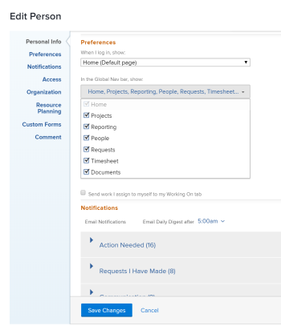

# Customize the `<MadCap:conditionalText data-mc-conditions="QuicksilverOrClassic.Quicksilver"> Main Menu</MadCap:conditionalText>` in *`Adobe Workfront`* {#customize-the-main-menu-in-adobe-workfront}

The `<MadCap:conditionalText data-mc-conditions="QuicksilverOrClassic.Quicksilver"> Main Menu</MadCap:conditionalText>` changes with the access level you have been assigned by your *`Adobe Workfront administrator`*. By default, you are given access only to the areas of the `<MadCap:conditionalText data-mc-conditions="QuicksilverOrClassic.Quicksilver"> Main Menu</MadCap:conditionalText>` that include functionality allowed by your access level. To understand the components of the default layout of each access level, see [About the default Adobe Workfront layout](about-the default-wf-layout.md).

You can customize the `<MadCap:conditionalText data-mc-conditions="QuicksilverOrClassic.Quicksilver"> Main Menu</MadCap:conditionalText>` to better fit your needs and your workflow.

## Access requirements {#access-requirements}

You must have the following access to perform the steps in this article:

<table style="width: 100%;margin-left: 0;margin-right: auto;mc-table-style: url('../../../Resources/TableStyles/TableStyle-List-options-in-steps.css');" class="TableStyle-TableStyle-List-options-in-steps" cellspacing="0"> 
 <col class="TableStyle-TableStyle-List-options-in-steps-Column-Column1"> 
 </col> 
 <col class="TableStyle-TableStyle-List-options-in-steps-Column-Column2"> 
 </col> 
 <tbody> 
  <tr class="TableStyle-TableStyle-List-options-in-steps-Body-LightGray"> 
   <td class="TableStyle-TableStyle-List-options-in-steps-BodyE-Column1-LightGray" role="rowheader">Adobe Workfront plan*</td> 
   <td class="TableStyle-TableStyle-List-options-in-steps-BodyD-Column2-LightGray"> 
Any
 </td> 
  </tr> 
  <tr class="TableStyle-TableStyle-List-options-in-steps-Body-MediumGray"> 
   <td class="TableStyle-TableStyle-List-options-in-steps-BodyB-Column1-MediumGray" role="rowheader">Adobe Workfront license*</td> 
   <td class="TableStyle-TableStyle-List-options-in-steps-BodyA-Column2-MediumGray"> 
Review or higher
 
Note: Users with a Request license can access their profiles and see the Global Nav Bar field, but the only option is Requests and it cannot be removed.
 </td> 
  </tr> 
 </tbody> 
</table>

&#42;To find out what plan or license type you have, contact your *`Workfront administrator`*.

## Customize the `<MadCap:conditionalText data-mc-conditions="QuicksilverOrClassic.Quicksilver"> Main Menu</MadCap:conditionalText>` {#customize-the-main-menu}

1.  `<MadCap:conditionalText data-mc-conditions="QuicksilverOrClassic.Quicksilver">  In the upper-right corner of  Workfront, click the  Main menu, then click on your user avatar.</MadCap:conditionalText>` 
1.  `<MadCap:conditionalText data-mc-conditions="QuicksilverOrClassic.Quicksilver"> In your user profile, click the  More menu next to your name, then select  Edit.</MadCap:conditionalText>` 
1. Click `Preferences`.  

1. (Optional) In the `When I log in, show:` field, select the default landing page for your *`Workfront`* web application.

1.  Click the `In the Global Nav bar, show:` drop-down list, then select the areas that you want to show in the `<MadCap:conditionalText data-mc-conditions="QuicksilverOrClassic.Quicksilver"> Main Menu</MadCap:conditionalText>`.

   

1. Click `Save Changes`.

