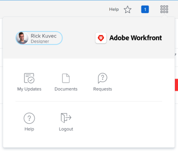

# Understand a Reviewer's `<MadCap:conditionalText data-mc-conditions="QuicksilverOrClassic.Quicksilver"> Main Menu</MadCap:conditionalText>` in *`Adobe Workfront`* {#understand-a-reviewers-main-menu-in-adobe-workfront}

The highlighted information on this page refers to functionality not yet generally available. It is available only in the Preview Sandbox environment.

The `<MadCap:conditionalText data-mc-conditions="QuicksilverOrClassic.Quicksilver">  Main Menu</MadCap:conditionalText>` changes with the access level you have been assigned by your *`Adobe Workfront administrator`*. By default, you are given access only to the areas that include functionality allowed by your access level. To understand the components of the default layout of each access level, see [About the default Adobe Workfront layout](about-the default-wf-layout.md).

## Understand the default `<MadCap:conditionalText data-mc-conditions="QuicksilverOrClassic.Quicksilver">  Main Menu</MadCap:conditionalText>` of a Reviewer {#understand-the-default-main-menu-of-a-reviewer}

As a Reviewer, your main responsibility is to review, comment on, and approve work. The areas that are visible to you in the `<MadCap:conditionalText data-mc-conditions="QuicksilverOrClassic.Quicksilver"> Main Menu</MadCap:conditionalText>` allow you to do that.

The following areas are included in the default layout of a Reviewer:

*  `Home`: In the Production environment, this is the landing page for Review users. You only see information about work you have to review, comment on, or approve. This is the default landing area for a Reviewer, however, it doesn't appear in the Main Menu unless a *`Workfront administrator`* adds it in the layout template.

  **My Updates**: In the Preview environment, the `Home`area which is available to users of all access levels is replaced by the `My Updates` for a Review-license user, by default. As a Reviewer, you do not complete work. You need to only see information about work you have to review, comment on, or approve. The `My Updates` area allows you to perform these actions. This is the default landing area for Reviewers.

  >[!TIP] {type="tip"}
  >
  >`Your *`Workfront`* or *`Group administrator`* may assign you a layout template that could change your default landing page. Using a layout template, you can also view both the Home and the Updates area as a Review-license user.` 

* `Requests`: You can submit and review requests you or other users from your company have submitted in this area.
* `Documents`: You can upload documents, or review documents shared with you here.

&nbsp;

## Customize your default `<MadCap:conditionalText data-mc-conditions="QuicksilverOrClassic.Quicksilver">  Main Menu</MadCap:conditionalText>` {#customize-your-default-main-menu}

You can customize the areas that you see in your `<MadCap:conditionalText data-mc-conditions="QuicksilverOrClassic.Quicksilver">  Main Menu</MadCap:conditionalText>` by removing or adding areas.

For more information about customizing the `<MadCap:conditionalText data-mc-conditions="QuicksilverOrClassic.Quicksilver"> Main Menu</MadCap:conditionalText>`, see [Customize the Main Menu in Adobe Workfront](customize-global-navigation-bar.md).

Your *`Workfront administrator`* can also modify your *`Workfront`* default layout by assigning you a Layout Template. For more information about working with Layout Templates, see `<MadCap:conditionalText data-mc-conditions="QuicksilverOrClassic.Quicksilver"> <a href="customize-main-menu.md" class="MCXref xref">Customize the Main Menu using a layout template</a></MadCap:conditionalText>`.
