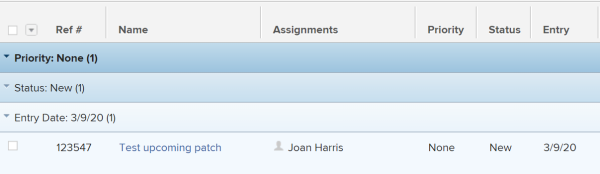
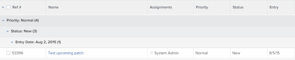
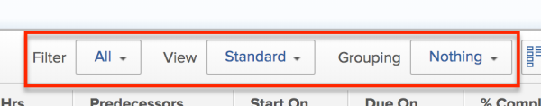
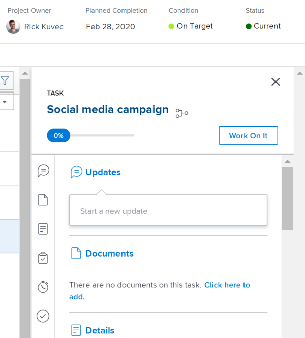
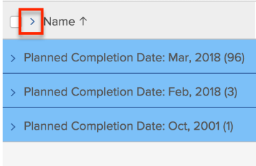
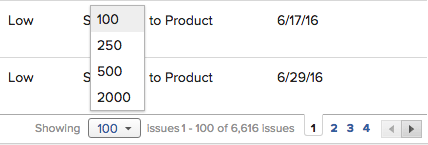
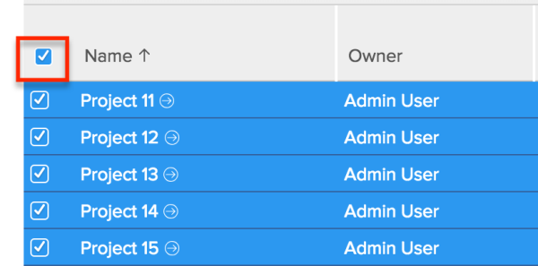

# View items in a list {#view-items-in-a-list}

The highlighted information on this page refers to functionality not yet generally available. It is available only in the Preview Sandbox environment.

## Default `Workfront` lists {#default-workfront-lists}

Objects can be displayed in lists in `Workfront`. A list is a grid that contains a number of objects, information about them, or other objects referenced from them. 

The following are some characteristics of lists in `Workfront`:

* Lists are object specific: one list can only reference one type of object. Other objects that are directly connected to the object of the list can also be referenced in the same list.   
  For example, on a list of tasks you can find task information like Assignments, Start and Due Date, and also project information, as well, like Project Name or the name of the Project Owner.
* Lists refresh automatically every 5 minutes to update the information that other users in the system might update elsewhere. 
* Some `Workfront` areas and tabs come preconfigured with default lists of objects.  
  You can customize most of the preconfigured lists. 

* The `Workfront administrator` can create custom lists that could be applied to various areas of `Workfront`.  
  For more information about creating system-level lists, see the article [Create and share default filters, views, and groupings](create-and-share-default-fvgs.md).

The following are examples of system lists in `Workfront` and the areas or the tabs where they display by default:

&#42;You cannot customize the list on the specified area. The `Workfront administrator` can build a customized list at the system level, or you can build a report for this object if you have access to Edit reports. 

## The difference between the updated and the legacy lists {#the-difference-between-the-updated-and-the-legacy-lists}

There are two types of lists in `Workfront`:

*  Legacy lists

  

*  Updated lists

  

The following table shows some of the differences between the legacy and the updated lists in  `Workfront`:

<table style="width: 100%;mc-table-style: url('../../../Resources/TableStyles/TableStyle-HeaderRow.css');" class="TableStyle-TableStyle-HeaderRow" cellspacing="0"> 
 <col class="TableStyle-TableStyle-HeaderRow-Column-Column1"> 
 <col class="TableStyle-TableStyle-HeaderRow-Column-Column1"> 
 <tbody> 
  <tr class="TableStyle-TableStyle-HeaderRow-Body-LightGray"> 
   <td class="TableStyle-TableStyle-HeaderRow-BodyE-Column1-LightGray" style="font-weight: bold;">Legacy lists</td> 
   <td class="TableStyle-TableStyle-HeaderRow-BodyD-Column1-LightGray" style="font-weight: bold;">Updated lists</td> 
  </tr> 
  <tr class="TableStyle-TableStyle-HeaderRow-Body-MediumGray"> 
   <td class="TableStyle-TableStyle-HeaderRow-BodyE-Column1-MediumGray">Legacy fonts, column headers, blue grouping color scheme</td> 
   <td class="TableStyle-TableStyle-HeaderRow-BodyD-Column1-MediumGray">Updated fonts, column headers, gray grouping color scheme</td> 
  </tr> 
  <tr class="TableStyle-TableStyle-HeaderRow-Body-LightGray"> 
   <td class="TableStyle-TableStyle-HeaderRow-BodyE-Column1-LightGray">Slower inline editing </td> 
   <td class="TableStyle-TableStyle-HeaderRow-BodyD-Column1-LightGray">Faster inline editing</td> 
  </tr> 
  <tr class="TableStyle-TableStyle-HeaderRow-Body-MediumGray"> 
   <td class="TableStyle-TableStyle-HeaderRow-BodyE-Column1-MediumGray">Display 100 items by default</td> 
   <td class="TableStyle-TableStyle-HeaderRow-BodyD-Column1-MediumGray">Display All or up to 2000 items by default</td> 
  </tr> 
  <tr class="TableStyle-TableStyle-HeaderRow-Body-LightGray"> 
   <td class="TableStyle-TableStyle-HeaderRow-BodyE-Column1-LightGray">Use CTRL+F to find items in a list</td> 
   <td class="TableStyle-TableStyle-HeaderRow-BodyD-Column1-LightGray"> 
Use quick filters for quickly finding information in a large list
 
For information about using quick filters in lists, see the <a href="#applying-quick-filters" class="MCXref xref">Apply quick filters to lists</a> section of this article. 
 </td> 
  </tr> 
  <tr class="TableStyle-TableStyle-HeaderRow-Body-MediumGray"> 
   <td class="TableStyle-TableStyle-HeaderRow-BodyB-Column1-MediumGray">No formatting available for fields</td> 
   <td class="TableStyle-TableStyle-HeaderRow-BodyA-Column1-MediumGray">Custom fields can be configured to allow bolding, italicizing, and underlining of text. For more information, see <a href="create-a-custom-form.md" class="preview MCXref xref xrefpreview">Create a Custom Form</a>. </td> 
  </tr> 
 </tbody> 
</table>

All lists and reports have been updated, except for the following:

* Lists in the Setup and Reports areas
* Documents lists

## List elements {#list-elements}

A list contains certain building elements that define what information displays on the screen as well as in what format it displays. You can find several system list elements that are available by default, and you can also create custom ones to meet your needs.

Any user can customize list elements and can share them with other users they have access to see. Customizing the list elements will customize the information in the list and how it displays. 

You can customize lists in the following areas of `Workfront`:

* Any system default list that exists in an area, or on a tab, as listed in the section [Default Workfront lists](#default-workfront-lists) in this article.
* Any report that is shared with you. 

The building elements for lists are the same as the building elements for reports.  
For more information about creating and customizing the building elements of lists and reports, see [Reporting elements: Filters, Views, and Groupings](reporting-elements-filters-views-groupings.md).

The building elements of a list display at the top of every list, by default.  
They are sticky and do not move as you scroll through the list. 

The following are the building elements of a list: 

* **Filter**: Defines the amount of information you display on the screen by filtering out useless information based on criteria you specify.  
  For more information about filters, see the article [Create and customize Filters](create-customize-filters.md).

* **View:** Defines what information you display on the screen. You can select to display fields about the object of the list or information about other objects referenced from them.  
  For more information about views, see the article [Create and customize Views](create-customize-views.md).

* **Grouping**: Separates the objects on the list in areas by a common criteria.   
  For example, the issues in a list can be displayed in sections by Status, or Priority that the issues have in common.   
  You can have up to three layers of groupings in a standard grouping, and you can add a fourth layer if you are configuring a grouping in text mode.  
  For more information about groupings, see the article [Create and customize Groupings](create-customize-groupings.md).  
  For more information about text mode, see the article [Understand Text Mode](understand-text-mode.md).

## The difference between lists and reports {#the-difference-between-lists-and-reports}

Both lists and reports are grids that contain information about a type of object. 

The following table outlines the similarities and differences between lists and reports:

&#42; You must have access to Filters, Views, and Groupings to be able to create them. For information about getting access to Filters, Views, and Groupings, see [Grant access to filters, views, and groupings](grant-access-fvg.md).

&#42;&#42; You must have access to Filters, View, and Groupings as well as Reports,&nbsp;Dashboards, and Calendars to be able to create them. For information about getting access to Reports,&nbsp;Dashboards, and Calendars, see [Grant access to reports, dashboards, and calendars](grant-access-reports-dashboards-calendars.md).

&#42;&#42;&#42; You can customize lists for reports that are placed on a dashboard, only if the creator of the report has configured the list elements to be visible on the dashboard. 

>[!NOTE]
>
>You cannot add a list to a dashboard without creating a report and adding it to the dashboard first. 

For more information about building a report, see the article [Create a custom report](create-custom-report.md). For more information about creating custom tabs, see the article [Create custom tabs or sections](create-custom-tabs.md).

## Edit objects in lists {#edit-objects-in-lists}

You can edit the objects and their information inside a list by editing them inline. 

For more information about inline editing objects, see the article [Inline edit objects](inline-edit-objects.md).

## Update objects in lists using the Summary {#update-objects-in-lists-using-the-summary}

You can update tasks and issues at the project level using the Summary panel. 

>[!TIP] {type="tip"}
>
>The Summary is not available for all objects and it is not available in tasks and issues reports.

Accessing the Summary is identical for tasks and issues. 

1. Go to a project, then click **Tasks** or **Issues** in the left panel.

1.  Select a task or an issue in the list, then click the **Open Summary icon**  in the upper-right corner of the list.

   The Summary of the task opens to the right of the task.

   

1.  Update information about the task or issue in the Summary panel, including the following: 

    
    
    * Percent complete
    * Enter an update
    * Planned Completion Date
    * Actual Start Date
    * Assignments
    * Status
    * Log time
    * Make approval decisions
    
    

1. Click the **X icon**  to close the Summary and return to the list. 

## Customize the look and feel of lists {#customize-the-look-and-feel-of-lists}

You can customize the look and feel of a list, the column arrangement, or sorting order of items. 

The customizations you make on lists are visible only to you and are temporary. They are reset when you log out and log back in.

To customize the look and feel of a list:

1. Go to a list of objects in `Workfront`.
1.  (Conditional) If the list you want to view is collapsed, click the desired grouping to expand the list. By default, groupings are collapsed.  
   Click anywhere in the line indicating a grouping to expand it and display the information listed in it.  
   You can expand all groupings by clicking the arrow to the right of the name of the first column in the list.  
   

1.  Mouse over the line that separates two columns and drag it to the desired width, then drop it to modify the width of the columns.

   The column is resized until you clear your cache on the browser or until you manually resize it back. 

1.  Mouse over a column header to display the hand tool, then click to drag the column and drop it to another spot. 

   The position of the column is saved until you refresh your page.   
   For more information about customizing the width and the order of columns in a list, see the article [Modify column width and order](modify-column-width-order.md).  

1. Click one of the column headers to select it, then keep the CMD (or Windows) key pressed on your keyboard and click additional column headers to sort by them. You can select up to three column headers this way. The list is sorted by each of the selected columns in the order of your selection.  
   All modifications you make to the list are saved instantly. 

## Configure the number of items to display in a list {#configure-the-number-of-items-to-display-in-a-list}

You can change the number of items that display in a list.

>[!NOTE]
>
>Changes you make to the number of items to display on a page are reverted when you log out of `Workfront` or close your browser. Changes might also be reverted after a period of 8 hours.

To configure the number of items that are displayed on a page:

1.  Go to the list where you want to modify the number of items that are displayed per page.

   Up to 2000 items display by default in all list, except for the following:

    
    
    * Lists in the Setup area
    * Lists in the Reports area
    *  Document lists
    
    
      100 items display by default in these lists. 
    
    
    

1.  (Optional and conditional) If you want to show a specific number of items on the screen, click the **Showing** drop-down menu at the bottom of the list, then select to display **100**, **250**, **500**, **All**, or **2000 **items.  
     
   The results of your list are paginated to show 100, 250, or 500 items per page.

   >[!TIP] {type="tip"}
   >
   >You cannot display more than 2000 items in a list at one time. 

1. (Optional and conditional) When you have multiple pages, click the backward and forward arrows to navigate from one page to another. The pagination area remains sticky as you scroll through the list, and is available at the bottom right corner of the list.
1.  (Optional and conditional) If the list contains more than 2000 items you cannot display all the items inside `Workfront`.  
   To see all the items in the list, you must export the list.  
   For information about exporting lists, see the [Export lists](#exportin) section in this article.

## Export lists {#export-lists}

You can export a list of objects from `Workfront`. When the list of objects in `Workfront` contains more than 2000 items, exporting the list is the only way to review all items in the list.

1. Go to a list of objects.
1. Click **Export**.
1. Select from the following formats:   

    
    
    * PDF
    * Excel
    * Excel (xlsx)
    * Tab Delimited  
      `This exports a copy of the list to one of these formats and saves it on your computer.`
    
    
    

1. (Optional) Open the exported list using the appropriate application.  
   All the items in the list are displayed in the exported file, whether they are displayed on the screen in the web application or not.

## Apply quick filters to lists {#apply-quick-filters-to-lists}

* [Quick filters overview](#understand-quick-filters) 
* [Apply quick filters and manage information in a list](#apply-quick-filters-subsection) 

### Quick filters overview {#quick-filters-overview}

You can apply quick filters in a list of objects to find only items that are important to you, so you can quickly review, update, or share them with others. 

>[!IMPORTANT] {type="important"}
>
>You can find items that contain a search word using quick filters, whether that item has been physically displayed on your screen or will display after you have scrolled to the bottom of the page. When you use your browser's search capabilities, you can only find items that are physically displayed on the screen. If your list has multiple pages, quick filters do not find items that are on pages that do not display. 

If you want to save a quick filter, we recommend that you build a permanent filter for your list instead.  
For information about how to build filters in `Workfront`, see the article [Create and customize Filters](create-customize-filters.md).

You can create temporary quick filters in all lists and reports, except the following: 

* The Setup area
* The Reports area
* Document lists and reports

Consider the following when applying quick filters to a list `<MadCap:conditionalText data-mc-conditions="QuicksilverOrClassic.Quicksilver"> or report</MadCap:conditionalText>`:

* You can use keywords to filter for any field that displays in the view of the list. This includes custom fields, or complex fields like Predecessors, Assignments, Assignment and Status, Approver and Status, etc. 
*  If your list has collapsed groupings, they are automatically expanded when you use quick filters.  
  When removing the quick filter, groupings are collapsed again. 
*  Groupings retain the aggregated information of the original list, regardless of the quick filters applied or any changes made to the objects on the list. 
*  Quick filters are temporary.  
  Changing the grouping, view, filter, or sort of the list removes the quick filter criteria. 
*  If you have more than one grouping in the list and the quick filter finds items in just one grouping, only that grouping displays with the found items. All other groupings are hidden. 
* In a task or subtask list, the task hierarchy is removed when the results of the quick filter display. 
*  You cannot save a quick filter. If you want to save a filter to use it again, consider building a permanent filter for the list.  
  For information about how to build filters in `Workfront`, see the article [Create and customize Filters](create-customize-filters.md).

### Apply quick filters and manage information in a list {#apply-quick-filters-and-manage-information-in-a-list}

1.  Go to a list or report that supports quick filters, then click the **Quick Filter icon**  in the toolbar. 

   Or 

   Depending on your operating system or browser, press the following set of commands to launch the quick filter:

    
    
    * ALT+F for Windows computers
    * ALT+Shift+F for Internet Explorer on Windows computers
    *  ALT/ Option+F for Mac computers
    
    
      >[!TIP] {type="tip"}
      >
      >If you press CTRL+F or CMD+F, a tooltip displays next to the quick filter to remind you about these commands. The commands also display inside the quick filter search box. 
    
    
    
    
    

1.  In the **Filter page** box, start typing the keyword by which you want to filter, then select the word from the list.

   You can use any word that currently displays in the view of the list.

   >[!TIP] {type="tip"}
   >
   >If you use a word that might display on another page of the list, the quick filter does not find any results.

   A list of items that match the search criteria display in the list dynamically, as you type, and all other items are hidden. `The keyword you used in your search is highlighted in yellow in all standalone and complex fields. Some examples of complex fields are shared columns, or any of the following: Assignments, Assignments and Status, Percent Complete, Predecessors, Approvers and Status, Resource Managers, Categories, Condition, Condition Update etc.`

1. (Optional) To bulk edit the items found by the quick filter: 
    
    
    1. Select all or several of the items in the list, then click **Edit** to bulk edit the items.
    1. Click **Save Changes**. 
    
    
1. (Optional) To export the items found by the quick filter: 
    
    
    1. Select all or several of the items in the list, then click **Export** to export them.  
           
    
    
    1. Select from the following file types:     
        
        
        * PDF Landscape
        * PDF Portrait
        * Excel
        * Excel (.xlsx)
        * Tab Delimited  
          Only the items you found in the quick filter search export to the file you selected. 
        
        
          >[!NOTE]
          >
          >You must select some or all items in the quick-filtered list before exporting them; otherwise the complete, unfiltered list is exported.  

        
        
        
        
        
    
    
1. (Optional) To clear the filtered results, click the **Quick Filter** icon in the top right corner of the window.   
   Or  
   Refresh the page.

