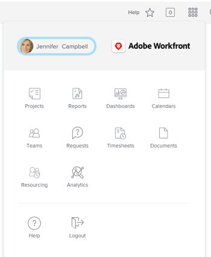

# Understand a Worker's `<MadCap:conditionalText data-mc-conditions="QuicksilverOrClassic.Quicksilver"> Main Menu</MadCap:conditionalText>` in  *`Adobe Workfront`* {#understand-a-workers-main-menu-in-adobe-workfront}

The `<MadCap:conditionalText data-mc-conditions="QuicksilverOrClassic.Quicksilver"> Main Menu</MadCap:conditionalText>` changes with the access level you have been assigned by your *`Adobe Workfront administrator`*. By default, you are given access only to the areas that include functionality allowed by your access level. To understand the components of the default layout of each access level, see [About the default Adobe Workfront layout](about-the default-wf-layout.md).

## Understand the default `<MadCap:conditionalText data-mc-conditions="QuicksilverOrClassic.Quicksilver"> Main Menu</MadCap:conditionalText>` of a Worker {#understand-the-default-main-menu-of-a-worker}

As a Worker, your main responsibility is to complete work. The areas in the `<MadCap:conditionalText data-mc-conditions="QuicksilverOrClassic.Quicksilver"> Main Menu</MadCap:conditionalText>` that are visible to you allow you to do that.

The following areas are included in the default layout of a Worker:

* `Home`: Tasks and issues assigned to you display here. This is the default landing page for a Worker`<MadCap:conditionalText data-mc-conditions="QuicksilverOrClassic.Quicksilver"> , however, it doesn't appear in the Main Menu unless a  Workfront administrator adds it in the layout template</MadCap:conditionalText>`.

* `Projects`: Projects that are shared with you display here.
* `Report` `<MadCap:conditionalText data-mc-conditions="QuicksilverOrClassic.Quicksilver"> s</MadCap:conditionalText>`: Reports that are shared with you display here.

* `Dashboards`:&nbsp;Dashboards that are shared with you display here.
* `Calendars`: Calendars that are shared with you display here.
* `Teams`: Tasks and issues assigned to your teams display in this area. As a Worker, you are the only *`Workfront`* user who sees the Teams area by default.

* `Requests`: You can submit requests and review requests you or your team members have submitted here.
* `Timesheet` `<MadCap:conditionalText data-mc-conditions="QuicksilverOrClassic.Quicksilver"> s</MadCap:conditionalText>`: You can access your current, future, or old timesheets here.

* `Documents`: You can upload documents, or review documents shared with you, here.
* `Resourcing`: You can view resource allocation in the Resource Planning tools and view Resource Pools here.  

## Customize your default `<MadCap:conditionalText data-mc-conditions="QuicksilverOrClassic.Quicksilver"> Main Menu</MadCap:conditionalText>` {#customize-your-default-main-menu}

You can customize the areas that you see in your`<MadCap:conditionalText data-mc-conditions="QuicksilverOrClassic.Quicksilver">  Main Menu</MadCap:conditionalText>` by removing or adding areas.

For more information about customizing the `<MadCap:conditionalText data-mc-conditions="QuicksilverOrClassic.Quicksilver"> Main Menu</MadCap:conditionalText>`, see [Customize the Main Menu in Adobe Workfront](customize-global-navigation-bar.md).

Your *`Workfront administrator`* can also modify your *`Workfront`* default layout by assigning you a Layout Template. For more information about working with Layout Templates, see `<MadCap:conditionalText data-mc-conditions="QuicksilverOrClassic.Quicksilver"> <a href="customize-main-menu.md" class="MCXref xref">Customize the Main Menu using a layout template</a></MadCap:conditionalText>`.
