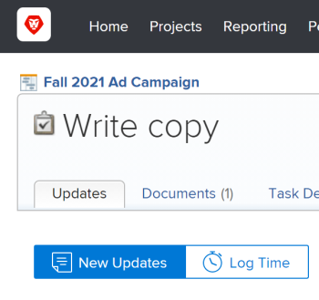
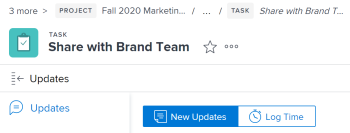

# Breadcrumbs overview in *`the new Adobe Workfront experience`* {#breadcrumbs-overview-in-the-new-adobe-workfront-experience}

In *`Adobe Workfront Classic`*, breadcrumbs display only the level immediately above the current object you're viewing.

In the following example, only the project (Fall 2021 Ad Campaign) is shown in the breadcrumb, and there is no way to see which portfolio the project belongs to.

Unlike *`Adobe Workfront Classic`*, breadcrumbs in *`the new Adobe Workfront experience`* display the full navigational hierarchy for all object types. Each object in the breadcrumb path has a label that displays the object type. The page that you are currently on displays both in the page header and at the end of the breadcrumb path in italics. In the example below, this is the "Share with Brand Team" task.

When there are too many objects in the breadcrumb path or the screen width prohibits the full navigational hierarchy from displaying, the path collapses some of the breadcrumbs and groups these objects at the beginning of the breadcrumb path. Both the project and the current object page are always visible in the breadcrumb path.

For example, "3 more" in the image above indicates that 3 objects are not displaying. These items could be located above the project level or between the project and the current page.

Clicking "more" allows you to expand the full hierarchy. You can click "Less" to collapse the breadcrumb path again.

You can also use the following keys to navigate the breadcrumbs:

<table class="TableStyle-TableStyle-List-options-in-steps" style="mc-table-style: url('../../Resources/TableStyles/TableStyle-List-options-in-steps.css');" cellspacing="0"> 
 <col style="width: 50%;" class="TableStyle-TableStyle-List-options-in-steps-Column-Column1"> 
 <col style="width: 50%;" class="TableStyle-TableStyle-List-options-in-steps-Column-Column2"> 
 <tbody> 
  <tr class="TableStyle-TableStyle-List-options-in-steps-Body-LightGray"> 
   <td class="TableStyle-TableStyle-List-options-in-steps-BodyE-Column1-LightGray" role="rowheader">Tab </td> 
   <td class="TableStyle-TableStyle-List-options-in-steps-BodyD-Column2-LightGray"> 
Navigate to each item in the breadcrumbs
 </td> 
  </tr> 
  <tr class="TableStyle-TableStyle-List-options-in-steps-Body-MediumGray"> 
   <td class="TableStyle-TableStyle-List-options-in-steps-BodyB-Column1-MediumGray" role="rowheader">Enter </td> 
   <td class="TableStyle-TableStyle-List-options-in-steps-BodyA-Column2-MediumGray"> 
Expand a collapsed breadcrumb path, collapse an expanded breadcrumb path, and open a new page when on an object link
 </td> 
  </tr> 
 </tbody> 
</table>

## Access requirements {#access-requirements}

You must have the following access to perform the steps in this article:

<table style="width: 100%;margin-left: 0;margin-right: auto;mc-table-style: url('../../Resources/TableStyles/TableStyle-List-options-in-steps.css');" class="TableStyle-TableStyle-List-options-in-steps" cellspacing="0"> 
 <col class="TableStyle-TableStyle-List-options-in-steps-Column-Column1"> 
 </col> 
 <col class="TableStyle-TableStyle-List-options-in-steps-Column-Column2"> 
 </col> 
 <tbody> 
  <tr class="TableStyle-TableStyle-List-options-in-steps-Body-LightGray"> 
   <td class="TableStyle-TableStyle-List-options-in-steps-BodyE-Column1-LightGray" role="rowheader">Adobe Workfront plan*</td> 
   <td class="TableStyle-TableStyle-List-options-in-steps-BodyD-Column2-LightGray"> 
Any
 </td> 
  </tr> 
  <tr class="TableStyle-TableStyle-List-options-in-steps-Body-MediumGray"> 
   <td class="TableStyle-TableStyle-List-options-in-steps-BodyB-Column1-MediumGray" role="rowheader">Adobe Workfront license*</td> 
   <td class="TableStyle-TableStyle-List-options-in-steps-BodyA-Column2-MediumGray"> 
Request or higher
 </td> 
  </tr> 
 </tbody> 
</table>

&#42;To find out what plan or license type you have, contact your *`Workfront administrator`*.

##  Access a parent object in the breadcrumbs {#access-a-parent-object-in-the-breadcrumbs}

For information about parent objects in  *`Adobe Workfront administrator`*, see [Understand objects in Adobe Workfront](understand-objects.md).

1.  (Conditional) If you don't see the object you want to navigate to in a collapsed breadcrumb path, click `more`, then locate the object.

   >[!NOTE]
   >
   >If you don't have permission to an object, it's not visible in the breadcrumbs.

1.  Click any object in the breadcrumb path to access that object.

   The object page opens.

