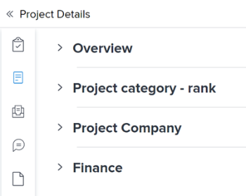
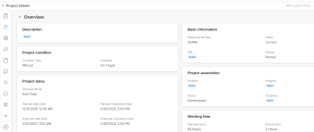

# Edit object details in *the new Adobe Workfront experience*

We have merged all the subtabs located under the Details tab of an object into a single page in *the new Adobe Workfront experience*.

>[!NOTE]
>
>This is currently available for projects, tasks, issues, programs, portfolios, templates, template tasks, users, documents.

## Benefits of displaying all object details on one page

* You can access all information about the object in one place with fewer clicks.
* Your *Adobe Workfront administrator* can modify the sequence of the areas displayed in the Details page or remove fields according to your needs using a Layout Template.
* You can update all fields that you have permissions to edit in one place without navigating between multiple subtabs.

## Access requirements

You must have the following access to perform the steps in this article:

<table cellspacing="0"> 
 <col> 
 <col> 
 <tbody> 
  <tr> 
   <td role="rowheader"><em>Adobe Workfront</em> plan*</td> 
   <td> 
Any
 </td> 
  </tr> 
  <tr> 
   <td role="rowheader"><em>Adobe Workfront</em> license*</td> 
   <td> 
<em>Request</em> or higher
 </td> 
  </tr> 
  <tr> 
   <td role="rowheader">Access level configurations*</td> 
   <td> 
Edit access to the object whose details you want to update
 
Note: If you still don't have access, ask your <em>Workfront administrator</em> if they set additional restrictions in your access level. For information on how a <em>Workfront administrator</em> can modify your access level, see <a href="../../administration-and-setup/add-users/configure-and-grant-access/create-modify-access-levels.md" class="MCXref xref">Create or modify custom access levels</a>.
 </td> 
  </tr> 
  <tr> 
   <td role="rowheader">Object permissions</td> 
   <td> 
Contribute or higher permissions to the object whose details you want to update
 
For information on requesting additional access, see <a href="../../workfront-basics/grant-and-request-access-to-objects/request-access.md" class="MCXref xref">Request access to objects in Adobe Workfront</a>.
 </td> 
  </tr> 
 </tbody> 
</table>

&#42;To find out what plan, license type, or access you have, contact your *Workfront administrator*.

## Edit the Details page on an object

Accessing the Details page for an object is similar to all objects where this functionality is supported.

>[!NOTE]
>
>Currently, you can access the combined Details page on projects, tasks, issues, programs, portfolios, templates, and template tasks.

<ol> 
 <li value="1">Go to the object whose Details page you want to access.</li> 
 <li value="2"> 
In the left panel, click <Object>&nbsp;Details.&nbsp;For example, for a project, click&nbsp;Project&nbsp;Details. 
 
  
 
Notice the following in the new Details page:
 
  <ul> 
   <li> 
The page displays to the right of the left panel and it is organized in several areas. 
 
Your <em>Workfront administrator</em> determines what areas and what fields display on the Details page when configuring and assigning you a Layout Template. For information about Layout Templates in <em>the new Adobe Workfront experience</em>, see the article <a href="../../administration-and-setup/customize-workfront/use-layout-templates/use-layout-templates-customize-ui.md" class="MCXref xref">Layout templates</a>.
 </li> 
   <li> 
Each area contains multiple cards that group similar information together. 
 
  
 </li> 
   <li> 
 The following areas display on the Details page by default:
 
    <table cellspacing="0"> 
     <col> 
     <col> 
     <tbody> 
      <tr> 
       <td role="rowheader">Overview</td> 
       <td> 
Displays general information about the object. The fields in this area are <em>Workfront</em> system fields.
 
This area is expanded by default.
 </td> 
      </tr> 
      <tr> 
       <td role="rowheader">Names of custom forms</td> 
       <td> 
If they are attached, the names of the custom forms display here. 
 
They are collapsed by default. The fields in this area are fields created by your organization. 
 </td> 
      </tr> 
      <tr> 
       <td role="rowheader">Finance</td> 
       <td> 
This is available only for projects and tasks. 
 
Displays financial information related to the object. 
 
This area is collapsed by default. 
 </td> 
      </tr> 
     </tbody> 
    </table> </li> 
  </ul> </li> 
 <li value="3"> 
(Optional) Click the Collapse All icon  in the upper-right corner to collapse all the areas. 
 </li> 
 <li value="4"> 
  
 
   
To add or edit information for fields in the Details section,
 
   <ol style="list-style-type: lower-alpha;"> 
    <li value="1"> 
Click the Edit icon  in the upper-right corner of the Details section, then do one of the following:
 
     <ul> 
      <li>Click Edit all to open all areas and custom forms for editing.</li> 
      <li>Click Edit sections, then click a section or custom form to open it for editing.</li> 
     </ul> 
If you use Edit sections to open one area or custom form for editing, you can repeat this step to open others.
 </li> 
    <li value="2"> 
Edit any field that is available for editing, or click +Add to add information to an empty field.
 
You can double-click or hover over and single-click an editable field to edit its contents.
 
Fields are not available for editing if they are automatically generated by <em>Workfront</em> or if you don't have editing permissions on them.
 </li> 
    <li value="3"> 
Click Save changes when you ares finished editing information in fields.
 </li> 
   </ol> 
  
 </li> 
 <li value="5"> 
(Optional) Click the Export icon  to export the Overview and custom forms information to a PDF file, then click Export. Select from the following:Select all (displays only when there is at least one custom form attached)OverviewThe name of one or multiple custom formsThe PDF file downloads to your computer. 
 
This is available for the following objects:
 
  <ul> 
   <li> 
Projects
 </li> 
   <li> 
Tasks
 </li> 
   <li> 
Issues
 </li> 
   <li> 
Portfolios
 </li> 
   <li> 
Programs
 </li> 
  </ul> 
For more information, see <a href="../../workfront-basics/work-with-custom-forms/export-custom-forms-details.md" class="MCXref xref">Export custom forms and object details in Adobe Workfront</a>. 
 </li> 
 <li value="6"> 
(Conditional) If you have made edits, click Save Changes.
 
  
Tips: </b>">
   <b>Tips: </b> 
   <ul> 
    <li>You can click the Edit icon again if you made no changes and want to close the edit-mode Details page. &nbsp;</li> 
    <li>When the Details page is editable, you cannot edit information in the header of the object at the same time. You can only subscribe to the object or add it to your list of favorites before you save your changes.  </li> 
   </ul> 
  
 </li> 
</ol>

