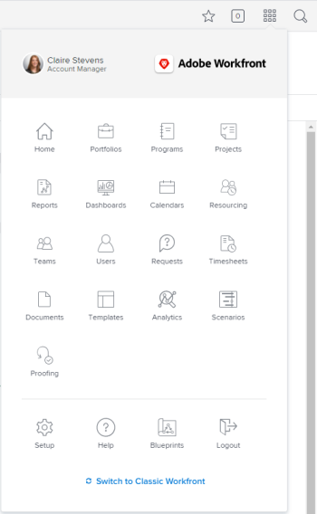

# Top navigation bar overview in *`the new Adobe Workfront experience`* {#top-navigation-bar-overview-in-the-new-adobe-workfront-experience}

The top navigation bar—which appears at the top of your screen in *`the new Adobe Workfront experience`*—allows you to easily find and navigate to other areas of the platform.

## Home icon {#home-icon}

The `Home` icon  takes you to the Home page, which is the default landing page. To learn more about Home, see [Use the Home area](_use-the-home-area.md).

An *`Adobe Workfront administrator`* can customize the Home icon to match your company's brand. For more information, see [Brand your Adobe Workfront instance](brand-your-workfront-instance.md).

## Pinned pages {#pinned-pages}

You can pin pages that you visit frequently so that they display within the top navigation bar. To learn more about pinned pages, see [Pin pages to customize your workspace in the new Adobe Workfront experience](pin-pages.md).

## Help menu {#help-menu}

The `Help` menu allows you to search for help with a specific task, find more information on using *`the new Adobe Workfront experience`*, view content related to the page you are currently on, or submit feedback about your experience.

To learn more about the Help menu, see [Access Adobe Workfront help](access-workfront-help.md).

## Favorites and Recents menu {#favorites-and-recents-menu}

The `Favorites` icon  opens a list of pages in the system that you have favorited. You can add the page that you're currently on from within this menu. To see a list of places you have visited recently, you can click on the `Recents` tab.

To learn more about favorites and recents, see [Recents and favorites in Adobe Workfront](_recent-and-favorites.md).

## Notifications menu {#notifications-menu}

The blue numbered box  in the top-right corner of the screen opens a list of notifications.

To learn more about notifications, see [View and manage in-app notifications](view-and-manage-in-app-notifications.md).

## Main Menu {#main-menu}

The `Main Menu` icon  opens the Main Menu, which allows you to navigate to a different area of *`Workfront`*.

The options that are available in the Main Menu are dependent on:

* `Layout template configurations`: To learn how a *`Workfront administrator`* can modify the Main Menu from a layout template, see [Customize the Main Menu using a layout template](customize-main-menu.md).

* `License type`: To learn the default configurations for different license types, see [Understand a Reviewer's Main Menu in Adobe Workfront](reviewer-global-navigation-bar.md) or [Understand a Worker's Main Menu in Adobe Workfront](worker-global-navigation-bar.md).

* `User customization`: To learn how to change your own Main menu configuration, see [Customize the Main Menu in Adobe Workfront](customize-global-navigation-bar.md).

Each icon takes you to a different area of *`the new Adobe Workfront experience`*. To learn more about each area, see:

<table> 
 <col style="width: 50%;"> 
 <col style="width: 50%;"> 
 <tbody> 
  <tr> 
   <td> 
    <ul> 
     <li>Home: <a href="_use-the-home-area.md" class="MCXref xref">Use the Home area</a></li> 
     <li>Portfolios: <a href="_portfolio-management-overview.md" class="MCXref xref">Portfolio Management</a></li> 
     <li>Programs: <a href="_create-and-manage-programs.md" class="MCXref xref">Create and manage programs </a></li> 
     <li>Projects: <a href="_projects-overview.md" class="MCXref xref">Projects</a></li> 
     <li>Reports: <a href="_reports-overview.md" class="MCXref xref">Reports</a></li> 
     <li>Dashboards: <a href="_dashboards-overview.md" class="MCXref xref">Dashboards</a></li> 
     <li>Calendars: <a href="_calendars.md" class="MCXref xref">Calendars</a></li> 
     <li>Resourcing: <a href="_resource-management-overview.md" class="MCXref xref">Resource Management </a></li> 
     <li>Teams: <a href="_create-and-mange-teams.md" class="MCXref xref">Create and manage teams</a></li> 
     <li>Users: <a href="_create-and-manage-users.md" class="MCXref xref">Create and manage users</a></li> 
    </ul> </td> 
   <td> 
    <ul> 
     <li>Requests: <a href="_create-requests.md" class="MCXref xref">Create requests</a></li> 
     <li>Timesheets: <a href="_timesheets-all.md" class="MCXref xref">Timesheets</a></li> 
     <li>Documents: <a href="_documents-overview.md" class="MCXref xref">Documents</a></li> 
     <li>Templates: <a href="_create-manage-templates.md" class="MCXref xref">Create and manage project templates</a></li> 
     <li>Analytics: <a href="enhanced-analytics-overview.md" class="MCXref xref">Enhanced analytics overview</a></li> 
     <li>Goals: <a href="wf-goals-overview.md" class="MCXref xref">Adobe Workfront Goals overview</a></li> 
     <li>Scenarios: <a href="scenario-planner-overview.md" class="MCXref xref">The Adobe Workfront Scenario Planner overview</a></li> 
     <li>Proofing: <a href="_workfront-proof.md" class="MCXref xref">Workfront Proof</a></li> 
    </ul> </td> 
  </tr> 
 </tbody> 
</table>

Below these options in the Main Menu, you can access:

<table style="margin-left: 0;margin-right: auto;mc-table-style: url('../../Resources/TableStylesheets/Standard.css');" class="TableStyle-Standard" cellspacing="3"> 
 <col class="TableStyle-Standard-Column-Column1" style="width: 155px;"> 
 <col class="TableStyle-Standard-Column-Column1"> 
 <tbody> 
  <tr class="TableStyle-Standard-Body-LightGray"> 
   <td class="TableStyle-Standard-BodyE-Column1-LightGray"> 
Setup
 </td> 
   <td class="TableStyle-Standard-BodyD-Column1-LightGray"> 
Clicking <b>Setup</b> takes you to the Setup area where you can configure different aspects of your Workfront account. Depending on your access settings, what you can configure may be limited.
 
For more information on the Setup area, see <a href="_administration-and-setup.md" class="MCXref xref">Administration and setup</a>.
 </td> 
  </tr> 
  <tr class="TableStyle-Standard-Body-MediumGray"> 
   <td class="TableStyle-Standard-BodyE-Column1-MediumGray"> 
Help
 </td> 
   <td class="TableStyle-Standard-BodyD-Column1-MediumGray"> 
Clicking <b>Help</b> takes you to Adobe Workfront One where you can access help articles, find training, submit a customer support ticket, and so on.
 
For more information on Workfront One or other methods of getting help, see <a href="guide-for-help-in-workfront.md" class="MCXref xref">Your quick guide to finding help in Adobe Workfront</a>.
 </td> 
  </tr> 
  <tr class="TableStyle-Standard-Body-LightGray"> 
   <td class="TableStyle-Standard-BodyE-Column1-LightGray"> 
Switch to Classic
 </td> 
   <td class="TableStyle-Standard-BodyD-Column1-LightGray"> 
Clicking <b>Switch to Classic</b>—which is only available for&nbsp;Adobe Workfront administrators and group administrators—takes you to the Adobe Workfront Classic environment.
 
For more information on switching to Adobe Workfront Classic, see the section "Switch your admin account to Adobe Workfront Classic" in <a href="enroll-users-new-workfront-experience.md" class="MCXref xref">Enroll users in the new Adobe Workfront experience</a>.
 </td> 
  </tr> 
  <tr class="TableStyle-Standard-Body-MediumGray"> 
   <td class="TableStyle-Standard-BodyB-Column1-MediumGray"> 
Logout
 </td> 
   <td class="TableStyle-Standard-BodyA-Column1-MediumGray">Clicking <b>Logout</b> logs you out of Workfront.</td> 
  </tr> 
 </tbody> 
</table>

## Search menu {#search-menu}

The `Search` icon  in the top-right corner of *`Workfront`* allows you to perform a basic search, restrict your search to a specific object, or use Advanced Search to search for a keyword for a specific object and use filters to limit your search to specific fields.

To learn more about search, see [Search Adobe Workfront](search-workfront.md).
