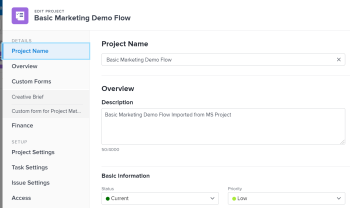

# New Edit Object box {#new-edit-object-box}

We have introduced a new design for the Edit Object box to match *`the new Adobe Workfront experience`* style and to more closely resemble the Details section of an object. 

>[!NOTE]
>
>This is currently available for the following objects when editing an individual object or when editing a single object from a list:
>
>
>
>*  Projects
>*  `Tasks` 
>*  `Issues` 
>
>

##  

## Benefits of the new Edit Object box {#benefits-of-the-new-edit-object-box}

* A cleaner, more streamlined design that matches *`the new Adobe Workfront experience`* style. 
*  Individual custom form names are now listed in the left panel of the Edit Object box and you can quickly access each form from there. 
* Synchronicity with the Details page that allows the *`Adobe Workfront administrator`* to customize your Layout Template once and to reflect those customizations in both the Details page and the&nbsp;Edit Object box. For information about customizing the Details page using a Layout Template, see [Customize the Details view using a layout template](customize-details-view-layout-template.md). 

* The Edit Object page has been divided into two distinct areas based on the similarity of the fields that they contain:
    
    
    * Details:&nbsp;Contains general information about the object, like name, description, custom data.
    * Setup:&nbsp;Contains information that reflects the specific setup of the object, like approval process or permissions. 
    
    

## Access requirements {#access-requirements}

You must have the following access to perform the steps in this article:

<table style="width: 100%;margin-left: 0;margin-right: auto;mc-table-style: url('../../Resources/TableStyles/TableStyle-List-options-in-steps.css');" class="TableStyle-TableStyle-List-options-in-steps" cellspacing="0"> 
 <col class="TableStyle-TableStyle-List-options-in-steps-Column-Column1"> 
 <col class="TableStyle-TableStyle-List-options-in-steps-Column-Column2"> 
 <tbody> 
  <tr class="TableStyle-TableStyle-List-options-in-steps-Body-LightGray"> 
   <td class="TableStyle-TableStyle-List-options-in-steps-BodyE-Column1-LightGray" role="rowheader">Adobe Workfront plan*</td> 
   <td class="TableStyle-TableStyle-List-options-in-steps-BodyD-Column2-LightGray"> 
Any
 </td> 
  </tr> 
  <tr class="TableStyle-TableStyle-List-options-in-steps-Body-MediumGray"> 
   <td class="TableStyle-TableStyle-List-options-in-steps-BodyE-Column1-MediumGray" role="rowheader">Adobe Workfront license*</td> 
   <td class="TableStyle-TableStyle-List-options-in-steps-BodyD-Column2-MediumGray"> 
Request or higher
 </td> 
  </tr> 
  <tr class="TableStyle-TableStyle-List-options-in-steps-Body-LightGray"> 
   <td class="TableStyle-TableStyle-List-options-in-steps-BodyE-Column1-LightGray" role="rowheader">Access level configurations*</td> 
   <td class="TableStyle-TableStyle-List-options-in-steps-BodyD-Column2-LightGray"> 
Edit access to the object that you want to edit
 
Note: If you still don't have access, ask your Workfront administrator if they set additional restrictions in your access level. For information on how a Workfront administrator can modify your access level, see <a href="create-modify-access-levels.md" class="MCXref xref">Create or modify custom access levels</a>.
 </td> 
  </tr> 
  <tr class="TableStyle-TableStyle-List-options-in-steps-Body-MediumGray"> 
   <td class="TableStyle-TableStyle-List-options-in-steps-BodyB-Column1-MediumGray" role="rowheader">Object permissions</td> 
   <td class="TableStyle-TableStyle-List-options-in-steps-BodyA-Column2-MediumGray"> 
Manage permissions to the object that you want to edit 
 
For information on requesting additional access, see <a href="request-access.md" class="MCXref xref">Request access to objects in Adobe Workfront</a>.
 </td> 
  </tr> 
 </tbody> 
</table>

&#42;To find out what plan, license type, or access you have, contact your *`Workfront administrator`*.

## Access the new Edit Object box  {#access-the-new-edit-object-box}

Accessing the Edit Object box is similar for all objects where this functionality is supported. The areas and the fields available in the Edit Object box differs depending on which object you are updating. 

1.  Go to the object that you want to edit and click the `More` icon  >  `Edit`. 

   Or

   Go to a list of objects that contains the item you want to edit, select the item, then click the `Edit icon`  at the top of the list. 

   The `Edit Object` box opens. 

   ` `**Example: **`` For example, the Edit Project box opens. 

   

1.  In the left panel, notice the two main sections: `Details` and  `Setup`. 

   Notice the following in the Details and Setup sections: 

    
    
    *  Each section contains multiple links that take you directly to areas in the Edit box where you can update fields related to the object. 
    *   Depending on how your *`Workfront administrator`* sets up our Layout Template, the fields in the Edit box might display different fields in your environment. For information, see [Customize the Details view using a layout template](customize-details-view-layout-template.md).
    
    

1.  To edit information, click any editable field that you have permissions to edit, and specify the information about the object, then click  `Save`.

   For more information about editing different objects, see the following articles:

    
    
    *  [Edit projects](edit-projects.md) 
    *  [Edit tasks](edit-tasks.md) 
    *  [Edit issues](edit-issues.md) 
    
    

