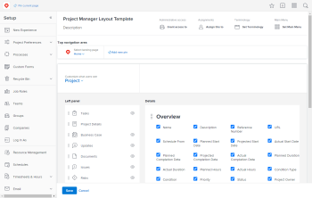
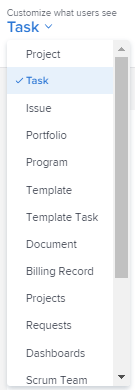
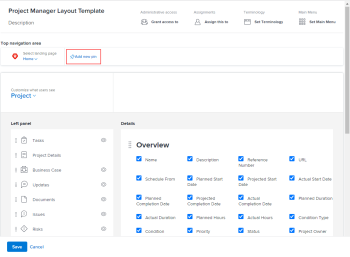
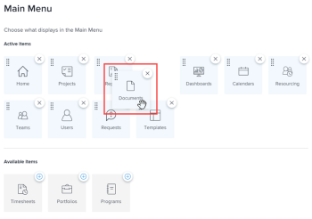
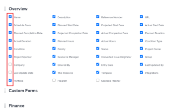
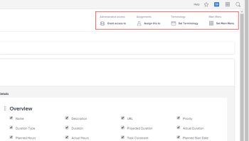

# New Layout Templates area in *the new Adobe Workfront experience*

As a user with administrative access, you can create and edit Layout Templates to customize what your users see in *Adobe Workfront*. This process was completely redesigned with *the new Adobe Workfront experience*. The following information explains the key differences and new customization options

For details and instructions on creating and managing Layout Templates in *the new Adobe Workfront experience*, see [Create and manage layout templates](../../administration-and-setup/customize-workfront/use-layout-templates/create-and-manage-layout-templates.md).

## About Layout Templates migrated from *Adobe Workfront Classic*

Your older Layout Templates created in *Adobe Workfront Classic* have been automatically available in your instance of *the new Adobe Workfront experience* since they were migrated in early Fall 2019. Layout Templates created in *Adobe Workfront Classic* after that time were migrated in April 2020. We recommend that you update these Layout Templates in *the new Adobe Workfront experience* to take advantage of new functionality and to make them even more useful in that environment.

>[!NOTE]
>
>* The migrated version and the original version of each Layout Template are separate because they serve two different environments, so if you edit one version, your changes don't affect the other version.
>* If you created a Layout Template too recently in Workfront Classic to be able to see it in *the new Adobe Workfront experience*, you can contact Workfront Support to request that we migrate it for you.
>

## Benefits of the new Layout Templates design and features

<ul> 
 <li> 
Everything you need is in one simple view. Customization options are not divided by tabs.
 
  
 </li> 
 <li>All of the <em>Workfront</em> areas you can customize are available in a single drop-down list.

</li> 
 <li> 
You can pin work items that your users need often, such as a project or report they view daily.
 
  
 </li> 
 <li> 
You can drag to rearrange items throughout <em>Workfront</em>:
 
  <ul> 
   <li>Left panel items</li> 
   <li>Areas in the Details view</li> 
   <li>Fields in Home and Summary</li> 
   <li> 
Main Menu items
 
  
 </li> 
  </ul> </li> 
 <li> 
With a click, you can hide or show items throughout <em>Workfront</em>:
 
  <ul> 
   <li>Left panel items.</li> 
   <li>Fields in Home and Summary.</li> 
   <li>Controls in list filters, views, and groupings.</li> 
   <li> 
Fields in the Details view, including native fields that your users don't need.
 
  
 </li> 
  </ul> </li> 
 <li> 
You can easily access the general customization controls for Layout Templates, always available in the upper-right corner of the screen.
 
  
 </li> 
</ul>

