# New object actions area {#new-object-actions-area}

As part of the redesign in *`the new Adobe Workfront experience`*, we have added new actions areas for several objects. 

For information about *`Workfront`* objects, see [Understand objects in Adobe Workfront](understand-objects.md).

In *`Workfront`* classic, the actions area is located in the upper-right corner of the object page.

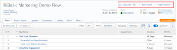

In *`the new Adobe Workfront experience`*, the actions area is located next to the name of the object.

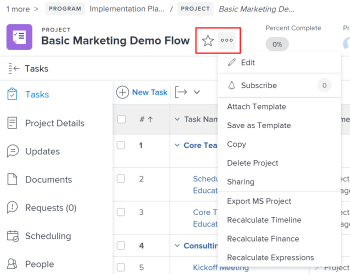

>[!NOTE]
>
>The actions area of some objects—such as reports or dashboards—display in the same locations in *`the new Adobe Workfront experience`* as in *`Adobe Workfront Classic`*.

## Benefits of the new actions area {#benefits-of-the-new-actions-area}

Consider the following when using the new actions areas in *`the new Adobe Workfront experience`*:

*  The area remains highly visible in the upper-left corner of the object page.
* The area is smaller and less intrusive, as links have been replaced by icons.
* The Favorites icon  has been added to the area for better visibility and accessibility.

## Access requirements {#access-requirements}

You must have the following access to perform the steps in this article:

<table style="width: 100%;margin-left: 0;margin-right: auto;mc-table-style: url('../../Resources/TableStyles/TableStyle-List-options-in-steps.css');" class="TableStyle-TableStyle-List-options-in-steps" cellspacing="0"> 
 <col class="TableStyle-TableStyle-List-options-in-steps-Column-Column1"> 
 <col class="TableStyle-TableStyle-List-options-in-steps-Column-Column2"> 
 <tbody> 
  <tr class="TableStyle-TableStyle-List-options-in-steps-Body-LightGray"> 
   <td class="TableStyle-TableStyle-List-options-in-steps-BodyE-Column1-LightGray" role="rowheader">Adobe Workfront plan*</td> 
   <td class="TableStyle-TableStyle-List-options-in-steps-BodyD-Column2-LightGray"> 
Any
 </td> 
  </tr> 
  <tr class="TableStyle-TableStyle-List-options-in-steps-Body-MediumGray"> 
   <td class="TableStyle-TableStyle-List-options-in-steps-BodyE-Column1-MediumGray" role="rowheader">Adobe Workfront license*</td> 
   <td class="TableStyle-TableStyle-List-options-in-steps-BodyD-Column2-MediumGray"> 
Request or higher
 </td> 
  </tr> 
  <tr class="TableStyle-TableStyle-List-options-in-steps-Body-LightGray"> 
   <td class="TableStyle-TableStyle-List-options-in-steps-BodyE-Column1-LightGray" role="rowheader">Access level configurations*</td> 
   <td class="TableStyle-TableStyle-List-options-in-steps-BodyD-Column2-LightGray"> 
View or higher access to the object whose actions area you want to access
 
Note: If you still don't have access, ask your Workfront administrator if they set additional restrictions in your access level. For information on how a Workfront administrator can modify your access level, see <a href="create-modify-access-levels.md" class="MCXref xref">Create or modify custom access levels</a>.
 </td> 
  </tr> 
  <tr class="TableStyle-TableStyle-List-options-in-steps-Body-MediumGray"> 
   <td class="TableStyle-TableStyle-List-options-in-steps-BodyB-Column1-MediumGray" role="rowheader">Object permissions</td> 
   <td class="TableStyle-TableStyle-List-options-in-steps-BodyA-Column2-MediumGray"> 
View or higher permissions to the object whose actions area you want to access
 
For information on requesting additional access, see <a href="request-access.md" class="MCXref xref">Request access to objects in Adobe Workfront</a>.
 </td> 
  </tr> 
 </tbody> 
</table>

&#42;To find out what plan, license type, or access you have, contact your *`Workfront administrator`*.

## Access the actions area for *`Workfront`* objects {#access-the-actions-area-for-workfront-objects}

Accessing the new actions area for *`Workfront`* objects is similar for all objects, but the options available in the actions area differ depending on the object you are viewing.

For information on what options are available for an object, see [Actions areas for objects in the new Adobe Workfront experience](#examples).

To access the actions area:

1.  Go to an object that displays the new actions areas.

   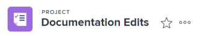

1.  (Optional) Click the `More` menu , then select the action that you want.

   For example, select `Edit` on a task to update the `Actual Start Date` in the `Edit Task` dialog.

   >[!NOTE]
   >
   >The options available in the More menu vary by object. For information on what is available for a specific object, see [Actions areas for objects in the new Adobe Workfront experience](#examples) in this article.

1.  (Optional) Click the `Favorites` icon  to add an object to your `Favorites` menu.

   To learn more about the Favorites menu, see [View and manage favorites](view-and-manage-favorites.md).

1.  (Conditional) If you want to see a different version of a document, click the version drop-down menu 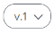, then select the version that you want to see.

## Actions areas for objects in *`the new Adobe Workfront experience`* {#actions-areas-for-objects-in-the-new-adobe-workfront-experience}

The following are examples of redesigned actions areas in *`the new Adobe Workfront experience`*:

<table class="TableStyle-TableStyle-HeaderRow" style="mc-table-style: url('../../Resources/TableStyles/TableStyle-HeaderRow.css');margin-left: 0;margin-right: auto;" cellspacing="15"> 
 <col class="TableStyle-TableStyle-HeaderRow-Column-Column1"> 
 <col class="TableStyle-TableStyle-HeaderRow-Column-Column1"> 
 <thead> 
  <tr class="TableStyle-TableStyle-HeaderRow-Head-Header1"> 
   <th class="TableStyle-TableStyle-HeaderRow-HeadE-Column1-Header1">Object</th> 
   <th class="TableStyle-TableStyle-HeaderRow-HeadD-Column1-Header1">Actions area</th> 
  </tr> 
 </thead> 
 <tbody> 
  <tr class="TableStyle-TableStyle-HeaderRow-Body-LightGray"> 
   <td class="TableStyle-TableStyle-HeaderRow-BodyE-Column1-LightGray">Portfolio </td> 
   <td class="TableStyle-TableStyle-HeaderRow-BodyD-Column1-LightGray"> 
The actions area for a portfolio includes the Favorites icon  and the More menu .
 
 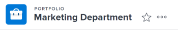 
 
You can select the following options from the More menu:
 
    <ul> 
     <li>Edit</li> 
     <li> 
Deactivate Portfolio
 </li> 
     <li> 
Delete Portfolio
 </li> 
     <li>Sharing</li> 
    </ul> </td> 
  </tr> 
  <tr class="TableStyle-TableStyle-HeaderRow-Body-MediumGray"> 
   <td class="TableStyle-TableStyle-HeaderRow-BodyE-Column1-MediumGray">Program </td> 
   <td class="TableStyle-TableStyle-HeaderRow-BodyD-Column1-MediumGray"> 
The actions area for a program includes the Favorites icon  and the More menu .
 
 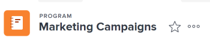 
 
You can select the following options from the More menu:
 
    <ul> 
     <li>Edit</li> 
     <li> 
Deactivate Program
 </li> 
     <li> 
Delete Program
 </li> 
     <li>Sharing</li> 
    </ul> </td> 
  </tr> 
  <tr class="TableStyle-TableStyle-HeaderRow-Body-LightGray"> 
   <td class="TableStyle-TableStyle-HeaderRow-BodyE-Column1-LightGray">Project </td> 
   <td class="TableStyle-TableStyle-HeaderRow-BodyD-Column1-LightGray"> 
The actions area for a project includes the Favorites icon  and the More menu .
 
  
 
You can select the following options from the More menu:
 
    <ul> 
     <li>Edit</li> 
     <li>Subscribe</li> 
     <li>Attach Template</li> 
     <li>Save as Template</li> 
     <li>Copy</li> 
     <li>Delete Project</li> 
     <li>Sharing</li> 
     <li>Export MS Project</li> 
     <li>Recalculate Timeline</li> 
     <li>Recalculate Finance</li> 
     <li> 
Recalculate Expressions
 
Note: The Recalculate Expressions option displays only when there is a custom form attached to the object.
 </li> 
    </ul> </td> 
  </tr> 
  <tr class="TableStyle-TableStyle-HeaderRow-Body-MediumGray"> 
   <td class="TableStyle-TableStyle-HeaderRow-BodyE-Column1-MediumGray">Task </td> 
   <td class="TableStyle-TableStyle-HeaderRow-BodyD-Column1-MediumGray"> 
The actions area for a task includes the Favorites icon  and the More menu .
 
 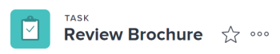 
 
The Dependency icon also displays if there are predecessors or successors for the task.
 
You can select the following options from the More menu:
 
    <ul> 
     <li>Edit</li> 
     <li>Subscribe</li> 
     <li>Copy to</li> 
     <li>Move to</li> 
     <li>Delete Task</li> 
     <li>Sharing</li> 
     <li> 
Recalculate Expressions
 
Note: The Recalculate Expressions option displays only when there is a custom form attached to the object.
 </li> 
     <li>Convert to Project</li> 
    </ul> </td> 
  </tr> 
  <tr class="TableStyle-TableStyle-HeaderRow-Body-LightGray"> 
   <td class="TableStyle-TableStyle-HeaderRow-BodyE-Column1-LightGray">Issue </td> 
   <td class="TableStyle-TableStyle-HeaderRow-BodyD-Column1-LightGray"> 
The actions area for an issue includes the Favorites icon  and the More menu .
 
  
 
The Dependency icon also displays if there are predecessors or successors for the issue.
 
You can select the following options from the More menu:
 
    <ul> 
     <li>Edit</li> 
     <li>Subscribe</li> 
     <li>Copy</li> 
     <li>Move</li> 
     <li>Delete Issue</li> 
     <li>Sharing</li> 
     <li> 
Convert to Task
 </li> 
     <li>Convert to Project</li> 
     <li> 
Recalculate Expressions
 
Note: The Recalculate Expressions option displays only when there is a custom form attached to the object.
 </li> 
    </ul> </td> 
  </tr> 
  <tr class="TableStyle-TableStyle-HeaderRow-Body-MediumGray"> 
   <td class="TableStyle-TableStyle-HeaderRow-BodyE-Column1-MediumGray">Document </td> 
   <td class="TableStyle-TableStyle-HeaderRow-BodyD-Column1-MediumGray"> 
The actions area for a document includes the Version drop-down menu , the Favorites icon , and the More menu .
 
 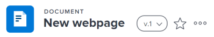 
 
You can select the following options from the More menu:
 
    <ul> 
     <li>Share</li> 
     <li>Move</li> 
     <li>Delete Document</li> 
     <li>Download</li> 
     <li>Send</li> 
    </ul> </td> 
  </tr> 
  <tr class="TableStyle-TableStyle-HeaderRow-Body-LightGray" data-mc-conditions=""> 
   <td class="TableStyle-TableStyle-HeaderRow-BodyE-Column1-LightGray">Template </td> 
   <td class="TableStyle-TableStyle-HeaderRow-BodyD-Column1-LightGray"> 
The actions area for a template includes the Favorites icon  and the More menu .
 
  
 
You can select the following options from the More menu:
 
    <ul> 
     <li>Edit</li> 
     <li>Create Project</li> 
     <li>Copy</li> 
     <li>Template Sharing</li> 
     <li>Project Sharing</li> 
     <li>Deactivate Template</li> 
     <li>Delete Template</li> 
     <li>Recalculate Timeline</li> 
    </ul> </td> 
  </tr> 
  <tr class="TableStyle-TableStyle-HeaderRow-Body-MediumGray" data-mc-conditions=""> 
   <td class="TableStyle-TableStyle-HeaderRow-BodyE-Column1-MediumGray">Template Task </td> 
   <td class="TableStyle-TableStyle-HeaderRow-BodyD-Column1-MediumGray"> 
The actions area for a template task includes the Favorites icon  and the More menu .
 
 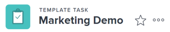 
 
You can select the following options from the More menu:
 
    <ul> 
     <li>Edit</li> 
     <li>Copy</li> 
     <li>Move</li> 
     <li>Delete Template Task</li> 
    </ul> </td> 
  </tr> 
  <tr class="TableStyle-TableStyle-HeaderRow-Body-LightGray"> 
   <td class="TableStyle-TableStyle-HeaderRow-BodyE-Column1-LightGray">User </td> 
   <td class="TableStyle-TableStyle-HeaderRow-BodyD-Column1-LightGray"> 
The actions area for a user includes the Favorites icon  and the More menu .
 
 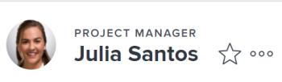 
 
You can select the following options from the More menu:
 
    <ul> 
     <li> 
Send work request
 
This creates an ad-hoc task for the user. For information about ad-hoc tasks, see <a href="create-work-items-in-home.md" class="MCXref xref">Create work items from the Home area</a>.
 </li> 
     <li>Edit</li> 
     <li> 
Deactivate
 </li> 
    </ul> </td> 
  </tr> 
  <tr class="TableStyle-TableStyle-HeaderRow-Body-MediumGray"> 
   <td class="TableStyle-TableStyle-HeaderRow-BodyE-Column1-MediumGray">Team </td> 
   <td class="TableStyle-TableStyle-HeaderRow-BodyD-Column1-MediumGray"> 
The actions area for a team includes the Switch Team icon , the Favorites icon  and the More menu .
 
 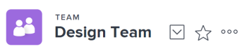 
 
With the Switch Team icon , you can select a new team from the drop-down menu. If a team doesn't display by default in the drop-down, use the search bar to find and select the team.
 
You can select the following options from the More menu:
 
    <ul> 
     <li> 
Send work request
 
This creates an ad-hoc task for the team. For information about ad-hoc tasks, see <a href="create-work-items-in-home.md" class="MCXref xref">Create work items from the Home area</a>.
 </li> 
     <li>Edit</li> 
     <li> 
Delete
 </li> 
    </ul> </td> 
  </tr> 
  <tr class="TableStyle-TableStyle-HeaderRow-Body-LightGray" data-mc-conditions=""> 
   <td class="TableStyle-TableStyle-HeaderRow-BodyE-Column1-LightGray">Iteration </td> 
   <td class="TableStyle-TableStyle-HeaderRow-BodyD-Column1-LightGray"> 
The actions area for an iteration includes the Favorites icon , the Synchronize Burndown Data icon , the Edit icon , and the More menu .
 
In Preview, the actions area has moved to the right of the iteration name.
 
  
 
You can select the following options from the More menu:
 
    <ul> 
     <li> 
Delete Iteration
 </li> 
    </ul> </td> 
  </tr> 
  <tr class="TableStyle-TableStyle-HeaderRow-Body-MediumGray" data-mc-conditions=""> 
   <td class="TableStyle-TableStyle-HeaderRow-BodyB-Column1-MediumGray">Plan </td> 
   <td class="TableStyle-TableStyle-HeaderRow-BodyA-Column1-MediumGray"> 
The actions area for a plan includes the Favorites icon  and the More menu .
 
  
 
You can select the following options from the More menu:
 
    <ul> 
     <li> 
Share
 </li> 
     <li> 
Delete
 </li> 
    </ul> 
To learn about the other actions available in the plan header, see <a href="new-object-headers.md" class="MCXref xref">New object headers</a>.
 
To learn more about plans in the Workfront Scenario Planner, see <a href="plans-overview.md" class="MCXref xref">Plans overview in the Adobe Workfront Scenario Planner</a>.
 </td> 
  </tr> 
 </tbody> 
</table>

