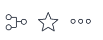
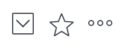
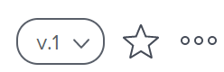
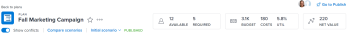

# New object headers

You can view information at a glance about objects in Adobe Workfront when you review their header. The information in a header can include the owner of the object, the status, or the percent complete.

The look and feel of the headers—as well as what information is included—has changed in the new Adobe Workfront experience for some objects. This redesign allows you to quickly understand an object's state or to access additional editing and sharing options for that object.

The headers of the following objects have been redesigned:

| Object type |Section in this article |
|---|---|
| Home | [Home header overview](#home)  |
| Project | [Project header overview](#project)  |
| Task | [Task header overview](#task)  |
| Issue | [Issue header overview](#issue)  |
| Program | [Program header overview](#program)  |
| Portfolio | [Portfolio header overview](#portfoli)  |
| Template | [Template header overview](#templat)  |
| Template Task | [Template Task header overview](#template)  |
| Billing Record | [Billing Record header overview](#billing)  |
| User | [User header overview](#user)  |
| Team | [Team header overview](#team)  |
| Document | [Document header overview](#document)  |

For more information on objects, see [Understand objects in Adobe Workfront](../../workfront-basics/navigate-workfront/workfront-navigation/understand-objects.md).

## Benefits of the new object headers

Consider the following benefits as you view the new object headers in the new Adobe Workfront experience:

* Streamlined design which is cohesive for all objects
* Improved breadcrumbs allow for a deeper hierarchy of objects to display at one time
* The name of the object type displays to add clarity
* Colorful, more modern icons that are larger for easier viewing
* Improved discoverability as more relevant information displays in the header

  For example, the Planned Completion Date field now displays in the header of projects, tasks, and issues.

## Access the header of an object

Accessing the header for an object in Workfront is identical for all the objects that have it.

For example, to access the header of a project:

1. Go to a project.  
   The header displays at the top of the page and contains the name of the project.

   

## Home header overview

The following headers are available in Home:

* Task: For more information on how you can use this header, see the [Task header overview](#task) in this article.
* Issue: For more information on how you can use this header, see the [Issue header overview](#issue) in this article.

## Project header overview

The project header displays the following information:

<table cellspacing="0"> 
 <col> 
 <col> 
 <thead> 
  <tr> 
   <th>Header Information</th> 
   <th>Notes</th> 
  </tr> 
 </thead> 
 <tbody> 
  <tr> 
   <td role="rowheader">Breadcrumb with parent objects</td> 
   <td>If the project is associated with a program or a portfolio, they display in the breadcrumb in the upper-left corner of the header. Clicking the name of the parent opens that parent object.</td> 
  </tr> Object icon The purple Project icon displays to the left of the project name. 
  <tr> 
   <td role="rowheader">Name of the project</td> 
   <td>You can edit the project name in the header.</td> 
  </tr> 
  <tr> 
   <td role="rowheader">Name of the object type</td> 
   <td> 
The text "PROJECT" displays above the project name in the header.
 </td> 
  </tr> 
  <tr> 
   <td role="rowheader">The actions area of the task</td> 
   <td> 
Next to the name of the project, the actions area displays.
 
  
 
To learn more about the new actions area, see <a href="../../workfront-basics/the-new-workfront-experience/new-object-actions-area.md" class="MCXref xref">New object actions area</a>.
 </td> 
  </tr> 
  <tr> 
   <td role="rowheader">Percent Complete</td> 
   <td>You cannot edit the project percent complete in the header.</td> 
  </tr> 
  <tr> 
   <td role="rowheader">Project Owner</td> 
   <td> 
You can edit the Project Owner in the header.
 </td> 
  </tr> 
  <tr> 
   <td role="rowheader">Planned Completion Date </td> 
   <td> 
You can edit the project Planned Completion Date and time in the header if the project is scheduled from Completion Date. If the project is scheduled from Start Date, this information is updated from the tasks in the project.
 </td> 
  </tr> 
  <tr> 
   <td role="rowheader">Condition </td> 
   <td> 
When you set the Condition Type of the project to Manual, you can update the project Condition in the header.
 
To learn more, see <a href="../../manage-work/projects/manage-projects/project-condition-and-condition-type.md" class="MCXref xref">Overview of Project Condition and Condition Type</a>.
 </td> 
  </tr> 
  <tr> 
   <td role="rowheader">Status</td> 
   <td>You can edit the project Status in the header.</td> 
  </tr> 
  <tr> 
   <td role="rowheader">The Approvals area</td> 
   <td> 
When you are one of the approvers, use the following icons to manage the approvals for the project:
 
  </img> Approve
 
  </img> Reject
 
  </img> Recall
 
If you are not an approver, click the More icon  to view information about the current approval step.
 
To learn more about approvals, see <a href="../../review-and-approve-work/manage-approvals/approval-process-in-workfront.md" class="MCXref xref">Approval process overview</a>.
 </td> 
  </tr> 
 </tbody> 
</table>

## Task header overview

The task header includes the following information:

<table cellspacing="0"> 
 <col> 
 <col> 
 <thead> 
  <tr> 
   <th>Header Information</th> 
   <th>Notes</th> 
  </tr> 
 </thead> 
 <tbody> 
  <tr> 
   <td role="rowheader">Breadcrumb with parent objects</td> 
   <td> 
The parent objects of the task display in the breadcrumb. Clicking the name of the parent opens that parent object.
 
For more information, see <a href="../../workfront-basics/the-new-workfront-experience/breadcrumb-overview.md" class="MCXref xref">Breadcrumbs overview in the new Adobe Workfront experience</a>.
 </td> 
  </tr> Object icon The green Task icon displays to the left of the task name. 
  <tr> 
   <td role="rowheader">Name of the task</td> 
   <td>You can edit the task name in the header.</td> 
  </tr> 
  <tr> 
   <td role="rowheader">Name of the object type</td> 
   <td> 
The text "TASK" displays above the task name in the header.
 </td> 
  </tr> 
  <tr> 
   <td role="rowheader">The actions area of the task</td> 
   <td> 
Next to the name of the task, the actions area displays.
 
  
 
If the Dependency icon displays, you can click the icon to see any predecessors or successors for the task.
 
To learn more about the new actions area, see <a href="../../workfront-basics/the-new-workfront-experience/new-object-actions-area.md" class="MCXref xref">New object actions area</a>.
 </td> 
  </tr> 
  <tr> 
   <td role="rowheader">Percent Complete</td> 
   <td>You can edit the task percent complete in the header.</td> 
  </tr> 
  <tr> 
   <td role="rowheader">Assignments</td> 
   <td>You can edit the assignees of a task from the header.</td> 
  </tr> 
  <tr> 
   <td role="rowheader"> 
Work on It, Done, or Start Task button
 </td> 
   <td> 
If the task is assigned to you, you can click the Work on It or Start Task button to indicate that you are now working on the task, or the Done button to indicate that you completed the task.
 
For information about replacing the Work On It button with a Start Task button, see <a href="../../people-teams-and-groups/create-and-manage-teams/work-on-it-button-to-start-button.md" class="MCXref xref">Replace the Work On It button with a Start button</a> . 
 </td> 
  </tr> 
  <tr> 
   <td role="rowheader">Planned Completion Date</td> 
   <td> 
You can edit the task Planned Completion Date and time in the header.
 
Tip: Notice that the Commit Date is not visible in the header. You can view it on the Details page.
 </td> 
  </tr> 
  <tr> 
   <td role="rowheader">Status</td> 
   <td>You can edit the task Status in the header.</td> 
  </tr> 
  <tr> 
   <td role="rowheader">The Approvals area</td> 
   <td> 
When you are one of the approvers, use the following icons to manage the approvals for the task:
 
  </img> Approve
 
  </img> Reject
 
  </img> Recall
 
If you are not an approver, click the More icon  to view information about the current approval step.
 
To learn more about approvals, see <a href="../../review-and-approve-work/manage-approvals/approval-process-in-workfront.md" class="MCXref xref">Approval process overview</a>.
 </td> 
  </tr> 
 </tbody> 
</table>

## Issue header overview

The issue header includes the following information:

<table cellspacing="0"> 
 <col> 
 <col> 
 <thead> 
  <tr> 
   <th>Header Information</th> 
   <th>Notes</th> 
  </tr> 
 </thead> 
 <tbody> 
  <tr> 
   <td role="rowheader">Breadcrumb with parent objects</td> 
   <td> 
The parent objects of the issue display in the breadcrumb. Clicking the name of the parent opens that parent object.
 
For more information, see <a href="../../workfront-basics/the-new-workfront-experience/breadcrumb-overview.md" class="MCXref xref">Breadcrumbs overview in the new Adobe Workfront experience</a>.
 </td> 
  </tr> 
  <tr> 
   <td role="rowheader">Object icon </td> 
   <td> 
The pink Issue icon  displays to the left of the issue name.
 </td> 
  </tr> 
  <tr> 
   <td role="rowheader">Name of the issue</td> 
   <td>You can edit the issue name in the header.</td> 
  </tr> 
  <tr> 
   <td role="rowheader">Name of the object type</td> 
   <td> 
The text "ISSUE" displays above the issue name in the header.
 </td> 
  </tr> 
  <tr> 
   <td role="rowheader">The actions area of the issue</td> 
   <td> 
Next to the name of the issue, the actions area displays.
 
  
 
If the Dependency icon displays, you can click the icon to see any predecessors or successors for the issue.
 
To learn more about the new actions area, see <a href="../../workfront-basics/the-new-workfront-experience/new-object-actions-area.md" class="MCXref xref">New object actions area</a>.
 </td> 
  </tr> 
  <tr> 
   <td role="rowheader">Percent Complete</td> 
   <td> 
You can edit the percent complete of the issue from the header.
 </td> 
  </tr> 
  <tr> 
   <td role="rowheader">Assignments</td> 
   <td>You can edit the assignees of a issue from the header.</td> 
  </tr> 
  <tr> 
   <td role="rowheader">Work on It, Done, or Start Issue button</td> 
   <td>If the issue is assigned to you, you can click the Work on It or Start Issue button to indicate that you are now working on the issue, or the Done button to indicate that you completed the issue.For information about replacing the Work On It button with a Start Task button, see <a href="../../people-teams-and-groups/create-and-manage-teams/work-on-it-button-to-start-button.md" class="MCXref xref">Replace the Work On It button with a Start button</a>.</td> 
  </tr> 
  <tr> 
   <td role="rowheader">Planned Completion Date</td> 
   <td> 
You can edit the issue Planned Completion Date and time in the header.
 
Tip: Notice that the Commit Date is not visible in the header. You can view it on the Details page.
 </td> 
  </tr> 
  <tr> 
   <td role="rowheader">Status</td> 
   <td>You can edit the issue Status in the header.</td> 
  </tr> 
  <tr> 
   <td role="rowheader">The Approvals area</td> 
   <td> 
When you are one of the approvers, use the following icons to manage the approvals for the issue:
 
  Approve
 
  Reject
 
  Recall
 
If you are not an approver, click the More icon  to view information about the current approval step.
 
To learn more about approvals, see <a href="../../review-and-approve-work/manage-approvals/approval-process-in-workfront.md" class="MCXref xref">Approval process overview</a>.
 </td> 
  </tr> 
 </tbody> 
</table>

## Program header overview

The program header displays the following information:

<table cellspacing="0"> 
 <col> 
 <col> 
 <thead> 
  <tr> 
   <th>Header Information</th> 
   <th>Notes</th> 
  </tr> 
 </thead> 
 <tbody> 
  <tr> 
   <td role="rowheader">Breadcrumb with the name of the Portfolio</td> 
   <td> 
You can access the Portfolio from the header of the Program. Clicking the name of the parent opens that parent object.
 
For more information, see <a href="../../workfront-basics/the-new-workfront-experience/breadcrumb-overview.md" class="MCXref xref">Breadcrumbs overview in the new Adobe Workfront experience</a>.
 </td> 
  </tr> 
  <tr> 
   <td role="rowheader">Object icon </td> 
   <td> 
The orange Program icon  displays to the left of the program name.
 </td> 
  </tr> 
  <tr> 
   <td role="rowheader">Name of the program</td> 
   <td>You can edit the program name in the header.</td> 
  </tr> 
  <tr> 
   <td role="rowheader">Name of the object type</td> 
   <td> 
If the program is marked as Active, the text "PROGRAM" displays above the program name in the header.
 </td> 
  </tr> 
  <tr> 
   <td role="rowheader">Activation status</td> 
   <td> 
If the program is deactivated, the text "PROGRAM DEACTIVATED" displays above the program name in the header.
 </td> 
  </tr> 
  <tr> 
   <td role="rowheader">The actions area of the program</td> 
   <td> 
Next to the name of the program, the actions area displays.
 
  
 
To learn more about the new actions area, see <a href="../../workfront-basics/the-new-workfront-experience/new-object-actions-area.md" class="MCXref xref">New object actions area</a>.
 </td> 
  </tr> 
  <tr> 
   <td role="rowheader">Percent Complete</td> 
   <td> 
You cannot edit the Percent Complete of the program in the header. This information is updated from the projects in the program.
 
Tip: By default, the percent complete of the program is an average of the percent complete values of the projects in a Current or Approved Status that belong to the program.
 </td> 
  </tr> 
  <tr> 
   <td role="rowheader">Program Manager</td> 
   <td> 
You can edit the Program Manager in the header. This is the same as the Program Owner.
 </td> 
  </tr> 
  <tr> 
   <td role="rowheader">Planned Completion Date</td> 
   <td>You cannot edit the program Planned Completion Date in the header. This information is updated from the Planned Completion Date of the projects in the program.</td> 
  </tr> 
  <tr> 
   <td role="rowheader">Active Projects Condition</td> 
   <td>This is a calculation of what percentage of active projects in the program have the Condition set as On Target, At Risk, or In Trouble.</td> 
  </tr> 
 </tbody> 
</table>

## Portfolio header overview

The portfolio header includes the following information:

<table cellspacing="0"> 
 <col> 
 <col> 
 <thead> 
  <tr> 
   <th>Header Information</th> 
   <th>Notes</th> 
  </tr> 
 </thead> 
 <tbody> 
  <tr> 
   <td role="rowheader">Object icon </td> 
   <td> 
The blue Portfolio icon displays to the left of the portfolio name.
 </td> 
  </tr> 
  <tr> 
   <td role="rowheader">Name of the portfolio</td> 
   <td>You can edit the portfolio name in the header.</td> 
  </tr> 
  <tr> 
   <td role="rowheader">Name of the object type</td> 
   <td> 
If the portfolio is marked as active, the text "PORTFOLIO" displays above the portfolio name in the header.
 </td> 
  </tr> 
  <tr> 
   <td role="rowheader">Activation status</td> 
   <td> 
If the portfolio is deactivated, the text "PORTFOLIO DEACTIVATED" displays above the portfolio name in the header.
 </td> 
  </tr> 
  <tr> 
   <td role="rowheader">The actions area of the portfolio</td> 
   <td> 
Next to the name of the portfolio, the actions area displays.
 
  
 
To learn more about the new actions area, see <a href="../../workfront-basics/the-new-workfront-experience/new-object-actions-area.md" class="MCXref xref">New object actions area</a>.
 </td> 
  </tr> 
  <tr> 
   <td role="rowheader">Portfolio Manager</td> 
   <td>You can edit the Portfolio Manager in the header. This is the same as the Portfolio Owner.</td> 
  </tr> 
  <tr> 
   <td role="rowheader">On Time</td> 
   <td>This is a calculation of what percentage of projects in the portfolio are currently on time.</td> 
  </tr> 
  <tr> 
   <td role="rowheader">On Budget</td> 
   <td>This is a calculation of what percentage of projects in the portfolio are currently on budget.</td> 
  </tr> 
  <tr> 
   <td role="rowheader">Aligned</td> 
   <td>This is a calculation of what percentage of projects in the portfolio are aligned with the portfolio.</td> 
  </tr> 
  <tr> 
   <td role="rowheader">ROI</td> 
   <td>This is the Return on Investment calculation for all projects in the portfolio.</td> 
  </tr> 
  <tr> 
   <td role="rowheader">Net Value</td> 
   <td>This is the Net Value calculation for all projects in the portfolio.</td> 
  </tr> 
 </tbody> 
</table>

##  Template header overview

The template header displays the following information:

<table cellspacing="0"> 
 <col> 
 <col> 
 <thead> 
  <tr> 
   <th>Header Information</th> 
   <th>Notes</th> 
  </tr> 
 </thead> 
 <tbody> 
  <tr> 
   <td role="rowheader">Object icon </td> 
   <td> 
The green Template icon displays to the left of the template name.
 </td> 
  </tr> 
  <tr> 
   <td role="rowheader">Name of the template</td> 
   <td>You can edit the template name in the header.</td> 
  </tr> 
  <tr> 
   <td role="rowheader">Name of the object type</td> 
   <td> 
If the template is marked as active, the text "TEMPLATE" displays above the Template name in the header.
 </td> 
  </tr> 
  <tr> 
   <td role="rowheader">Activation status</td> 
   <td> 
If the template is deactivated, the text "TEMPLATE DEACTIVATED" displays above the template name in the header.
 </td> 
  </tr> 
  <tr> 
   <td role="rowheader">The actions area of the template</td> 
   <td> 
Next to the name of the template, the actions area displays.
 
  
 
To learn more about the new actions area, see <a href="../../workfront-basics/the-new-workfront-experience/new-object-actions-area.md" class="MCXref xref">New object actions area</a>.
 </td> 
  </tr> 
  <tr> 
   <td role="rowheader">Template Owner</td> 
   <td>You can edit the Template Owner field in the header.</td> 
  </tr> 
  <tr> 
   <td role="rowheader">Duration</td> 
   <td>The duration of the template. You cannot edit this field in the header.</td> 
  </tr> 
 </tbody> 
</table>

## Template Task header overview

The template task header displays the following information:

<table cellspacing="0"> 
 <col> 
 <col> 
 <thead> 
  <tr> 
   <th>Header Information</th> 
   <th>Notes</th> 
  </tr> 
 </thead> 
 <tbody> 
  <tr> 
   <td role="rowheader">Breadcrumb to parent objects</td> 
   <td> 
The parent objects of the template task display in the breadcrumb. Clicking the name of a parent object opens that parent object.
 
For more information, see <a href="../../workfront-basics/the-new-workfront-experience/breadcrumb-overview.md" class="MCXref xref">Breadcrumbs overview in the new Adobe Workfront experience</a>.
 </td> 
  </tr> 
  <tr> 
   <td role="rowheader">Object icon </td> 
   <td> 
The green Task icon displays to the left of the template task name.
 </td> 
  </tr> 
  <tr> 
   <td role="rowheader">Name of the template task</td> 
   <td>You can edit the template task name in the header.</td> 
  </tr> 
  <tr> 
   <td role="rowheader">Name of the object type</td> 
   <td> 
The text "TEMPLATE TASK" displays above the template task name in the header.
 </td> 
  </tr> 
  <tr> 
   <td role="rowheader">The actions area of the template task</td> 
   <td> 
Next to the name of the template task, the actions area displays.
 
  
 
To learn more about the new actions area, see <a href="../../workfront-basics/the-new-workfront-experience/new-object-actions-area.md" class="MCXref xref">New object actions area</a>.
 </td> 
  </tr> 
  <tr> 
   <td role="rowheader">Assignments</td> 
   <td>You can edit the Assignments of the template task in the header.</td> 
  </tr> 
  <tr> 
   <td role="rowheader">Completion Day</td> 
   <td>This is the day in the duration of the template when the template task should complete.</td> 
  </tr> 
 </tbody> 
</table>

## Billing Record header overview

The billing record header displays the following information:

<table cellspacing="0"> 
 <col> 
 <col> 
 <thead> 
  <tr> 
   <th>Header Information</th> 
   <th>Notes</th> 
  </tr> 
 </thead> 
 <tbody> 
  <tr> 
   <td role="rowheader">Breadcrumb to parent objects</td> 
   <td> 
The parent objects of the billing record display in the breadcrumb. Clicking the name of a parent object opens that parent object.
 
For more information, see <a href="../../workfront-basics/the-new-workfront-experience/breadcrumb-overview.md" class="MCXref xref">Breadcrumbs overview in the new Adobe Workfront experience</a>.
 </td> 
  </tr> 
  <tr> 
   <td role="rowheader">Object icon </td> 
   <td> 
The blue Billing Record icon  displays to the left of the billing record name.
 </td> 
  </tr> 
  <tr> 
   <td role="rowheader">Name of the billing record</td> 
   <td>You can edit the name of the billing record in the header.</td> 
  </tr> 
  <tr> 
   <td role="rowheader">Name of the object type</td> 
   <td> 
The text "BILLING RECORD" displays above the billing record name in the header.
 </td> 
  </tr> 
  <tr> 
   <td role="rowheader">The actions area of the billing record</td> 
   <td> 
Next to the name of the billing record, the More menu  displays, which allows you to select the following options:
 
    <ul> 
     <li> 
Edit
 </li> 
     <li> 
Delete
 </li> 
    </ul> </td> 
  </tr> 
  <tr> 
   <td role="rowheader">Billing Record Total</td> 
   <td>This is the total amount of the billing record. You cannot edit this field.</td> 
  </tr> 
  <tr> 
   <td role="rowheader">Billing Date</td> 
   <td>This is the date when the billing record was created, unless it was manually changed when the billing record was created. You can edit the Billing Date in the header.</td> 
  </tr> 
  <tr> 
   <td role="rowheader">Status</td> 
   <td> 
When the billing record has a status of Billed, you can no longer edit it.
 
You can edit the Status of the billing record in the header.
 </td> 
  </tr> 
 </tbody> 
</table>

## User header overview

The user header displays the following information:

<table cellspacing="0"> 
 <col> 
 <col> 
 <thead> 
  <tr> 
   <th>Header Information</th> 
   <th>Notes</th> 
  </tr> 
 </thead> 
 <tbody> 
  <tr> 
   <td role="rowheader">User's profile picture</td> 
   <td>You cannot update the profile picture in the header.</td> 
  </tr> 
  <tr> 
   <td role="rowheader">Name of the user and title</td> 
   <td> 
 The title of the user displays in all capital letters above their name. You cannot edit the name of the user in the header.
 </td> 
  </tr> <!--
   Name of the object type The name of the object type does not display.
  --> 
  <tr> 
   <td role="rowheader">Activation status</td> 
   <td> 
If the user has been deactivated, all text and the profile picture in the header is dimmed.
 </td> 
  </tr> 
  <tr> 
   <td role="rowheader">The actions area of the user</td> 
   <td> 
Next to the name of the user, the actions area displays.
 
  
 
To learn more about the new actions area, see <a href="../../workfront-basics/the-new-workfront-experience/new-object-actions-area.md" class="MCXref xref">New object actions area</a>.
 </td> 
  </tr> 
  <tr> 
   <td role="rowheader">Email address</td> 
   <td>You cannot edit the email address in the header. This is usually also the username.</td> 
  </tr> 
  <tr> 
   <td role="rowheader">Phone number</td> 
   <td>You cannot edit the phone number in the header.</td> 
  </tr> 
  <tr> 
   <td role="rowheader">Teams</td> 
   <td> 
You can view the teams that the user belongs to. Mouse over a team avatar to display the team's name. You cannot edit the teams in the header.
 </td> 
  </tr> 
 </tbody> 
</table>

## Team header overview

The team header displays the following information:

<table cellspacing="0"> 
 <col> 
 <col> 
 <thead> 
  <tr> 
   <th>Header Information</th> 
   <th>Notes</th> 
  </tr> 
 </thead> 
 <tbody> 
  <tr> 
   <td role="rowheader">Object icon </td> 
   <td> 
The purple Team icon  displays to the left of the team name.
 </td> 
  </tr> 
  <tr> 
   <td role="rowheader">Name of the team</td> 
   <td>You can edit the team name in the header.</td> 
  </tr> 
  <tr> 
   <td role="rowheader">Name of the object type</td> 
   <td> 
The text "TEAM" displays above the team name in the header.
 </td> 
  </tr> 
  <tr> 
   <td role="rowheader">The actions area of the team</td> 
   <td> 
Next to the name of the team, the actions area displays.
 
  
 
To learn more about the new actions area, see <a href="../../workfront-basics/the-new-workfront-experience/new-object-actions-area.md" class="MCXref xref">New object actions area</a>.
 </td> 
  </tr> 
  <tr> 
   <td role="rowheader">Team member profile pictures</td> 
   <td>The profile pictures of the team members. Mouse over a picture to display the user's name.</td> 
  </tr> 
  <tr> 
   <td role="rowheader">Description</td> 
   <td>This is a brief description about the members of the team. You cannot edit the description of the team in the header.</td> 
  </tr> 
 </tbody> 
</table>

## Iteration header overview

The iteration header displays the following information:

<table cellspacing="0"> 
 <col> 
 <col> 
 <thead> 
  <tr> 
   <th>Header Information</th> 
   <th>Notes</th> 
  </tr> 
 </thead> 
 <tbody> 
  <tr> 
   <td role="rowheader">Object icon </td> 
   <td> 
The orange Iteration icon  displays to the left of the iteration name.
 </td> 
  </tr> 
  <tr> 
   <td role="rowheader">Name of the iteration</td> 
   <td>You can edit the iteration name in the header.</td> 
  </tr> 
  <tr> 
   <td role="rowheader">Name of the object type</td> 
   <td> 
The text "ITERATION" displays above the iteration name in the header.
 </td> 
  </tr> 
  <tr> 
   <td role="rowheader">The actions area of the iteration</td> 
   <td> 
In the upper-right corner of the header, the actions area displays.
 
  
 
To learn more about the new actions area, see <a href="../../workfront-basics/the-new-workfront-experience/new-object-actions-area.md" class="MCXref xref">New object actions area</a>.
 </td> 
  </tr> 
  <tr> 
   <td role="rowheader">Owner</td> 
   <td>This is the Owner of the iteration. You cannot edit the Owner in the header.</td> 
  </tr> 
  <tr> 
   <td role="rowheader">Timeline</td> 
   <td>The Timeline shows the start and end dates of the iteration. You cannot edit the Timeline in the header.</td> 
  </tr> 
  <tr> 
   <td role="rowheader">Team</td> 
   <td>You cannot edit the team of the iteration in the header. Clicking the team name takes you to the team page.</td> 
  </tr> 
 </tbody> 
</table>

## Group header overview

The group header displays the following information:

<table cellspacing="0"> 
 <col> 
 <col> 
 <thead> 
  <tr> 
   <th>Header Information</th> 
   <th>Notes</th> 
  </tr> 
 </thead> 
 <tbody> 
  <tr> 
   <td role="rowheader">Object icon </td> 
   <td> 
The orange Group icon  displays to the left of the group name.
 </td> 
  </tr> 
  <tr> 
   <td role="rowheader">Name of the group</td> 
   <td>You can edit the group name in the header.</td> 
  </tr> 
  <tr> 
   <td role="rowheader">Name of the object type</td> 
   <td> 
The text "GROUP" displays above the group name in the header.
 </td> 
  </tr> 
  <tr> 
   <td role="rowheader">The actions area of the group</td> 
   <td> 
Next to the name of the group, the More menu  displays, which allows you to select the following options:
 
    <ul> 
     <li> 
Edit
 </li> 
     <li> 
Copy
 </li> 
     <li> 
Delete
 </li> 
    </ul> </td> 
  </tr> 
  <tr> 
   <td role="rowheader">Business Leader</td> 
   <td>You can edit the Business Leader in the header.</td> 
  </tr> 
  <tr> 
   <td role="rowheader">Licenses in use </td> 
   <td> 
The Licenses in use box displays the number of Plan and Work license users in the group and its subgroups. You can click the numbers to see this information for all 5 license types.
 
For more information, see <a href="../../administration-and-setup/manage-groups/create-and-manage-groups/view-number-licenses-allocated-used-group.md" class="MCXref xref">View the number of licenses allocated and used in a group in the new Adobe Workfront experience</a>.
 </td> 
  </tr> 
  <tr> 
   <td role="rowheader">Group Administrators</td> 
   <td>You can edit the Group Administrators in the header.</td> 
  </tr> 
 </tbody> 
</table>

## Document header overview

The document header displays the following information:

<table cellspacing="0"> 
 <col> 
 <col> 
 <thead> 
  <tr> 
   <th>Header Information</th> 
   <th>Notes</th> 
  </tr> 
 </thead> 
 <tbody> 
  <tr> 
   <td role="rowheader">Breadcrumb with parent objects</td> 
   <td> 
The parent objects of the document display in the breadcrumb. Clicking the name of a parent object opens that parent object.
 
For more information, see <a href="../../workfront-basics/the-new-workfront-experience/breadcrumb-overview.md" class="MCXref xref">Breadcrumbs overview in the new Adobe Workfront experience</a>.
 </td> 
  </tr> 
  <tr> 
   <td role="rowheader">Object icon </td> 
   <td> 
The blue Document icon  displays to the left of the document name.
 </td> 
  </tr> 
  <tr> 
   <td role="rowheader">Name of the document</td> 
   <td>You can edit the document name in the header.</td> 
  </tr> 
  <tr> 
   <td role="rowheader">Name of the object type</td> 
   <td> 
The text "DOCUMENT" displays above the document name in the header.
 </td> 
  </tr> 
  <tr> 
   <td role="rowheader">The actions area of the document</td> 
   <td> 
Next to the name of the document, the actions area displays.
 
  
 
To learn more about the new actions area, see <a href="../../workfront-basics/the-new-workfront-experience/new-object-actions-area.md" class="MCXref xref">New object actions area</a>.
 </td> 
  </tr> 
  <tr> 
   <td role="rowheader">The approval Decision area</td> 
   <td> 
When the document is in an approval step, the Decisions area displays in the upper-right corner of the Document header.
 
Use the following icons to manage the approvals for the document:
 
  Approve
 
  Recall
 
  Reject
 
For more information on approval decisions, see <a href="../../review-and-approve-work/manage-approvals/approving-work.md" class="MCXref xref">Approving work in Adobe Workfront</a>.
 </td> 
  </tr> 
 </tbody> 
</table>

## Company header overview

The company header displays the following information:

<table cellspacing="0"> 
 <col> 
 <col> 
 <thead> 
  <tr> 
   <th>Header Information</th> 
   <th>Notes</th> 
  </tr> 
 </thead> 
 <tbody> 
  <tr> 
   <td role="rowheader">Object icon </td> 
   <td> 
The blue Company icon  displays to the left of the company name.
 </td> 
  </tr> 
  <tr> 
   <td role="rowheader">Name of the company</td> 
   <td>You can edit the name of the company in the header.</td> 
  </tr> 
  <tr> 
   <td role="rowheader">Name of the object type</td> 
   <td> 
The text "COMPANY" displays above the company name in the header.
 </td> 
  </tr> 
  <tr> 
   <td role="rowheader">The actions area of the company</td> 
   <td> 
Next to the name of the company, the More menu  displays, which allows you to select the following options:
 
    <ul> 
     <li> 
Edit
 </li> 
     <li> 
Delete Company
 </li> 
    </ul> </td> 
  </tr> 
 </tbody> 
</table>

## Plan header overview

Plans are the objects of the Workfront Scenario Planner. For information about the Scenario Planner, see [The Adobe Workfront Scenario Planner overview](../../scenario-planner/scenario-planner-overview.md).

The plan header displays the following information:

<table cellspacing="0"> 
 <col> 
 <col> 
 <thead> 
  <tr> 
   <th>Header Information</th> 
   <th>Notes</th> 
  </tr> 
 </thead> 
 <tbody> 
  <tr> 
   <td role="rowheader">Back to plans</td> 
   <td>Clicking this link takes you to the Plans list.</td> 
  </tr> 
  <tr> 
   <td role="rowheader">Object icon </td> 
   <td> 
The blue Plan icon displays to the left of the plan name.
 </td> 
  </tr> 
  <tr> 
   <td role="rowheader">Name of the plan</td> 
   <td>You can edit the plan name in the header.</td> 
  </tr> 
  <tr> 
   <td role="rowheader">Name of the object type</td> 
   <td> 
The text "PLAN" displays above the plan name in the header.
 </td> 
  </tr> 
  <tr> 
   <td role="rowheader">The actions area of the plan</td> 
   <td> 
Next to the name of the plan, the actions area displays.
 
  
 
To learn more about the new actions area, see <a href="../../workfront-basics/the-new-workfront-experience/new-object-actions-area.md" class="MCXref xref">New object actions area</a>.
 </td> 
  </tr> 
  <tr> 
   <td role="rowheader">Additional plan actions</td> 
   <td> 
Below the plan name and actions area, you can complete the following actions:
 
    <ul> 
     <li> 
Show conflicts: Clicking this toggle shows or hides conflicts in the initiatives.
 </li> 
     <li> 
Compare scenarios: Clicking this link shows you a side-by-side comparison of the scenarios you have created.
 </li> 
     <li> 
Scenario selection: In this drop-down menu, you can copy a scenario or select to view a different scenario.
 </li> 
    </ul> </td> 
  </tr> 
  <tr> 
   <td role="rowheader">Job role information</td> 
   <td>In the Job Role box, you can see how many job roles are available for the plan compared to how many are required. Clicking the box allows you to adjust the available job roles.</td> 
  </tr> 
  <tr> 
   <td role="rowheader">Financial information</td> 
   <td>In the Financial box, you can see the budget, cost, and utilization percentage for the plan. Clicking the box allows you to adjust the budget amount and determine if people costs are included in the plan.</td> 
  </tr> 
  <tr> 
   <td role="rowheader">Net Value</td> 
   <td>In the Net Value box, you can see the net value of the plan based on the budget and costs you have entered for the plan.</td> 
  </tr> 
  <tr> 
   <td role="rowheader">Shared with information</td> 
   <td>The users that have access to view or manage the plan display in the upper-right corner of the header. Hovering over their profile pictures displays their names.</td> 
  </tr> 
  <tr> 
   <td role="rowheader">Go to Publish</td> 
   <td>When you click Go to Publish, you can create or update a project linked to an initiative in the scenario you are viewing.</td> 
  </tr> 
 </tbody> 
</table>

