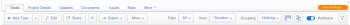
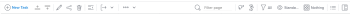
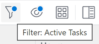
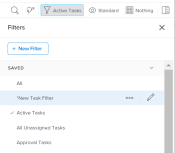

# Toolbar for lists in *`the new Adobe Workfront experience`* {#toolbar-for-lists-in-the-new-adobe-workfront-experience}

The highlighted information on this page refers to functionality available only in the new Workfront experience beta. 

The toolbar that displays above select lists in *`the new Adobe Workfront experience`* is designed with a modern look and feel that makes list management easier. The functionality is largely the same as what is available in *`Adobe Workfront Classic`*.

## Access requirements {#access-requirements}

You must have the following:

<table style="width: 100%;margin-left: 0;margin-right: auto;mc-table-style: url('../../Resources/TableStyles/TableStyle-List-options-in-steps.css');" class="TableStyle-TableStyle-List-options-in-steps" cellspacing="0"> 
 <col class="TableStyle-TableStyle-List-options-in-steps-Column-Column1"> 
 </col> 
 <col class="TableStyle-TableStyle-List-options-in-steps-Column-Column2"> 
 </col> 
 <tbody> 
  <tr class="TableStyle-TableStyle-List-options-in-steps-Body-LightGray"> 
   <td class="TableStyle-TableStyle-List-options-in-steps-BodyE-Column1-LightGray" role="rowheader">Adobe Workfront plan*</td> 
   <td class="TableStyle-TableStyle-List-options-in-steps-BodyD-Column2-LightGray"> 
Any 
 </td> 
  </tr> 
  <tr class="TableStyle-TableStyle-List-options-in-steps-Body-MediumGray"> 
   <td class="TableStyle-TableStyle-List-options-in-steps-BodyE-Column1-MediumGray" role="rowheader">Adobe Workfront license*</td> 
   <td class="TableStyle-TableStyle-List-options-in-steps-BodyD-Column2-MediumGray"> 
Request or higher
 </td> 
  </tr> 
  <tr class="TableStyle-TableStyle-List-options-in-steps-Body-LightGray"> 
   <td class="TableStyle-TableStyle-List-options-in-steps-BodyE-Column1-LightGray" role="rowheader">Access level configurations*</td> 
   <td class="TableStyle-TableStyle-List-options-in-steps-BodyD-Column2-LightGray"> 
View or higher access to&nbsp;filters, views, groupings
 
Note: If you still don't have access, ask your Workfront administrator if they set additional restrictions in your access level. For information on how a Workfront administrator can modify your access level, see <a href="create-modify-access-levels.md" class="MCXref xref">Create or modify custom access levels</a>.
 </td> 
  </tr> 
  <tr class="TableStyle-TableStyle-List-options-in-steps-Body-MediumGray"> 
   <td class="TableStyle-TableStyle-List-options-in-steps-BodyB-Column1-MediumGray" role="rowheader">Object permissions</td> 
   <td class="TableStyle-TableStyle-List-options-in-steps-BodyA-Column2-MediumGray"> 
View or higher permissions with access to share
 
For information on requesting additional access, see <a href="request-access.md" class="MCXref xref">Request access to objects in Adobe Workfront</a>.
 </td> 
  </tr> 
 </tbody> 
</table>

&#42;To find out what plan, license type, or access you have, contact your *`Workfront administrator`*.

## Benefits of the toolbar in *`the new Adobe Workfront experience`* {#benefits-of-the-toolbar-in-the-new-adobe-workfront-experience}

* Most drop-down menus, links, or toggles have been replaced by icons to make efficient use of the toolbar space and to provide a more consistent experience.
* A new icon for opening the Summary has been added to the toolbar. This gives you more control over when you want to display more information on tasks and issues or collaborate on them.
*  Managing filters, views, and groupings has been standardized for all three elements to match one another. You can now remove or share a filter, view, or a grouping without first having to display it.

## Lists where the updated toolbar is available in *`the new Adobe Workfront experience`* {#lists-where-the-updated-toolbar-is-available-in-the-new-adobe-workfront-experience}

The updated toolbar is available in the following lists:

* Projects
* Tasks and subtasks
* Issues
* Portfolios
* Programs
* Groups (in the Setup area)
* Users
* Dashboards

>[!TIP] {type="tip"}
>
>The new toolbar is not available in reports. 

## Examples of a toolbar in *`Adobe Workfront Classic`* vs. *`the new Adobe Workfront experience`* {#examples-of-a-toolbar-in-adobe-workfront-classic-vs-the-new-adobe-workfront-experience}

The icons you can find in an updated toolbar depend on the type of list that you view. The following are examples of the *`Adobe Workfront Classic`* and *`the new Adobe Workfront experience`* toolbars in a task list:

* [Task list toolbar in Adobe Workfront Classic](#task2) 
* [Task list toolbar in the new Adobe Workfront experience](#task3) 

### Task list toolbar in *`Adobe Workfront Classic`* {#task-list-toolbar-in-adobe-workfront-classic}

In *`Adobe Workfront Classic`*, a combination of menus, icons, and links existed in the toolbar of a task list:

### Task list toolbar in *`the new Adobe Workfront experience`* {#task-list-toolbar-in-the-new-adobe-workfront-experience}

In *`the new Adobe Workfront experience`*, most menus and links have been replaced with icons, for a more streamlined and modern look: 

## Overview of the new toolbar {#overview-of-the-new-toolbar}

The following table lists many of the icons in the new toolbar and indicates what happens after you click them:

<table style="width: 100%;mc-table-style: url('../../Resources/TableStyles/TableStyle-HeaderRow.css');" class="TableStyle-TableStyle-HeaderRow" cellspacing="15"> 
 <col class="TableStyle-TableStyle-HeaderRow-Column-Column1"> 
 <col class="TableStyle-TableStyle-HeaderRow-Column-Column1"> 
 <col class="TableStyle-TableStyle-HeaderRow-Column-Column1"> 
 <tbody> 
  <tr class="TableStyle-TableStyle-HeaderRow-Body-LightGray"> 
   <td class="TableStyle-TableStyle-HeaderRow-BodyE-Column1-LightGray" style="font-weight: bold;">Icon</td> 
   <td class="TableStyle-TableStyle-HeaderRow-BodyE-Column1-LightGray" style="font-weight: bold;">Description</td> 
   <td class="TableStyle-TableStyle-HeaderRow-BodyD-Column1-LightGray" style="font-weight: bold;">On click</td> 
  </tr> 
  <tr class="TableStyle-TableStyle-HeaderRow-Body-MediumGray"> 
   <td class="TableStyle-TableStyle-HeaderRow-BodyE-Column1-MediumGray" style="text-align: center;">  </td> 
   <td class="TableStyle-TableStyle-HeaderRow-BodyE-Column1-MediumGray">Add item or user</td> 
   <td class="TableStyle-TableStyle-HeaderRow-BodyD-Column1-MediumGray">Open more options including adding a new item or user.</td> 
  </tr> 
  <tr class="TableStyle-TableStyle-HeaderRow-Body-LightGray"> 
   <td class="TableStyle-TableStyle-HeaderRow-BodyE-Column1-LightGray" style="text-align: center;">  </td> 
   <td class="TableStyle-TableStyle-HeaderRow-BodyE-Column1-LightGray">Insert task above</td> 
   <td class="TableStyle-TableStyle-HeaderRow-BodyD-Column1-LightGray"> 
Insert a task above the selected task.
 
This is available only for tasks. 
 </td> 
  </tr> 
  <tr class="TableStyle-TableStyle-HeaderRow-Body-MediumGray"> 
   <td class="TableStyle-TableStyle-HeaderRow-BodyE-Column1-MediumGray" style="text-align: center;">  </td> 
   <td class="TableStyle-TableStyle-HeaderRow-BodyE-Column1-MediumGray">Insert task below</td> 
   <td class="TableStyle-TableStyle-HeaderRow-BodyD-Column1-MediumGray"> 
Insert a task below the selected task.
 
This is available only for tasks. 
 </td> 
  </tr> 
  <tr class="TableStyle-TableStyle-HeaderRow-Body-LightGray"> 
   <td class="TableStyle-TableStyle-HeaderRow-BodyE-Column1-LightGray" style="text-align: center;">  </td> 
   <td class="TableStyle-TableStyle-HeaderRow-BodyE-Column1-LightGray">Edit</td> 
   <td class="TableStyle-TableStyle-HeaderRow-BodyD-Column1-LightGray">Edit the selected item.</td> 
  </tr> 
  <tr class="TableStyle-TableStyle-HeaderRow-Body-MediumGray"> 
   <td class="TableStyle-TableStyle-HeaderRow-BodyE-Column1-MediumGray" style="text-align: center;">  </td> 
   <td class="TableStyle-TableStyle-HeaderRow-BodyE-Column1-MediumGray">Copy</td> 
   <td class="TableStyle-TableStyle-HeaderRow-BodyD-Column1-MediumGray">Copy the selected item.</td> 
  </tr> 
  <tr class="TableStyle-TableStyle-HeaderRow-Body-LightGray"> 
   <td class="TableStyle-TableStyle-HeaderRow-BodyE-Column1-LightGray" style="text-align: center;">  </td> 
   <td class="TableStyle-TableStyle-HeaderRow-BodyE-Column1-LightGray">Delete</td> 
   <td class="TableStyle-TableStyle-HeaderRow-BodyD-Column1-LightGray">Delete the selected item.</td> 
  </tr> 
  <tr class="TableStyle-TableStyle-HeaderRow-Body-MediumGray"> 
   <td class="TableStyle-TableStyle-HeaderRow-BodyE-Column1-MediumGray" style="text-align: center;">  </td> 
   <td class="TableStyle-TableStyle-HeaderRow-BodyE-Column1-MediumGray">Add to</td> 
   <td class="TableStyle-TableStyle-HeaderRow-BodyD-Column1-MediumGray"> 
Open the dialog box to add the selected issue to an iteration.
 
This is available only for issues.
 </td> 
  </tr> 
  <tr class="TableStyle-TableStyle-HeaderRow-Body-LightGray"> 
   <td class="TableStyle-TableStyle-HeaderRow-BodyE-Column1-LightGray" style="text-align: center;">  </td> 
   <td class="TableStyle-TableStyle-HeaderRow-BodyE-Column1-LightGray">Share</td> 
   <td class="TableStyle-TableStyle-HeaderRow-BodyD-Column1-LightGray">Share the selected item.</td> 
  </tr> 
  <tr class="TableStyle-TableStyle-HeaderRow-Body-MediumGray"> 
   <td class="TableStyle-TableStyle-HeaderRow-BodyE-Column1-MediumGray" style="text-align: center;">  </td> 
   <td class="TableStyle-TableStyle-HeaderRow-BodyE-Column1-MediumGray">Indent and outdent tasks </td> 
   <td class="TableStyle-TableStyle-HeaderRow-BodyD-Column1-MediumGray"> 
Indent or outdent the selected task. 
 
This is available only for tasks. 
 </td> 
  </tr> 
  <tr class="TableStyle-TableStyle-HeaderRow-Body-LightGray"> 
   <td class="TableStyle-TableStyle-HeaderRow-BodyE-Column1-LightGray" style="text-align: center;"> </td> 
   <td class="TableStyle-TableStyle-HeaderRow-BodyE-Column1-LightGray">More</td> 
   <td class="TableStyle-TableStyle-HeaderRow-BodyD-Column1-LightGray">Open additional options for the selected item.</td> 
  </tr> 
  <tr class="TableStyle-TableStyle-HeaderRow-Body-MediumGray"> 
   <td class="TableStyle-TableStyle-HeaderRow-BodyE-Column1-MediumGray" style="text-align: center;"> 
  
 </td> 
   <td class="TableStyle-TableStyle-HeaderRow-BodyE-Column1-MediumGray"> 
Quick filter 
 </td> 
   <td class="TableStyle-TableStyle-HeaderRow-BodyD-Column1-MediumGray"> 
Open the quick filter search box for finding items in the displayed list.
 </td> 
  </tr> 
  <tr class="TableStyle-TableStyle-HeaderRow-Body-LightGray"> 
   <td class="TableStyle-TableStyle-HeaderRow-BodyE-Column1-LightGray" style="text-align: center;">  </td> 
   <td class="TableStyle-TableStyle-HeaderRow-BodyE-Column1-LightGray">Export</td> 
   <td class="TableStyle-TableStyle-HeaderRow-BodyD-Column1-LightGray">Export the list to PDF, Excel, or tab-delimited files.</td> 
  </tr> 
  <tr class="TableStyle-TableStyle-HeaderRow-Body-MediumGray"> 
   <td class="TableStyle-TableStyle-HeaderRow-BodyE-Column1-MediumGray" style="text-align: center;">  </td> 
   <td class="TableStyle-TableStyle-HeaderRow-BodyE-Column1-MediumGray">Agile View</td> 
   <td class="TableStyle-TableStyle-HeaderRow-BodyD-Column1-MediumGray">Display the list in the Agile View. This is available only for tasks.</td> 
  </tr> 
  <tr class="TableStyle-TableStyle-HeaderRow-Body-LightGray"> 
   <td class="TableStyle-TableStyle-HeaderRow-BodyE-Column1-LightGray" style="text-align: center;">  </td> 
   <td class="TableStyle-TableStyle-HeaderRow-BodyE-Column1-LightGray">Gantt Chart</td> 
   <td class="TableStyle-TableStyle-HeaderRow-BodyD-Column1-LightGray"> 
Display the list in the Gantt Chart View.
 
This is available only for projects and tasks.
 </td> 
  </tr> 
  <tr class="TableStyle-TableStyle-HeaderRow-Body-MediumGray" data-mc-conditions=""> 
   <td class="TableStyle-TableStyle-HeaderRow-BodyE-Column1-MediumGray" style="text-align: center;">  
  
 </td> 
   <td class="TableStyle-TableStyle-HeaderRow-BodyE-Column1-MediumGray">Filter drop-down menu</td> 
   <td class="TableStyle-TableStyle-HeaderRow-BodyD-Column1-MediumGray"> 
Display a list of filters and additional options to manage filters, including creating one. 
 
On a small screen, the Filter name is replaced by the filter icon. A blue dot displays on the Filter icon when you apply any filter other than "All."
 
For information about managing filters in new toolbar, see the <a href="#new" class="MCXref xref">Manage Filters, Views, and Groupings from the new toolbar</a> section in this article.
 </td> 
  </tr> 
  <tr class="TableStyle-TableStyle-HeaderRow-Body-LightGray" data-mc-conditions=""> 
   <td class="TableStyle-TableStyle-HeaderRow-BodyE-Column1-LightGray" style="text-align: center;">  
  
 </td> 
   <td class="TableStyle-TableStyle-HeaderRow-BodyE-Column1-LightGray">View drop-down menu</td> 
   <td class="TableStyle-TableStyle-HeaderRow-BodyD-Column1-LightGray"> 
Display a list of views and additional options to manage views, including creating one. 
 
On a small screen, the View name is replaced by the view icon. A blue dot displays on the View icon when you apply any view other than "Standard."
 
For information about managing views in new toolbar, see the <a href="#new" class="MCXref xref">Manage Filters, Views, and Groupings from the new toolbar</a> section in this article.
 </td> 
  </tr> 
  <tr class="TableStyle-TableStyle-HeaderRow-Body-MediumGray" data-mc-conditions=""> 
   <td class="TableStyle-TableStyle-HeaderRow-BodyE-Column1-MediumGray" style="text-align: center;">  
  
 </td> 
   <td class="TableStyle-TableStyle-HeaderRow-BodyE-Column1-MediumGray">Grouping drop-down menu</td> 
   <td class="TableStyle-TableStyle-HeaderRow-BodyD-Column1-MediumGray"> 
Display a list of groupings and additional options to manage groupings, including creating one. 
 
On a small screen, the Grouping name is replaced by the grouping icon. A blue dot displays on the Grouping icon when you apply any grouping other than "Nothing."
 
For information about managing groupings in new toolbar, see the <a href="#new" class="MCXref xref">Manage Filters, Views, and Groupings from the new toolbar</a> section in this article.
 </td> 
  </tr> 
  <tr class="TableStyle-TableStyle-HeaderRow-Body-LightGray" data-mc-conditions=""> 
   <td class="TableStyle-TableStyle-HeaderRow-BodyE-Column1-LightGray" style="text-align: center;">  </td> 
   <td class="TableStyle-TableStyle-HeaderRow-BodyE-Column1-LightGray"> 
Plan mode
 </td> 
   <td class="TableStyle-TableStyle-HeaderRow-BodyD-Column1-LightGray"> 
Choose whether you want to save the changes you make in a task list automatically or manually. 
 
For information about editing tasks in a list, see <a href="edit-tasks-in-a-list.md" class="MCXref xref">Edit tasks in a list</a>. 
 
This is available only for tasks.
 </td> 
  </tr> 
  <tr class="TableStyle-TableStyle-HeaderRow-Body-MediumGray"> 
   <td class="TableStyle-TableStyle-HeaderRow-BodyE-Column1-MediumGray" style="text-align: center;">  </td> 
   <td class="TableStyle-TableStyle-HeaderRow-BodyE-Column1-MediumGray">Summary</td> 
   <td class="TableStyle-TableStyle-HeaderRow-BodyD-Column1-MediumGray"> 
Display or hide the Summary box for the selected item.
 
This is available only for tasks and issues.
 
For information about the Summary panel in the new Adobe Workfront experience, see <a href="summary-overview.md" class="MCXref xref">Summary overview in the new Adobe Workfront experience</a>.
 </td> 
  </tr> 
  <tr class="TableStyle-TableStyle-HeaderRow-Body-LightGray"> 
   <td class="TableStyle-TableStyle-HeaderRow-BodyE-Column1-LightGray" style="text-align: center;">  </td> 
   <td class="TableStyle-TableStyle-HeaderRow-BodyE-Column1-LightGray">Remove</td> 
   <td class="TableStyle-TableStyle-HeaderRow-BodyD-Column1-LightGray">Remove something from the list. For example, as a group administrator managing group or subgroup memberships, remove a group member as explained in <a href="view-and-manage-a-groups-memberships.md" class="MCXref xref">View and manage a group’s memberships</a>.</td> 
  </tr> 
  <tr class="TableStyle-TableStyle-HeaderRow-Body-MediumGray"> 
   <td class="TableStyle-TableStyle-HeaderRow-BodyB-Column1-MediumGray" style="text-align: center;">  </td> 
   <td class="TableStyle-TableStyle-HeaderRow-BodyB-Column1-MediumGray">Comment /Update</td> 
   <td class="TableStyle-TableStyle-HeaderRow-BodyA-Column1-MediumGray"> 
Type a comment or update.
 </td> 
  </tr> 
 </tbody> 
</table>

## Manage Filters, Views, and Groupings from the new toolbar {#manage-filters-views-and-groupings-from-the-new-toolbar}

Managing (creating, editing, or removing) a filter, view, or grouping has been updated in the new toolbar to give you a cohesive experience between these sets of list elements. Sharing or removing a filter, view, or grouping does not require applying it first anymore.

This experience is identical between managing a filter, a view, or a grouping.

For example, to manage a filter:

1. Go to a list of projects, tasks, issues, portfolios, or programs.
1.  Find the `Filters` drop-down menu or the Filter icon  at the top of the list.

   If it has a blue dot in the upper-right corner, it indicates that a filter other than "All" is selected for the list.

   When viewing a list on a smaller screen, mouse over the Filter icon  to view the name of the filter currently applied to the list in the tooltip.

   

1.  Click the name of the filter or click the Filter icon .

   The `Filters` box displays.

   

   A check mark appears to the left of a filter that is currently applied to the list.

1. In the filter box, do one of the following:
    
    
    * Click `New Filter` to add a new filter.
    
    
      The New Filter builder opens. For information about creating filters, see [Filters overview in Adobe Workfront](filters-overview.md).
    
    * Mouse over any of the filters listed and click the `Edit icon` .
    
    
      The `Customize Filter` builder opens. Customizing filters is identical to creating them.
    
    *  Mouse over any of the filters listed and click the `More menu` , then click  `Remove`.
    
    
      The filter is removed from the list.
    
    
      or 
    
    
      Click `Share` and specify the names of the entities that you want to share the filter with, then click `Save`.
    
    
      >[!TIP] {type="tip"}
      >
      >You cannot share or remove native *`Adobe Workfront`* filters or filters that you did not create yourself.
    
    
    
    
    

