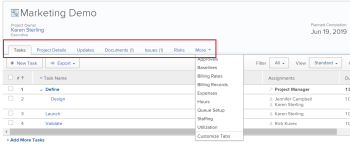
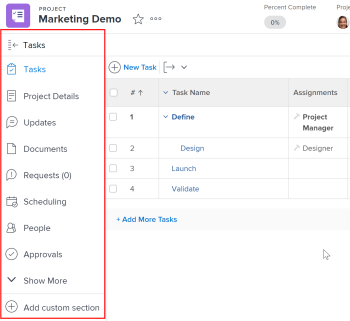
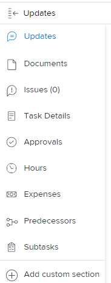
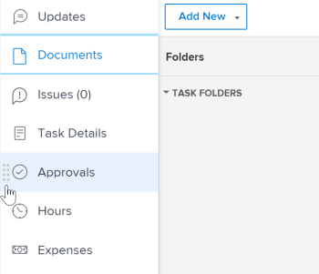

# Simplified left navigation in *`the new Adobe Workfront experience`* {#simplified-left-navigation-in-the-new-adobe-workfront-experience}

In the current version of *`Adobe Workfront`* the multi-level tabs make it sometimes difficult to navigate and require time-consuming clicks.

We made several changes in the way information displays in *`the new Adobe Workfront experience`*. Some of the former tabs have been removed and some of them have been moved to a simpler, less-intrusive left navigation panel for several areas and objects.

For information about tabs that have been removed, see the article [Subtabs replaced by new main areas or filters in the new Adobe Workfront experience](subtabs-removed.md).

## Benefits of the new left navigation {#benefits-of-the-new-left-navigation}

Consider the following benefits of the new left panel navigation:

* It is less intrusive and a better management of screen space.
*  Your *`Workfront administrator`* can hide any section in the left panel except for the object's Details using Layout Templates.

  For information about using Layout Templates, see the article [Create and manage layout templates](create-and-manage-layout-templates.md).

*  You can easily change the order of the sections in the left navigation without opening additional screens by dragging and dropping them in the order that you desire.

  For more information, see the following section in this article: [Use the new left navigation panel](#examples).

## Left navigation panel replaced most tabs {#left-navigation-panel-replaced-most-tabs}

Currently, the information about an object displays in tabs under the object name in *`Workfront`*.

In *`the new Adobe Workfront experience`*, this information displays under sections listed in a navigation panel to the left of the object.

## Access requirements {#access-requirements}

You must have the following access to perform the steps in this article:

<table style="width: 100%;margin-left: 0;margin-right: auto;mc-table-style: url('../../Resources/TableStyles/TableStyle-List-options-in-steps.css');" class="TableStyle-TableStyle-List-options-in-steps" cellspacing="0"> 
 <col class="TableStyle-TableStyle-List-options-in-steps-Column-Column1"> 
 </col> 
 <col class="TableStyle-TableStyle-List-options-in-steps-Column-Column2"> 
 </col> 
 <tbody> 
  <tr class="TableStyle-TableStyle-List-options-in-steps-Body-LightGray"> 
   <td class="TableStyle-TableStyle-List-options-in-steps-BodyE-Column1-LightGray" role="rowheader">Adobe Workfront plan*</td> 
   <td class="TableStyle-TableStyle-List-options-in-steps-BodyD-Column2-LightGray"> 
Any
 </td> 
  </tr> 
  <tr class="TableStyle-TableStyle-List-options-in-steps-Body-MediumGray"> 
   <td class="TableStyle-TableStyle-List-options-in-steps-BodyB-Column1-MediumGray" role="rowheader">Adobe Workfront license*</td> 
   <td class="TableStyle-TableStyle-List-options-in-steps-BodyA-Column2-MediumGray"> 
Request or higher
 </td> 
  </tr> 
 </tbody> 
</table>

&#42;To find out what plan or license type you have, contact your *`Workfront administrator`*.

## Default sections in the left navigation panel {#default-sections-in-the-left-navigation-panel}

You can access more information about objects or areas from the left panel for various objects or areas in *`the new Adobe Workfront experience`*.

The left panel is available for the following objects:

* Project
* Task
* Issue
* Portfolio
* Program
* Template
* User
* Team

>[!IMPORTANT] {type="important"}
>
>If the left panel displays only one section by default—such as `All Projects` in the `Projects` area—a *`Workfront administrator`* must add at least one custom section to this area when building a Layout Template and assign you to that template before the left panel displays in that area.  
>For information about how a *`Workfront administrator`* customizes the left panel in a Layout Template, see [Customize the left panel using a layout template](customize-left-panel.md).

Depending on the object or the area you've navigated to, the sections that appear in the left panel are different.

* [Default sections in the Dashboards area](#left7) 
* [Default sections in the Requests area](#left3) 
* [Default sections in the Resourcing area](#left4) 
* [Default sections in the Projects area](#left5) 
* [Default sections in the Timesheets area](#left6) 

### Default sections in the Dashboards area {#default-sections-in-the-dashboards-area}

The following sections display in the left panel for the `Dashboards` area:

To learn how to use the left panel in the Dashboards area, see [Use the new left navigation panel](#examples).

### Default sections in the Requests area {#default-sections-in-the-requests-area}

To learn how to use the left panel in the Requests area, see [Use the new left navigation panel](#examples).

### Default sections in the Resourcing area {#default-sections-in-the-resourcing-area}

The following sections display in the left panel for the `Resourcing` area:

<table style="width: 100%;mc-table-style: url('../../Resources/TableStyles/TableStyle-List-options-in-steps.css');" class="TableStyle-TableStyle-List-options-in-steps" cellspacing="0"> 
 <col class="TableStyle-TableStyle-List-options-in-steps-Column-Column1"> 
 <col class="TableStyle-TableStyle-List-options-in-steps-Column-Column2"> 
 <tbody> 
  <tr class="TableStyle-TableStyle-List-options-in-steps-Body-LightGray"> 
   <td class="TableStyle-TableStyle-List-options-in-steps-BodyE-Column1-LightGray" role="rowheader">Planner</td> 
   <td class="TableStyle-TableStyle-List-options-in-steps-BodyD-Column2-LightGray">Displays the Resource Planner. Use this area to plan your resources across multiple projects. For information about using the Resource Planner, see <a href="get-started-resource-planning.md" class="MCXref xref">Get started with Resource Planning </a>.</td> 
  </tr> 
  <tr class="TableStyle-TableStyle-List-options-in-steps-Body-MediumGray"> 
   <td class="TableStyle-TableStyle-List-options-in-steps-BodyE-Column1-MediumGray" role="rowheader">Scheduling</td> 
   <td class="TableStyle-TableStyle-List-options-in-steps-BodyD-Column2-MediumGray">Displays the Resource Scheduler. Use this area to assign actual work to your resources. You must be designated as a Resource Manager for at least one project to display information in this area. For information about using scheduling resources, see <a href="get-started-resource-scheduling.md" class="MCXref xref">Get started with Resource Scheduling </a>.</td> 
  </tr> 
  <tr class="TableStyle-TableStyle-List-options-in-steps-Body-LightGray"> 
   <td class="TableStyle-TableStyle-List-options-in-steps-BodyE-Column1-LightGray" role="rowheader">Utilization</td> 
   <td class="TableStyle-TableStyle-List-options-in-steps-BodyD-Column2-LightGray">Displays the Utilization Report. For information about how to read the Utilization Report, see <a href="resource-utilization-report.md" class="MCXref xref">Overview of the Resource Utilization report</a>.</td> 
  </tr> 
  <tr class="TableStyle-TableStyle-List-options-in-steps-Body-MediumGray"> 
   <td class="TableStyle-TableStyle-List-options-in-steps-BodyB-Column1-MediumGray" role="rowheader">Resource Pools</td> 
   <td class="TableStyle-TableStyle-List-options-in-steps-BodyA-Column2-MediumGray">Displays all Resource Pools in Workfront. For information about Resource Pools, see <a href="work-with-resource-pools.md" class="MCXref xref">Work with Resource Pools </a>.</td> 
  </tr> 
 </tbody> 
</table>

To learn how to use the left panel in the Resourcing area, see [Use the new left navigation panel](#examples).

### Default sections in the Projects area {#default-sections-in-the-projects-area}

The following sections display in the left panel for the `Projects` area:

To learn how to use the left panel in the Projects area, see [Use the new left navigation panel](#examples).

### Default sections in the Timesheets area {#default-sections-in-the-timesheets-area}

The following sections display in the left panel for the `Timesheets` area:

To learn how to use the left panel in the Timesheets area, see [Use the new left navigation panel](#examples).

## Use the new left navigation panel {#use-the-new-left-navigation-panel}

Finding and editing information in the left panel is similar for these objects. The options available in the left panel are different depending on what object you access.

To learn what sections are available for specific areas, see [Default sections in the left navigation panel](#default).

1.  Click the `Main menu` icon , then click the name of an object to access it.

   The object page displays.

1.  (Conditional) If you selected an area that contains a list of objects—such as `Projects` or `Portfolios`—you must do the following to access the left panel navigation:

    
    
    1. Click an object in the list.
    1. (Optional) In the left panel navigation, you can select another object—such as `Tasks` or `Issues` within a project—in the left panel to access a list of objects, then click the name of the specific object.  
       The object page displays.
    
    
    

1.  From the object page, click any of the sections in the left panel to view or edit the information in that section.

   You must have permissions to edit the object before you can edit the information.

   

1.  (Optional) Click `Show More` at the bottom of the left panel to display more sections.

   >[!NOTE]
   >
   >This option is not available if all sections display in the left panel by default.

1.  (Optional) At the bottom of the left panel, click `Add Custom Section` to add a custom section, then do the following:

    
    
    1. Type a name for the custom section in the `Custom Section Title` field.
    1.  Start typing the name of an existing dashboard in the `Add a Dashboard` field, then click the dashboard when it displays in the list.
    
    
       >[!TIP] {type="tip"}
       >
       >You must build the dashboard before it appears in the list.
    
    
    
    1.  Click `Add new section`.
    
    
       The custom section appears at the bottom of the left panel.
    
    
    

1.  (Optional) To change the order of a section in the left panel, click the `Drag` icon  to the left of a section and drag it up or down.

   

1.  (Optional) To close the left panel, click the `Collapse` icon .

   >[!NOTE]
   >
   >When you collapse the left panel, *`Workfront`* retains your preference even when you navigate to another *`Workfront`* object. To expand the left panel again, click the `Expand` icon .

