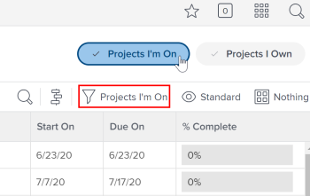

# Subtabs replaced by new main areas or filters in `the new Adobe Workfront experience`

In the current version of `Adobe Workfront`, the multiple-level tabs make it sometimes difficult to find information and require time-consuming clicks.

Some of the former tabs have been removed and some of them have been moved to a simpler, less-intrusive left navigation panel for several areas and objects. The tabs and subtabs that we have removed have been replaced by either main areas in the Main Menu or by filters.

For information about tabs that moved to the new left navigation panel, see [Simplified left navigation in the new Adobe Workfront experience](../../workfront-basics/the-new-workfront-experience/simplified-left-navigation.md).

## Benefits of removing tabs and subtabs

Consider the following benefits of removing subtabs:

* You can reach the information you need with fewer clicks.
* You can add new objects faster by accessing objects from the Main Menu and adding items in the respective lists.

  This is improved in the case of Programs, where you do not have to open a Portfolio before you can access or add Programs. Instead, you can access a list of Programs from the Main Menu.

* You can have a streamlined experience when viewing selective amounts of information throughout `the new Adobe Workfront experience` by using filters in all areas.

The tabs and subtabs that we have removed have been replaced by either main areas in the Main Menu or by filters.

* [Tabs moved to the Main Menu](#tabs) 
* [Tabs and subtabs replaced by filters](#tabs2)

## Access requirements

You must have the following access to perform the steps in this article:

<table cellspacing="0"> 
 <col> 
 </col> 
 <col> 
 </col> 
 <tbody> 
  <tr> 
   <td role="rowheader">Adobe Workfront plan*</td> 
   <td> 
Any
 </td> 
  </tr> 
  <tr> 
   <td role="rowheader">Adobe Workfront license*</td> 
   <td> 
Request or higher
 </td> 
  </tr> 
 </tbody> 
</table>

&#42;To find out what plan or license type you have, contact your `Workfront administrator`.

## Tabs moved to the Main Menu

The areas that you can access from the Main Menu in `the new Adobe Workfront experience` are dependent on:

* `Layout template configurations`: To learn how a Workfront administrator can modify the main menu from a layout template, see [Customize the Main Menu using a layout template](../../administration-and-setup/customize-workfront/use-layout-templates/customize-main-menu.md).

* `License type`: To learn the default configurations for different license types, see [Understand a Reviewer's Main Menu in Adobe Workfront](../../workfront-basics/navigate-workfront/workfront-navigation/reviewer-global-navigation-bar.md) or [Understand a Worker's Main Menu in Adobe Workfront](../../workfront-basics/navigate-workfront/workfront-navigation/worker-global-navigation-bar.md).

* `User customization`: To learn how to change your own main menu configuration, see [Customize the Main Menu in Adobe Workfront](../../workfront-basics/navigate-workfront/workfront-navigation/customize-global-navigation-bar.md).

To learn more about an option in the Main Menu, see [Top navigation bar overview in the new Adobe Workfront experience](../../workfront-basics/the-new-workfront-experience/global-navigation-overview.md).

To access the new areas in `the new Adobe Workfront experience`:

<ol> 
 <li value="1">Click the Main Menu icon  in the upper-right corner of the new Adobe Workfront experience.</li> 
 <li value="2"> 
Click an area to access a list of objects.
 </li> 
</ol>

## Tabs and subtabs replaced by filters

`Workfront` currently displays lists of objects filtered by predefined criteria in subtabs under their parent object or under a specific area.

Because the subtab structure has been replaced in `the new Adobe Workfront experience`, you can display the same lists of objects under the same parent objects or areas by using predefined filters.

The information in the following subtabs is now available through filters:

* [Project lists under a Portfolio](#project) 
* [Portfolio lists under the Portfolio area](#portfoli) 
* [Issue lists under a project or task](#issue)

### Project lists under a Portfolio

When accessing the Projects area, you can use the filter to display only projects that you own or projects you are part of.

<ol> 
 <li value="1"> 
Click the Main menu icon , then click Projects.
 
A list of projects displays.
 </li> 
 <li value="2"> 
From the Filter drop-down menu, select from the following built-in filters to display certain types of projects:
 
  <table cellspacing="0"> 
   <col> 
   <col> 
   <tbody> 
    <tr> 
     <td role="rowheader">All</td> 
     <td>Displays all projects you have access to view.</td> 
    </tr> 
    <tr> 
     <td role="rowheader">Projects I'm On</td> 
     <td> 
Displays projects for which you are part of the Project Team.
 
For information about the Project Team, see the <a href="../../manage-work/projects/planning-a-project/project-team-overview.md" class="MCXref xref">Project Team overview</a> article.
 </td> 
    </tr> 
    <tr> 
     <td role="rowheader">Projects I Own</td> 
     <td>Displays projects for which you are designated as the Project Owner.</td> 
    </tr> 
   </tbody> 
  </table> </li> 
</ol>

>[!NOTE]
>
>You can also quickly apply the filters Projects I'm On or Projects I Own by clicking the respective button in the Projects area header.  
>>

### Portfolio lists under the Portfolio area

When accessing the Portfolio area, you can use the filter to display only portfolios that you own or all portfolios.

<ol> 
 <li value="1"> 
Click the Main menu icon , then click Portfolios.
 
A list of portfolios displays.
 </li> 
 <li value="2"> 
From the Filter drop-down menu, select from the following built-in filters to display certain types of portfolios:
 
  <table cellspacing="0"> 
   <col> 
   <col> 
   <tbody> 
    <tr> 
     <td role="rowheader">All</td> 
     <td>Displays all portfolios you have access to view.</td> 
    </tr> 
    <tr> 
     <td role="rowheader">Portfolios I Own</td> 
     <td>Displays all portfolios where you are designated as the Portfolio Manager. </td> 
    </tr> 
   </tbody> 
  </table> </li> 
</ol>

### Issue lists under a project or task

When accessing the Issues area at the project level, you can use the filter to display only issues that are open, or issues that are closed.

<ol> 
 <li value="1"> 
Click the Main menu icon , then click Projects.
 
A list of projects displays.
 </li> 
 <li value="2">Click the name of a project to access it.</li> 
 <li value="3"> 
Click the Issues area in the left panel.
 
A list of issues displays.
 </li> 
 <li value="4"> 
From the Filter drop-down menu, select from the following built-in filters to displays certain types of issues:
 
  <table cellspacing="0"> 
   <col> 
   <col> 
   <tbody> 
    <tr> 
     <td role="rowheader">All</td> 
     <td>Displays all issues on the project, regardless of their status.</td> 
    </tr> 
    <tr> 
     <td role="rowheader">Complete</td> 
     <td>Displays only completed issues on the project.</td> 
    </tr> 
    <tr> 
     <td role="rowheader">Open</td> 
     <td>Displays only open issues on the project.</td> 
    </tr> 
   </tbody> 
  </table> </li> 
</ol>

