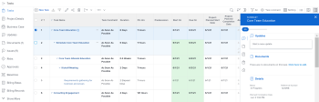
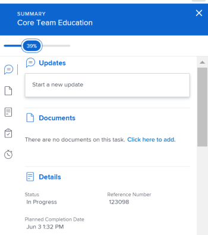
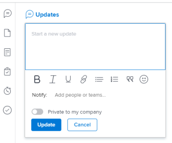
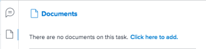
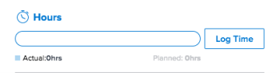

# Summary overview in *`the new Adobe Workfront experience`* {#summary-overview-in-the-new-adobe-workfront-experience}

The highlighted information on this page refers to functionality not yet generally available. It is available only in the Preview Sandbox environment.

You can use the Summary panel to review and update work item information directly from a list of tasks issues, documents, or from other areas of *`Adobe Workfront`* that display tasks and issues.

The following table displays the areas where you can locate and use the Summary panel: 

<table style="width: 100%;mc-table-style: url('../../Resources/TableStylesheets/Standard.css');" class="TableStyle-Standard" cellspacing="3"> 
 <col style="width: 342px;" class="TableStyle-Standard-Column-Column1" data-mc-conditions=""> 
 <tbody> 
  <tr class="TableStyle-Standard-Body-LightGray"> 
   <td class="TableStyle-Standard-BodyD-Column1-LightGray" style="font-weight: bold;">Tasks</td> 
  </tr> 
  <tr class="TableStyle-Standard-Body-MediumGray"> 
   <td class="TableStyle-Standard-BodyD-Column1-MediumGray"> 
Task lists within a
 
    <ul> 
     <li>Project</li> 
     <li>Subtask</li> 
    </ul> </td> 
  </tr> 
  <tr class="TableStyle-Standard-Body-LightGray"> 
   <td class="TableStyle-Standard-BodyD-Column1-LightGray">Tasks in the Unassigned and Assigned Work areas of the Workload Balancer</td> 
  </tr> 
  <tr class="TableStyle-Standard-Body-MediumGray" data-mc-conditions=""> 
   <td class="TableStyle-Standard-BodyD-Column1-MediumGray" style="font-weight: bold;">Issues</td> 
  </tr> 
  <tr class="TableStyle-Standard-Body-LightGray" data-mc-conditions=""> 
   <td class="TableStyle-Standard-BodyD-Column1-LightGray"> 
Issue lists within a
 
    <ul> 
     <li>Project</li> 
     <li>Task</li> 
     <li>Subtask</li> 
    </ul> </td> 
  </tr> 
  <tr class="TableStyle-Standard-Body-MediumGray" data-mc-conditions=""> 
   <td class="TableStyle-Standard-BodyD-Column1-MediumGray">Issues in the Assigned Work area of the Workload Balancer</td> 
  </tr> 
  <tr class="TableStyle-Standard-Body-LightGray" data-mc-conditions=""> 
   <td class="TableStyle-Standard-BodyD-Column1-LightGray">Issues in the Submitted section of the Requests area</td> 
  </tr> 
  <tr class="TableStyle-Standard-Body-MediumGray" data-mc-conditions=""> 
   <td class="TableStyle-Standard-BodyD-Column1-MediumGray" style="font-weight: bold;">Documents</td> 
  </tr> 
  <tr class="TableStyle-Standard-Body-LightGray" data-mc-conditions=""> 
   <td class="TableStyle-Standard-BodyD-Column1-LightGray">Documents area</td> 
  </tr> 
  <tr class="TableStyle-Standard-Body-MediumGray" data-mc-conditions=""> 
   <td class="TableStyle-Standard-BodyA-Column1-MediumGray">Documents section of any object (project, task, issue, program, portfolio, template, template task, user)</td> 
  </tr> 
 </tbody> 
</table>

This article describes how to access and use the Summary panel for tasks and issues. 

For information about accessing the Summary in the *`Workload Balancer`*, see [Update work items in the Workload Balancer using the Summary in the new Adobe Workfront experience](update-items-in-summary-panel-in-workload-balancer.md).

For information about accessing the Summary for documents, see [Summary for documents overview](summary-for-documents.md). 

## Access requirements {#access-requirements}

You must have the following access to perform the steps in this article:

<table style="width: 100%;margin-left: 0;margin-right: auto;mc-table-style: url('../../Resources/TableStyles/TableStyle-List-options-in-steps.css');" class="TableStyle-TableStyle-List-options-in-steps" cellspacing="0"> 
 <col class="TableStyle-TableStyle-List-options-in-steps-Column-Column1"> 
 <col class="TableStyle-TableStyle-List-options-in-steps-Column-Column2"> 
 <tbody> 
  <tr class="TableStyle-TableStyle-List-options-in-steps-Body-LightGray"> 
   <td class="TableStyle-TableStyle-List-options-in-steps-BodyE-Column1-LightGray" role="rowheader">Adobe Workfront plan*</td> 
   <td class="TableStyle-TableStyle-List-options-in-steps-BodyD-Column2-LightGray"> 
Any
 </td> 
  </tr> 
  <tr class="TableStyle-TableStyle-List-options-in-steps-Body-MediumGray"> 
   <td class="TableStyle-TableStyle-List-options-in-steps-BodyE-Column1-MediumGray" role="rowheader">Adobe Workfront license*</td> 
   <td class="TableStyle-TableStyle-List-options-in-steps-BodyD-Column2-MediumGray"> 
Request or higher
 </td> 
  </tr> 
  <tr class="TableStyle-TableStyle-List-options-in-steps-Body-LightGray"> 
   <td class="TableStyle-TableStyle-List-options-in-steps-BodyE-Column1-LightGray" role="rowheader">Access level configurations*</td> 
   <td class="TableStyle-TableStyle-List-options-in-steps-BodyD-Column2-LightGray"> 
View or higher access to Tasks, Issues, Documents
 
View or higher access to any objects for which you want to view documents' Summary
 
Note: If you still don't have access, ask your Workfront administrator if they set additional restrictions in your access level. For information on how a Workfront administrator can modify your access level, see <a href="create-modify-access-levels.md" class="MCXref xref">Create or modify custom access levels</a>.
 </td> 
  </tr> 
  <tr class="TableStyle-TableStyle-List-options-in-steps-Body-MediumGray"> 
   <td class="TableStyle-TableStyle-List-options-in-steps-BodyB-Column1-MediumGray" role="rowheader">Object permissions</td> 
   <td class="TableStyle-TableStyle-List-options-in-steps-BodyA-Column2-MediumGray"> 
View or higher permissions to a task, issue, or document
 
For information on requesting additional access, see <a href="request-access.md" class="MCXref xref">Request access to objects in Adobe Workfront</a>.
 </td> 
  </tr> 
 </tbody> 
</table>

&#42;To find out what plan, license type, or access you have, contact your *`Workfront administrator`*.

## View the Summary panel in a list of tasks or issues {#view-the-summary-panel-in-a-list-of-tasks-or-issues}

1.  Go to a task or issue and select an item in the list. 
1.  Click the `Open Summary`icon  `or  in the Submitted section of the Requests` `area`. 

   After you open the Summary, it stays open as you click or select other tasks or issues and remains open until you manually close it.

   >[!TIP] {type="tip"}
   >
   >You can only select one task or one issue at a time to view their details in the Summary panel. 

   

1.  
   (Optional)&nbsp;To close the Summary panel, do one of the following:

    
    
    *  In a task or issue list, click the `Open Summary` icon     
    

    
    
      Or
    
    
      Click the `X` icon in the upper-right corner of the Summary panel. 
    
    *  In the Submitted section of the Requests area, click the `Close Summary` icon     
    

    
    
      Or
    
    
      Click the `X` icon in the upper-right corner of the Summary panel. 
    
    
    

## Percent Complete {#percent-complete}

Use the progress bar at the top of the Summary to update the percent complete for the task or issue that you've selected. Enter a number or drag the bar to the correct percentage.

## Updates {#updates}

Use the Updates section of the Summary to view recent updates and make updates on the task or issue you selected. Click `See all` to go directly to the Updates tab on the task.

## Documents {#documents}

Use the Documents section of the Summary to see documents attached to the task or issue you selected. Click the thumbnail to open a document preview. To go directly to the Documents tab on the task or issue, click the `Documents` title.

## Details {#details}

Use the Details section of the Summary to view high-level work item details, make assignments, or add start dates. Click `See all` to go directly to the Details tab on the task or issue.

>[!NOTE]
>
>The fields that appear in this section are the same fields that appear in the right panel in Home. You can customize these fields [Customize Home and Summary using a layout template](customize-home-summary-layout-template.md).

## Subtasks {#subtasks}

This section is only available for tasks. Use the Subtasks section of the Summary to view New, In Progress, and Closed subtasks on the task you selected. Click the `Status` drop-down menu to switch between statuses. To go directly to the Subtasks tab on the task, click the `Subtasks`title.

If you have not added any subtasks to the task, click `Add one here` to go directly to the Subtasks tab on the task.

## Hours {#hours}

Use the Hours section of the Summary to log hours on the task or issue you selected. Click `Log Time` and enter your hours. To go directly to the Hours tab on the task or issue, click the `Hours` title.

The hour count in the Summary displays the hours you log. Other users will have different hour totals in the Summary depending on the time they log on the task.

If there are no planned hours on the task or issue and you have logged time, the hours bar displays red.

## Approvals {#approvals}

Use the Approvals section of the Summary to view approvals attached to the task or issue you selected. If you have not added any approvals, select an existing approval from the drop-down menu or click `Create single-use approval process` to go directly to the Approvals tab on the task or issue.

To go directly to the Approvals tab on the task or issue, click the `Approvals` title.

