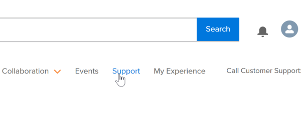
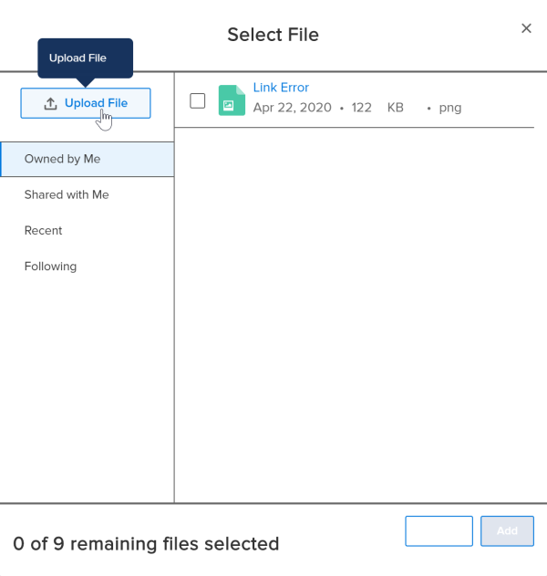

# Contact Customer Support {#contact-customer-support}

As a `Workfront` customer, you can contact the `Workfront Customer Support` team by phone, by chat, or by submitting a ticket online.

>[!NOTE]
>
>For critical issues, contact `Workfront Customer Support` by phone.

## Phone {#phone}

You can contact `Workfront` Customer Support 7 days a week, 24 hours a day, through the following numbers:

* US: 844-306-HELP(4357)
* EMEA: +44 1256 274200
* Australia:&nbsp;+61 1800 849259

These numbers are also found at the bottom of every page in the Workfront One site ([**one.workfront.com**](https://one.workfront.com/)).

## Live Chat {#live-chat}

If you are logged in as an Authorized Support Contact, you can use live chat to get answers to your questions. Members of the Support team are available on live&nbsp;chat from 0800 to 1700 Mountain Standard Time.

1. Log in to [**one.workfront.com**](https://one.workfront.com/) as an Authorized Support Contact.
1.  Click&nbsp;**Chat With An Expert**&nbsp;in the lower-right corner of the page.  
   

   The Chat box displays.

1. Complete the fields in the **Chat** box. All fields are required.  

  

1.  Click **Start Chatting**.

   A `Workfront Customer Support` team member begins a chat with you.

## Web {#web}

If you are logged in as an Authorized Support Contact, you can contact `Workfront Customer Support` through the Workfront One site and create a case, formally called a ticket. 

1. Log in to [**one.workfront.com**](https://one.workfront.com/) as an Authorized Support Contact.
1.  On the **Home** page, click **Support**.

   

   The Customer Support page displays.

   >[!NOTE]
   >
   >If you don't see the Support option on the Home page, you are not an Authorized Support Contact. Your `Workfront administrator` can contact `Workfront Customer Support` and request you be added an Authorized Support Contact. If you are the only `Workfront administrator` for your organization, contact the `Workfront` Support team by phone.

1. Complete the fields in the **Create a Support Case** form. All fields are required.  

1. (Optional) Attach a file, such as an image or video file.
    
    
    1. At the bottom of the form, click **Upload File**.
    1. Click **Upload File**, then browse for and select the desired file.
    
    
           
    

    
    1. Click **Done** to upload the file to the case.
    
    
1. Click **Submit** to submit the case to `Workfront Customer Support`.

If you have any questions or problems submitting a request, please call the Customer Support team. 
