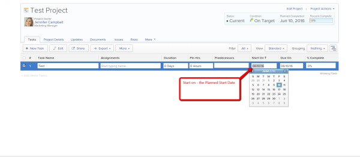
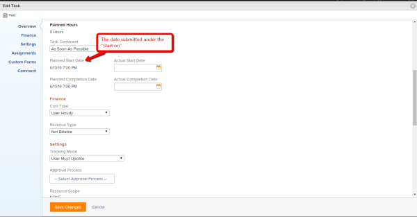
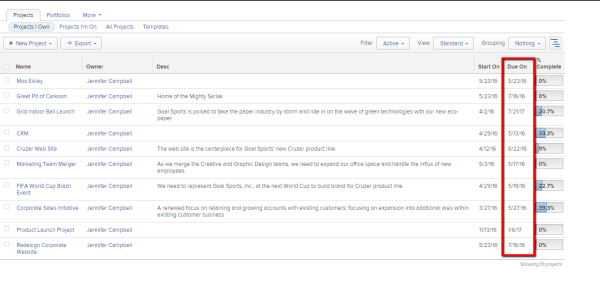
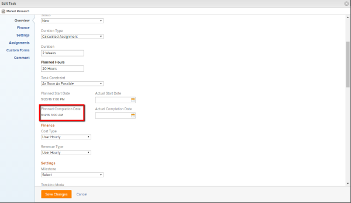
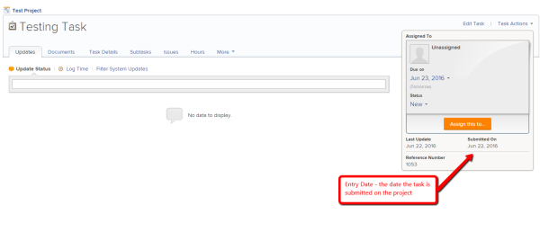
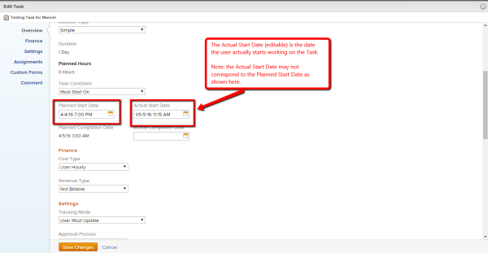
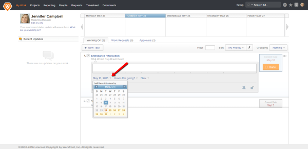
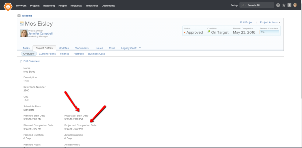

# Definitions for the Project, Task, and Issue dates within `Workfront` {#definitions-for-the-project-task-and-issue-dates-within-workfront}

## **Planned Start Date**  {#planned-start-date}

## Planned Completion Date {#planned-completion-date}

Due On = Planned Completion Date – this is a due date planned by a user (e.g. project owner) or `Workfront`&nbsp;indicating when a Project/Task/Issue&nbsp;is planned to be completed:

For more information, see [Overview of the project Planned Completion Date](project-planned-completion-date.md). 

## Entry Date {#entry-date}

Entry Date – the date a Project/Task/Issue is submitted by a user in `Workfront`:&nbsp;

Simply speaking it’s the date a Project/Task/Issue&nbsp;is created and is not related to any further actions done with aProject/Task/Issue, i.e. logging time, marking a Project/Task/Issue&nbsp;as "Done", etc. This is more for tracking purposes.

## **Actual Start Date**  {#actual-start-date}

Actual Start Date – the date a User actually starts working on a Project/Task/Issue.

By saying starts working, we mean a change of a status to something other than New, i.e. In Progress, Complete, etc. Even if a User logs time on thatProject/Task/Issue, that won’t generate an Actual Start Date unless the status is changed.

Note:

* Actual Start Date may not match a Planned Start Date of a tProject/Task/Issue as a User may start work later or earlier than is planned date:&nbsp;

* “Must Start On” status affects a Planned Start Date not the Actual Start Date. This fixes a Planned Start Date to a date you specify. While the Actual Start Date is still working according to a logic described above.

For more information, see [Overview of the project Actual Start Date](project-actual-start-date.md). 

## **Actual Completion Date**  {#actual-completion-date}

Actual Completion Date – the date a User actually completes working on aProject/Task/Issue. This may not match the Planned Completion Date. &nbsp;

For more information, see [Overview of the project Actual Completion Date](project-actual-completion-date.md). 

## **Log Time**  {#log-time}

A “**log time**” option is to submit the hours/days spent working a givenProject/Task/Issue.

For more information, see [Log Time](log-time.md). 

**The Date for which you Log Time ** 

The date you log the time for is the same as the Hour Entry Date. This can be different from the current date you are logging the hours and this is not the actual start date of a task/project/issue.

## **Commit Date**  {#commit-date}

Commit Date – the date set by the assignee as an estimation and commitment to complete a Project/Task/Issue:

Please note: the Commit Date automatically affects the Projected Completion Date but not the Planned Completion Date. Still the Commit Date can be used by a project manager to reset the Planned Completion.

For more information, see [Overview of Commit Dates](overview-of-commit-dates.md).

## **Projected Start Date**  {#projected-start-date}

Projected Start Date – this date shows the time a Project or Task&nbsp;is going to start depending on the progress of the other tasks/project’s tasks. A Projected Start Date may differ from the Planned Start Date in case it has a predecessor relationship with other tasks which are running behind the schedule.&nbsp;&nbsp;

For more information, see [Overview of the project Projected Start Date](project-projected-start-date.md). 

## **Projected Completion Date**  {#projected-completion-date}

Projected Completion date – this is the current time estimated to complete a given Project/Task/Issue, i.e. if everything goes smoothly and as planned the Projected Completion date should match the Planned Completion Date.&nbsp;Otherwise due to the delays on the predecessor tasks the Projected Completion Date will be different from the Planned Completion Date.

Both the Projected Start Date and the Projected Completion Date are shown in the Task/Project Details:&nbsp;

For more information, see [Overview of the Projected Completion Date for projects, tasks, and issues](project-projected-completion-date.md).
