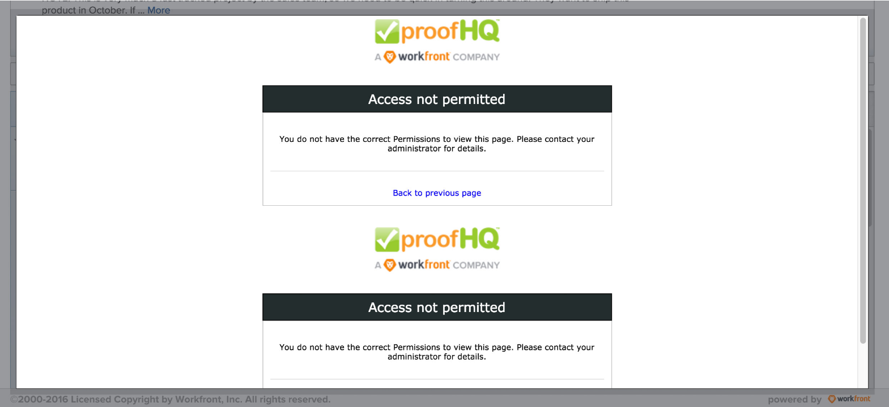

# *`Workfront Proof`* Manager permissions troubleshooting {#workfront-proof-manager-permissions-troubleshooting}

Following are the permission profiles available in *`Adobe Workfront`* for *`proofing`* users:

* Administrator
* Supervisor
* Manager

For detailed information about these options and how to configure them, see [Configure a user's proofing access](configure-a-users-proofing-access.md).

When granting a user Manager permissions, the following troubleshooting information is available:

* `PROBLEM:` Users with Manager permissions cannot view *`proofs`* created by other users. Instead, they see the Access Denied screen.&nbsp;  `SOLUTION:` Users with Manager permissions must be explicitly added to the *`proofs`*. Proofs should always be created via the Advanced *`proofing`* options window and users should always be added via this option.

* `PROBLEM:` Users with Manager permissions cannot add *`proof`* versions to the *`proofs`* created by other users (they could potentially submit a *`proof`* in the documents set, but the versions would NOT be connected to the original set created by another user).  
  `SOLUTION:` Users with Manager permissions can submit the versions to another user's *`proof`* only if the user with Manager permissions when both of the following : 
    
    
    * Explicitly added to the *`proofs`*
    * Set as Authors ( *`proof`* role) on the *`proofs`*
    
    
    

* `PROBLEM:` Users with Manager permissions cannot edit comments of other users on a *`proof`* they do not own or they did not create.  
  `SOLUTION:` If users with Manager permissions do not own the *`proofs`*, but they should be able to edit comments, add them as Authors (or Moderators).  
  These three types of permissions are available in *`Workfront`* for Planner, Worker, Requester, Reviewer type licenses. System Administrator or User Admin in *`Workfront`* can edit Users' profiles and adjust *`Workfront Proof`* permissions from there.&nbsp;

