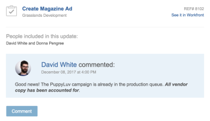

# Reply to updates {#reply-to-updates}

When someone adds or replies to an update on a work object, their reply appears in the communication thread on the Updates tab for the object. You can add a reply to an update or Like it if you have View access to the object.

## Access requirements {#access-requirements}

You must have the following access to perform the steps in this article:

<table style="width: 100%;margin-left: 0;margin-right: auto;mc-table-style: url('../../Resources/TableStyles/TableStyle-List-options-in-steps.css');" class="TableStyle-TableStyle-List-options-in-steps" cellspacing="0"> 
 <col class="TableStyle-TableStyle-List-options-in-steps-Column-Column1"> 
 <col class="TableStyle-TableStyle-List-options-in-steps-Column-Column2"> 
 <tbody> 
  <tr class="TableStyle-TableStyle-List-options-in-steps-Body-LightGray"> 
   <td class="TableStyle-TableStyle-List-options-in-steps-BodyE-Column1-LightGray" role="rowheader">Adobe Workfront plan*</td> 
   <td class="TableStyle-TableStyle-List-options-in-steps-BodyD-Column2-LightGray"> 
Any
 </td> 
  </tr> 
  <tr class="TableStyle-TableStyle-List-options-in-steps-Body-MediumGray"> 
   <td class="TableStyle-TableStyle-List-options-in-steps-BodyE-Column1-MediumGray" role="rowheader">Adobe Workfront license*</td> 
   <td class="TableStyle-TableStyle-List-options-in-steps-BodyD-Column2-MediumGray"> 
Request or higher for issues and documents; Review or higher for all other objects
 </td> 
  </tr> 
  <tr class="TableStyle-TableStyle-List-options-in-steps-Body-LightGray"> 
   <td class="TableStyle-TableStyle-List-options-in-steps-BodyE-Column1-LightGray" role="rowheader">Access level configurations*</td> 
   <td class="TableStyle-TableStyle-List-options-in-steps-BodyD-Column2-LightGray"> 
Requestor or higher for issues and documents; Reviewer or higher for all other objects
 
Note: If you still don't have access, ask your Workfront administrator if they set additional restrictions in your access level. For information on how a Workfront administrator can modify your access level, see <a href="create-modify-access-levels.md" class="MCXref xref">Create or modify custom access levels</a>.
 </td> 
  </tr> 
  <tr class="TableStyle-TableStyle-List-options-in-steps-Body-MediumGray"> 
   <td class="TableStyle-TableStyle-List-options-in-steps-BodyB-Column1-MediumGray" role="rowheader">Object permissions</td> 
   <td class="TableStyle-TableStyle-List-options-in-steps-BodyA-Column2-MediumGray"> 
View access to the object
 
For information on requesting additional access, see <a href="request-access.md" class="MCXref xref">Request access to objects in Adobe Workfront</a>.
 </td> 
  </tr> 
 </tbody> 
</table>

&#42;To find out what plan, license type, or access you have, contact your *`Workfront administrator`*.

## Reply to an update or a reply {#reply-to-an-update-or-a-reply}

1. Go to the object to which you want to add a reply.
1.  On the `Updates` tab for the object, find the update or reply to which you want to reply.

   To view an image in the update:

    
    
    *  Click the  `Preview` icon  on the image thumbnail to open the full-size image in a new browser tab.
    *  Click the  `Download` icon  on the image thumbnail to download the image.
    
    
   In addition to seeing the users who are actively engaged in the conversation, you can see who is tagged in each reply at the top of that update thread. These users, along with any users subscribed to the object, receive a notification whenever an update or reply is made on the object. To tag more users, see [Tag others on updates](tag-others-on-updates.md).

   

1.  Click `Reply` on the update, then type a reply in the box that appears.
1.  (Optional) To include text from a previous update in your reply, click the `More` menu next to the update or reply you want to quote, then click `Quote Reply`. Text from the previous update appears in the input area, marked with a gray line.
1.  (Optional) Use formatting and emojis, and include links `<MadCap:conditionalText data-mc-conditions="QuicksilverOrClassic.Quicksilver"> and images </MadCap:conditionalText>`as explained in the section [Add an update to a work item](update-work.md#add) in the article [Update work](update-work.md).
1.  Click `Reply` to save the reply.  

   Or  

   Click `Done` if the task or issue is in a status of Complete or Closed.

## Reply to an update via email notification {#reply-to-an-update-via-email-notification}

Depending on how your email notifications are configured, you might receive an email notification when an update is made to certain objects to which you have access.

>[!NOTE]
>
>Replying to updates by email is not available for environments on Cluster 6.

The following is an example of an email notification triggered as a result of an update made on the Updates tab of a task:

From the email, you can easily add a reply directly to the communications thread of the object in *`Workfront`*. You can also add a reply without logging in to *`Workfront`*, on an email that is generated from comments made to the following objects:

* Project
* Task
* Issue
* Document
* Template and template task
* Portfolio
* Program
* Iteration
* Timesheet

### Reply to an update from an email notification {#reply-to-an-update-from-an-email-notification}

When you receive an email notification, you can quickly open the associated *`Workfront`* object and add a reply directly to the communication thread. 

1.  Click `Comment` on the email notification.  

   The Details page for the object opens in *`Workfront`*.

1.  Go to the update to which you want to add a reply.

   In addition to seeing the users who are actively engaged in the conversation, you can see who was tagged in each reply at the top of that update thread. These users, along with any users subscribed to the object, receive notification whenever an update or reply is made on the object.&nbsp;To tag more users, see [Tag others on updates](tag-others-on-updates.md).

1. Click `Reply,`enter your reply, then click `Reply`.

### Add an update to an object outside of *`Workfront`* {#add-an-update-to-an-object-outside-of-workfront}

When you receive a *`Workfront`* email notification, you can quickly add an update to the communication thread without logging in to *`Workfront`*. 

To add an update to a *`Workfront`* email:

1. From your email application, open the *`Workfront`* email to which you want to respond, then open a reply email window.
1. Type your update.  
   Attachments are not permitted, and any Rich Text formatting applied to an update in an email does not display on the update when viewed in the Updates tab.
1.  Click `Send`.  

   Your update is added to the communications thread of the object.

