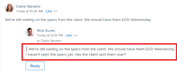
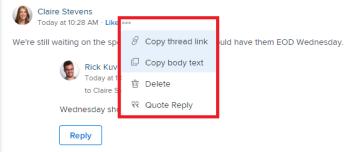
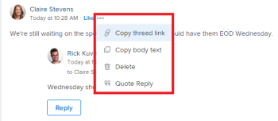
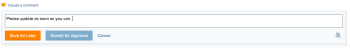
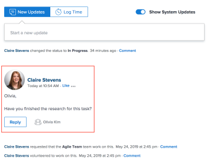
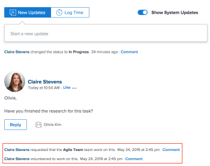

# Update work

You can add an update on a `Adobe Workfront` object (project, task, or issue) to communicate about progress on the object. Users who are assigned or subscribed to the object can view your update. You can also tag users to bring their attention to the update.

You can add updates to an object from the following areas of `Workfront`:

* From a `Workfront` object, in the Updates section 
* From the Home area (for tasks and issues)
* From the timesheet (for tasks and issues)

## Access requirements

You must have the following access to perform the steps in this article:

<table cellspacing="0"> 
 <col> 
 </col> 
 <col> 
 </col> 
 <tbody> 
  <tr> 
   <td role="rowheader">Adobe Workfront plan*</td> 
   <td> 
Any
 </td> 
  </tr> 
  <tr> 
   <td role="rowheader">Adobe Workfront license*</td> 
   <td> 
Request or higher for issues and documents; Review or higher for all other objects
 </td> 
  </tr> 
  <tr> 
   <td role="rowheader">Access level configurations*</td> 
   <td> 
View or Edit access for the object the update is on
 
Note: If you still don't have access, ask your Workfront administrator if they set additional restrictions in your access level. For information on how a Workfront administrator can modify your access level, see <a href="../../administration-and-setup/add-users/configure-and-grant-access/create-modify-access-levels.md" class="MCXref xref">Create or modify custom access levels</a>.
 </td> 
  </tr> 
  <tr> 
   <td role="rowheader">Object permissions</td> 
   <td> 
View access to the object
 
For information on requesting additional access, see <a href="../../workfront-basics/grant-and-request-access-to-objects/request-access.md" class="MCXref xref">Request access to objects in Adobe Workfront</a>.
 </td> 
  </tr> 
 </tbody> 
</table>

&#42;To find out what plan, license type, or access you have, contact your `Workfront administrator`.

## Add an update to a work item

<ol> 
 <li value="1">Go to the work item for which you want to provide an update (such as a project, task, or issue).</li> 
 <li value="2">Click the Updates section.</li> 
 <li value="3">Click Start a new update, then type your update. </li> 
 <li value="4"> 
(Optional) To add rich text formatting to your update, use any attributes on the Rich Text toolbar as you type.
 
  <table cellspacing="15"> 
   <col> 
   <col> 
   <col> 
   <col> 
   <thead> 
    <tr> 
     <th>Attribute </th> 
     <th>Toolbar Button </th> 
     <th>Mac Shortcut Keys </th> 
     <th>PC Shortcut Keys </th> 
    </tr> 
   </thead> 
   <tbody> 
    <tr> 
     <td>Bold</td> 
     <td>  </td> 
     <td>⌘+b</td> 
     <td>Ctrl+B</td> 
    </tr> 
    <tr> 
     <td>Italics</td> 
     <td>  </td> 
     <td>⌘+i</td> 
     <td>Ctrl+I</td> 
    </tr> 
    <tr> 
     <td>Underline</td> 
     <td>  </td> 
     <td>⌘+u</td> 
     <td>Ctrl+U</td> 
    </tr> 
    <tr> 
     <td>Hyperlink</td> 
     <td>  </td> 
     <td>⌘+K</td> 
     <td>Ctrl+K</td> 
    </tr> 
    <tr> 
     <td>Bulleted List</td> 
     <td>  </td> 
     <td>⌘+Shift+8</td> 
     <td>Ctrl+Shift+8</td> 
    </tr> 
    <tr> 
     <td>Numbered List</td> 
     <td>  </td> 
     <td>⌘+Shift+7</td> 
     <td>&nbsp;Ctrl+Shift+7</td> 
    </tr> Block Quote ⌘+Shift+9 Ctrl+Shift+9 
   </tbody> 
  </table> 
To stop formatting text, deselect the attribute on the Rich Text toolbar.
 <note type="note">  
   <ul> 
    <li>Formatting also displays in any email notification users receive containing your update.</li> 
    <li>Rich Text formatting applied to an update in an email does not display on the update when viewed in the Updates tab. If your organization uses Workfront with Internet Explorer, any formatted text pasted into an update loses its Rich Text formatting and displays as plain text. You can reformat the text using the attributes on the Rich Text toolbar.</li> 
    <li>Rich Text formatting is not available for updates made in the Timesheets area or for Note and Last Condition objects viewed in a report.</li> 
   </ul> 
  </note> </li> 
 <li value="5"> 
(Optional) If you want to include text from previous updates or from other sources and distinguish it from your own update, you can mark it as a Block Quote. Click the Block Quote icon  and type the text you want to quote. The quoted text displays marked with a vertical gray line. Click the Block Quote icon again to return to normal formatting.
 
  
 </li> 
 <li value="6"> 
(Optional) Add any emojis to your update.
 <note type="note">  
   <ul> 
    <li>Workfront does not replace punctuation emoticons such as :) with emojis.</li> 
    <li>Emojis are not available for updates made in the Timesheets area or for Note and Last Condition objects viewed in a report.</li> 
    <li>The emoji feature in Workfront utilizes Unicode characters and, as such, displays only on browsers and operating systems that support Unicode code points. Users on a platform, browser, or operating system version different than yours might not have access to the same emojis.</li> 
    <li>An unsupported emoji is represented by a black or white box.</li> 
    <li>Windows 7 supports only black and white emojis. </li> 
    <li>Emojis that are applied to an update made via email do not display on the update when viewed in the Updates area.</li> 
   </ul> 
  </note> </li> 
 <li value="7">(Optional) To add a URL link to additional information sources:  
  <ol> 
   <li value="1">Click in your update where you want to insert a link.</li> 
   <li value="2">
On the Rich Text toolbar, click the Hyperlink icon. 
</li> 
   <li value="3">In the Create Link box that appears, under URL, type or paste the URL of the source to which you want to link.</li> 
   <li value="4">Under Text to display, type or paste the link text.</li> 
   <li value="5">
Click Save.
</li> 
  </ol></li> 
 <li value="8"> 
(Optional) To insert a Zoom meeting URL in your update, click the Zoom icon .
 
The recipients that you notify can join the meeting after they receive their instant notification in Workfront or via email. For more information on notifying users, see the Notify section below.
 <note type="note">  
   <ul> 
    <li>The Zoom integration is available only if your Workfront administrator enabled it, as explained in <a href="../../administration-and-setup/configure-integrations/enable-zoom-integration.md" class="MCXref xref">Install the Zoom integration</a>.</li> 
    <li>The first time you use this integration, you need to follow the prompts requesting you to connect Zoom to Workfront. You need to do this only once.</li> 
    <li>Although the integration uses your Zoom account, the Zoom meeting ID that you add to your update is a unique meeting URL, not your personal Zoom meeting room URL.</li> 
   </ul> 
  </note> </li> (Optional) To attach an image to your update, click the Image icon and browse to the image on your computer. Or Drag the image into the update area. Note: Your Workfront administrator must enable adding images before you can see the Image icon. The maximum image file size is 7 MB. Supported image file types are .jpg, .gif, and .png. Images are accessible only from the Updates tab on an object, and they are not available on the Documents tab. You can send an update with an image and no text. 
 <li value="10"> 
(Optional) Specify any of the following items:
 
  <table cellspacing="0"> 
   <col> 
   <col> 
   <tbody> 
    <tr> 
     <td role="rowheader">Notify</td> 
     <td>Identify users who need to be notified of the update. Users assigned or subscribed to the object automatically receive notification when an update is made. 
For information about how to include others on an update, see <a href="../../workfront-basics/updating-work-items-and-viewing-updates/tag-others-on-updates.md" class="MCXref xref">Tag others on updates</a>.
</td> 
    </tr> 
    <tr> 
     <td role="rowheader">Commit Date</td> 
     <td>In the date picker, select the date that you commit to complete the work item. For information about Commit Date, see <a href="../../manage-work/projects/updating-work-in-a-project/overview-of-commit-dates.md" class="MCXref xref">Commit Date overview</a>.</td> 
    </tr> 
    <tr> 
     <td role="rowheader">Condition</td> 
     <td>Select a new condition for the task or issue. For information about selecting a condition, see <a href="../../manage-work/projects/updating-work-in-a-project/update-condition-for-tasks-and-issues.md" class="MCXref xref">Update Condition for tasks and issues</a>.</td> 
    </tr> 
    <tr> 
     <td role="rowheader">Status</td> 
     <td>Click the arrow beside&nbsp;the current status, then select the desired status from the drop-down menu. For information about setting a Status, see <a href="../../manage-work/projects/updating-work-in-a-project/update-task-status.md" class="MCXref xref">Update task status</a>.
Updating the status of a&nbsp;work item&nbsp;does not automatically change the status of a project. Depending on how your project is set up, you might need to make updates to the project status separately. For more information on the various project update types, see <a href="../../manage-work/projects/manage-projects/select-project-update-type.md" class="MCXref xref">Select the project Update Type </a>.
<note type="note">
       You cannot change the status of a work item while it is in a Pending Approval status.
      </note></td> 
    </tr> 
    <tr> 
     <td role="rowheader">Completion Bar</td> 
     <td>Indicate the percentage of work completed by sliding the progress bar to the desired percentage. You can also double-click the completion bar and enter the percent complete.</td> 
    </tr> 
    <tr> 
     <td role="rowheader">Private to my company</td> 
     <td> 
Disable this option to prevent users outside your company from having access to view this update.
 </td> 
    </tr> 
   </tbody> 
  </table> </li> 
 <li value="11">Click Update to add the update to the Workfront object.</li> 
 <li value="12">To reply to an update, see <a href="../../workfront-basics/updating-work-items-and-viewing-updates/reply-to-updates.md" class="MCXref xref">Reply to updates</a>.</li> 
</ol>

## Copy update information

There are several ways you can copy an update. After copying a link, you can share the link with others to direct them to the update.

* [Copy the update](#copy2) 
* [Copy the thread link](#copy3) 
* [Copy the update link](#copy4)

### Copy the update

This option copies the text from a specific update to the clipboard.

<ol> 
 <li value="1">Go to the update or reply you want to copy.</li> 
 <li value="2">Click the More menu, then click Copy body text.

</li> 
</ol>

### Copy the thread link

This option copies the full thread link to the clipboard so you can share the thread with other users.

<ol> 
 <li value="1">Go to the update thread you want to copy.</li> 
 <li value="2"> 
Click the More menu, then click Copy thread link. 
 
  
 </li> 
</ol>

### Copy the update link

This option copies a specific update link to the clipboard. When you share the update link, the user who follows it sees a border around the update.

<ol> 
 <li value="1">Go to the update or reply you want to copy.</li> 
 <li value="2"> 
Click the More menu next to the individual update, then click Copy update link. .
 
  
 </li> 
</ol>

## Delete an update or reply

Depending on the access your `Workfront administrator` gives you, you might be able to delete updates you added on the Updates tab of an object. For more information, see&nbsp; [Create or modify custom access levels](../../administration-and-setup/add-users/configure-and-grant-access/create-modify-access-levels.md#creating-a-new-access-from-scratch) in the article [Create or modify custom access levels](../../administration-and-setup/add-users/configure-and-grant-access/create-modify-access-levels.md).

No `Workfront` user (including the `Workfront administrator`) can delete updates made by another user. However, if a user's access level allows them to delete their own updates, the `Workfront administrator` can log in as that user and delete updates they made. For more information, see [Create or modify custom access levels](../../administration-and-setup/add-users/configure-and-grant-access/create-modify-access-levels.md#creating-a-new-access-from-scratch) and [Log in as another user](../../administration-and-setup/add-users/create-and-manage-users/log-in-as-another-user.md).

<ol> 
 <li value="1">Go to the update or reply you want to delete.</li> 
 <li value="2"> 
Click the More menu next to the update or reply you wish to delete, then click Delete.
 
  
 </li> 
 <li value="3"> 
In the message that appears, click Confirm.
 </li> 
</ol>

Note: Deleting an update with an attached image deletes both the comment and the image. 

## Add an update on a Timesheet

<ol> 
 <li value="1">Go to a Timesheet on which you want to make an update.</li> 
 <li value="2">Click the Timesheet to open it.</li> 
 <li value="3"> 
At the bottom of the Timesheet, click Include a comment.
 </li> 
 <li value="4"> 
In the box that displays at the bottom of the Timesheet, type an update.
 
  
 </li> 
 <li value="5"> 
(Conditional)To save your update without submitting the Timesheet for approval, click Save for Later. 
 
Or 
 
To save your update and submit the Timesheet for approval, click Submit for Approval. 
 
Or 
 
If your Timesheet is not set up with an approver, click Save and Close Timesheet to save your update.
 
For information about the additional functionality available when adding an update, see <a href="#" class="MCXref xref" xrefformat="{para}">Update work</a>.
 </li> 
</ol>

## Enable or disable system updates

The Updates tab for a `Workfront` object displays two types of information:

<ul> 
 <li> 
User updates: User updates are comments that you and other users in your system enter.
 
  
 </li> 
 <li> 
System updates: System updates record removing assets, adding or deleting versions, attaching or removing an approval request, as well as any edits or changes made to the documents on the object.
 
  
 </li> 
</ul>

Depending on your `Workfront` license, system updates might be enabled by default. `Workfront administrators` can determine what is tracked in system updates,&nbsp;as explained in [System-tracked updates](../../administration-and-setup/set-up-workfront/system-tracked-update-feeds/system-tracked-update-feeds.md). You can also filter out&nbsp;system updates or activities so that you see&nbsp;only user updates for all objects.

For more information about the difference between user and system updates, see [System-tracked updates](../../administration-and-setup/set-up-workfront/system-tracked-update-feeds/system-tracked-update-feeds.md).

To enable or disable system updates:

1. Click the `Updates` tab on an&nbsp;object.
1. Click `Show System Updates` to slide the switch left (disabled) or right (enabled).

   This option is persistent across all objects throughout `Workfront` and remains in the position you select, even if you log out of `Workfront`.

