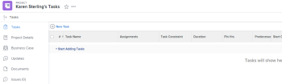

# Create work items from the Home area {#create-work-items-from-the-home-area}

You can create work items from the Home area. You can create personal tasks for yourself, request work from other users, or add tasks to specific projects.

## Access requirements {#access-requirements}

You must have the following access to perform the steps in this article:

<table style="width: 100%;margin-left: 0;margin-right: auto;mc-table-style: url('../../../Resources/TableStyles/TableStyle-List-options-in-steps.css');" class="TableStyle-TableStyle-List-options-in-steps" cellspacing="0"> 
 <col class="TableStyle-TableStyle-List-options-in-steps-Column-Column1"> 
 <col class="TableStyle-TableStyle-List-options-in-steps-Column-Column2"> 
 <tbody> 
  <tr class="TableStyle-TableStyle-List-options-in-steps-Body-LightGray"> 
   <td class="TableStyle-TableStyle-List-options-in-steps-BodyE-Column1-LightGray" role="rowheader">Adobe Workfront plan*</td> 
   <td class="TableStyle-TableStyle-List-options-in-steps-BodyD-Column2-LightGray"> 
Any
 </td> 
  </tr> 
  <tr class="TableStyle-TableStyle-List-options-in-steps-Body-MediumGray"> 
   <td class="TableStyle-TableStyle-List-options-in-steps-BodyE-Column1-MediumGray" role="rowheader">Adobe Workfront license*</td> 
   <td class="TableStyle-TableStyle-List-options-in-steps-BodyD-Column2-MediumGray"> 
Work or higher
 </td> 
  </tr> 
  <tr class="TableStyle-TableStyle-List-options-in-steps-Body-LightGray"> 
   <td class="TableStyle-TableStyle-List-options-in-steps-BodyE-Column1-LightGray" role="rowheader">Access level configurations*</td> 
   <td class="TableStyle-TableStyle-List-options-in-steps-BodyD-Column2-LightGray"> 
Worker
 
Note: If you still don't have access, ask your Workfront administrator if they set additional restrictions in your access level. For information on how a Workfront administrator can modify your access level, see <a href="create-modify-access-levels.md" class="MCXref xref">Create or modify custom access levels</a>.
 </td> 
  </tr> 
  <tr class="TableStyle-TableStyle-List-options-in-steps-Body-MediumGray"> 
   <td class="TableStyle-TableStyle-List-options-in-steps-BodyB-Column1-MediumGray" role="rowheader">Object permissions</td> 
   <td class="TableStyle-TableStyle-List-options-in-steps-BodyA-Column2-MediumGray"> 
Edit access or higher on tasks
 
For information on requesting additional access, see <a href="request-access.md" class="MCXref xref">Request access to objects in Adobe Workfront</a>.
 </td> 
  </tr> 
 </tbody> 
</table>

&#42;To find out what plan, license type, or access you have, contact your *`Workfront administrator`*.

## Create a personal task {#create-a-personal-task}

You can create a personal task that is available only to you in the Home area:

1.  Click the `Main Menu`  in the upper-right corner, then click  `Home`. 
1. Click `New Task` >  `Personal`.  
  
   

1. In the `Name` field, specify a name for the task.
1. (Optional) Click  `Select date`, then select the&nbsp;date when the task is due. This sets the Planned Completion Date for the task.  
   You can change the `Planned Completion Date` by clicking on the date in the right panel or editing the `This will be done by` date directly in the task.

1. Click `Create`&nbsp;to save the task.  
   The task is assigned to you and is available in the Home area.

>[!NOTE]
>
>When you create a personal task, it is stored in a "hidden" project that is not searchable in *`Workfront`*. You can only access this project when you delete a task on it (from the task itself, not from the Home area).  
>>
>

## Request work from another user {#request-work-from-another-user}

You can request work from another user directly from the Home area. When you request work from another user as described in this section, the task is displayed as a request in the user's Home area until the user clicks `Work On It`.

To request work from another user from the Home area:

1.  Click the `Main Menu`  in the upper-right corner, then click  `Home`. 
1. Click `New Task`, then select `Request`.  
   

1. In the `Name` field, specify a name for the task.&nbsp;
1. In the `Assign to` field, begin typing the name of the user,&nbsp;team, or role who you want to assign, then click the name when it appears in the drop-down menu.
1. In the Add As drop-down menu, select whether to add a task or issue.&nbsp;
1. Click  `Select date`, then select the&nbsp;date and time when the task is due.
1. Click `Create` to save the task.  
   The task is displayed as a work request in the Home area of the user you designated.

## Add a task or issue to a project {#add-a-task-or-issue-to-a-project}

You can add a task or issue to an existing project directly from the Home area:

1.  Click the `Main Menu`  in the upper-right corner, then click  `Home`. 
1. Click `New Task`, then select `Project Task`.  
   

1. In the `Name` field, specify a name for the task or issue.
1. In the `Assign to` field, begin typing the name of the user,&nbsp;team, or role who you want to assign, then click the name when it appears in the drop-down menu.
1. Begin typing the name of the project where you want to create the task or issue, then click the name when it appears in the drop-down menu.  

   >[!IMPORTANT] {type="important"}
   >
   >The task or issue appears on the Work List only when the project Status is set to Current.

1. (Conditional) To create an issue, select `Issue` from the `Add As` drop-down menu. By default, `Task` is selected.

1. Click  `Select date`, then select the&nbsp;date and time when the task is due.
1. Click `Create` to save the task.

