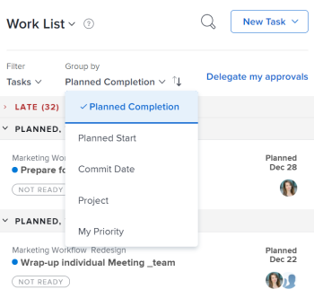

# Display items in the Work List in the Home area {#display-items-in-the-work-list-in-the-home-area}

The highlighted information on this page refers to functionality not yet generally available. It is available only in the Preview Sandbox environment.

The Work List in the Home area displays all work items that are assigned to you. You can control which items display in the Work List as described below.

## Access requirements {#access-requirements}

You must have the following access to perform the steps in this article:

<table style="width: 100%;margin-left: 0;margin-right: auto;mc-table-style: url('../../../Resources/TableStyles/TableStyle-List-options-in-steps.css');" class="TableStyle-TableStyle-List-options-in-steps" cellspacing="0"> 
 <col class="TableStyle-TableStyle-List-options-in-steps-Column-Column1"> 
 </col> 
 <col class="TableStyle-TableStyle-List-options-in-steps-Column-Column2"> 
 </col> 
 <tbody> 
  <tr class="TableStyle-TableStyle-List-options-in-steps-Body-LightGray"> 
   <td class="TableStyle-TableStyle-List-options-in-steps-BodyE-Column1-LightGray" role="rowheader">Adobe Workfront plan*</td> 
   <td class="TableStyle-TableStyle-List-options-in-steps-BodyD-Column2-LightGray"> 
Any
 </td> 
  </tr> 
  <tr class="TableStyle-TableStyle-List-options-in-steps-Body-MediumGray"> 
   <td class="TableStyle-TableStyle-List-options-in-steps-BodyE-Column1-MediumGray" role="rowheader">Adobe Workfront license*</td> 
   <td class="TableStyle-TableStyle-List-options-in-steps-BodyD-Column2-MediumGray"> 
Work or higher
 </td> 
  </tr> 
  <tr class="TableStyle-TableStyle-List-options-in-steps-Body-LightGray"> 
   <td class="TableStyle-TableStyle-List-options-in-steps-BodyB-Column1-LightGray" role="rowheader">Access level configurations*</td> 
   <td class="TableStyle-TableStyle-List-options-in-steps-BodyA-Column2-LightGray"> 
View or higher access to Projects,&nbsp;Tasks, Issues, and Documents
 
Note: If you still don't have access, ask your Workfront administrator if they set additional restrictions in your access level. For information on how a Workfront administrator can modify your access level, see <a href="create-modify-access-levels.md" class="MCXref xref">Create or modify custom access levels</a>.
 </td> 
  </tr> 
 </tbody> 
</table>

&#42;To find out what plan, license type, or access you have, contact your *`Workfront administrator`*.

## Filter the Work List {#filter-the-work-list}

You can filter items in the Work List to see only specific types of items. For example, you can filter the work list to display only issues or only requests.

To filter the Work List:

1.  Click the `Main Menu`  in the upper-right corner, then click  `Home`. 
1.  Click the `Filter` drop-down menu.

   

1.  Select from various options to determine which object types display in the Work List.

   ` `**Tips: **`` 
    
    
    *   Some options are based on objects (Tasks, Requests, Issues, Approvals, Proofs, and Personal), and others are based on status (Working On, Ready to Start, Not Ready, and Completed). If no status is selected, all selected objects of any status display. 
    *  Similarly, if no object is selected, all objects of any selected statuses display. If you select an object that is not in the selected status (for example, Approvals cannot be in a Ready to Start or Working On status), then nothing displays.  

    *  Note that open items in Team Requests and Approvals I've Submitted are always displayed.
    
    
   `All:` All item types are displayed. This includes tasks, requests, issues, approvals, and personal tasks.

   `Tasks:` Only tasks are displayed.

   `Issues:` Only issues you are currently working on are displayed. The `Issue` icon is displayed next to each issue in the Work List.

   `Approvals:` Only approvals assigned or delegated to you and approvals you have submitted are displayed. For more information about approvals, see the following articles:  

    
    
    * [View approvals](view-approvals.md)
    * [Manage approvals](_manage-approvals.md)
    
    

   `Personal:` Only personal tasks display. These are tasks that you create as a To Do task, as described in the section [Create a personal task](create-work-items-in-home.md#creating-a-personal-task) in the article [Create work items from the Home area](create-work-items-in-home.md).

   `Working On:` Only tasks and issues you are currently working on are displayed.

   `Ready to Start:` Only tasks and issues that are ready to start are displayed. Both of the following statements must be true:

    
    
    *  The tasks and their parents have no predecessors or task constraints preventing them from being worked on.
    *  The Planned Start Date of the tasks or issues is in the past or up to two weeks in the future.
    
    
   **Not Ready**: Only tasks and issues that are not yet ready to start are displayed. Either one of the following statements must be true:

    
    
    *  The tasks and their parents might have predecessors or task constraints that prevent them from being worked on.
    *  The tasks or issues have a Planned Start Date that is more than two weeks in the future.
    
    
   **Completed**: Only completed work is displayed. Completed work is displayed for the previous two weeks, and is grouped in the Work List according to week. Approvals are not included.

1.  (Optional) Further filter the Work List, as described in [Group and sort by Date, Project, and Priority](#sorting-by-date-and-project).

   >[!NOTE]
   >
   >The filter options are stored in the browser. If you consistently use the same browser on the same computer (and do not clear the site data) the filters will not change, but if you switch browsers or computers then the filters will be different.

## Group and sort by Date, Project, and Priority {#group-and-sort-by-date-project-and-priority}

You can group and sort the Work List by Planned Completion Date, Commit Date, Project, or My Priority. The option you choose determines how items are grouped in the Work List.

1.  Click the `Main Menu`  in the upper-right corner, then click  `Home`. 
1.  Click the `Group by` drop-down menu.  

   

1.  Select from the following options:

    
    
    * `Planned Completion:` Items display in the following groupings in the Work List, depending on their Planned Completion Date (the number of items contained within each grouping displays in parenthesis next to the heading title):    
        
        
        * Late
        * No Planned Completion Date
        * This Week
        
        
          This grouping is expanded by default.
        
        * Next Week
        * Planned, followed by various Planned Completion Dates (multiple groupings)
        * Complete
        
        
    
    *  `Planned Start`: Items display in the following groupings in the Work List, depending on their Planned Start&nbsp;Date (the number of items contained within each grouping displays in parenthesis next to the heading title): 
    
        
        
        *  Late
        *  This Week 
        
        
          This grouping is expanded by default.
        
        *  Next Week
        *  Planned, followed by various Planned Start Dates (multiple groupings)
        
        
    
    *  `Commit Date:` Items display in the following groupings in the Work List (the number of items contained within each groupingdisplays in parenthesis next to the heading title): 
    
        
        
        *  No Commit Date
        *  Committed Next Week
        
        
    
    *  `Project:` Items are grouped according to project, and projects appear alphabetically in the Work List.&nbsp;(The number of items contained within each grouping displays in parenthesis next to the heading title.)
    *  `My Priority`: Items display&nbsp;in an order you choose. For more information, see [Prioritize work in the Home Area](prioritize-work-in-home.md).
    
    

>[!NOTE]
>
>`The default sorting is ascending.`. If you change the sorting to `descending` , the selected sorting options are stored in the browser. If you consistently use the same browser on the same computer (and do not clear the site data) the sorting does not change, but if you switch browsers or computers then the sorting changes to the default sorting.

## View late items {#view-late-items}

*`Adobe Workfront`* uses the following dates to determine if work requests are late:

* `Tasks`: Planned Completion Date
* `Issues`: Planned Completion Date
* `Documents`: Submitted date
* `Timesheets`: Submitted date
* `Approvals`: Submitted date
* `Proof approvals`: Proof deadline

## Search the Work List&nbsp; {#search-the-work-list}

When you search the Work List, any items assigned to you are returned in the search (even items that are not currently loaded on the screen). If the Show complete option is selected, any items you marked complete within the past two weeks are also returned.

In addition, only the names of the work items are searched (information within the work item are not searched, neither are the names of the projects where the work item resides).

To search the Work List:

1.  Click the `Main Menu`  in the upper-right corner, then click  `Home`. 
1. (Optional) Filter the Work List, as described in [Filter the Work List](#filtering-by-item-type) and [Group and sort by Date, Project, and Priority](#sorting-by-date-and-project).

1. (Optional) If you are searching for a work item that is already complete, you must configure the Work List to display completed items before searching.
1. Click the `Search` icon at the top of the Work List.  
   

1. Begin typing the name of the item name you are searching for.   
   The Work List is automatically filtered as to include items with a matching name.

## Change the size of the Work List {#change-the-size-of-the-work-list}

You can change the size of the Work List so that it consumes anywhere between about a quarter of the Home area to about half of the Home area.

1.  Click the `Main Menu`  in the upper-right corner, then click  `Home`. 
1. Mouse over the right edge of the Work List, then drag left or right until the Work List is the desired size.

## Collapse and expand groupings {#collapse-and-expand-groupings}

Items in the Work List are displayed within groupings. You can collapse and expand groupings to control how much information is displayed on the page at a given time.&nbsp;

You can collapse and expand groupings within the Work List to better control what information is visible.  
By default, the This Week grouping is expanded and all other groupings are collapsed.&nbsp;Any changes you make are remembered the next time you access the Home area.&nbsp;

1.  Click the `Main Menu`  in the upper-right corner, then click  `Home`. 
1.  Click the `Expand` or `Collapse` arrow next to any grouping you want to expand or collapse.

      
   Or  
   To expand or collapse all groupings simultaneously, click the `Expand` or `Collapse` arrow next to any grouping while holding the Shift key.

