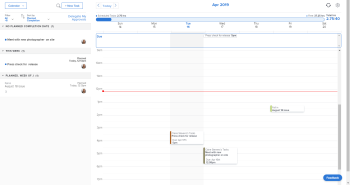
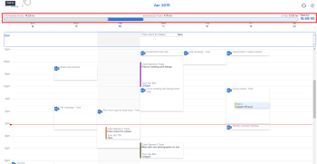

# Home Calendar view {#home-calendar-view}

The Home Calendar view in the Home area allows you to view and manage your work week and work assignments on a personal work calendar&nbsp;visible only to you. You can use it to schedule when you want to do your work. And you can integrate it with outside calendars such as a Microsoft Outlook calendar.&nbsp;

>[!NOTE]
>
>This is different from Calendar reports. For more information, see [Calendar reports overview](calendar-reports-overview.md).

If you need instructions on setting up your Home Calendar, see [Configure your Home Calendar view](configure-home-calendar-view.md).

For information about accessing the Home Calendar view, see [View the Home Calendar](view-home-calendar.md).

For information integrating your Home Calendar with an outside calendar, see [Configure your Home Calendar view](configure-home-calendar-view.md).

The remaining sections in this article explain sections and functions of the Home Calendar View in more detail.

## Work List {#work-list}

Work items (Tasks, Issues, Requests, and Approvals) assigned to you, your groups, your teams, and your roles display in the Work List on the left of the Calendar. 

   

You can drag your work items from the Work List to your Home Calendar to schedule when you want to work on them.&nbsp;To learn more about scheduling your work, see [Use the Home Calendar view](use-home-calendar-view.md).

## Allocation bar {#allocation-bar}

When you set up your Home Calendar, you specify the number of hours you typically work in a week (see [Configure your Home Calendar view](configure-home-calendar-view.md)). *`Adobe Workfront`* uses this number to determine your total allocable work hours.&nbsp;

The Allocation bar is a visual representation of the number of hours in your work week and how you are using them.

The colors in the Allocation bar indicate the following information:

* `Grey`: Number of hours scheduled for events from integrated calendars. For more information about integrating calendars, see the section [Configure your Home Calendar view](configure-home-calendar-view.md#configuring-your-home-calendar-view) in [Configure your Home Calendar view](configure-home-calendar-view.md).

* `Blue`: Number of hours you have scheduled for *`Workfront`* work items assigned to you. You can schedule work by dragging items from the Work List and dropping them into your calendar. For more information about scheduling work, see the [Schedule work items in your Home Calendar](use-home-calendar-view.md#scheduling-work-items-in-home-calendar) section in [Use the Home Calendar view](use-home-calendar-view.md).

* `Light Blue`:&nbsp;The number of free hours available for allocation.
* `Red`(not shown above):&nbsp;Scheduled events and work items that have exceeded the number of hours you have available for the week.

## Due bar {#due-bar}

The Due bar on your Home Calendar displays a summary your work that is due for the week currently displayed.

>[!NOTE]
>
>If you have integrated your Microsoft calendar with your *`Workfront`* calendar, items in the Due bar do not appear on your Microsoft calendar unless you have dragged them from the Work List to your *`Workfront`* Calendar. For more information, see the section&nbsp; [Work List](#using-the-left-panel-of-the-home-view)&nbsp;above and the article&nbsp; [Configure your Home Calendar view](configure-home-calendar-view.md).

