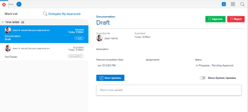

# Home area for Reviewers {#home-area-for-reviewers}

As a Reviewer in Workfront, you have access to a modified version of the Home area. Although users with a Review license can be assigned tasks, they do not receive email or other notifications regarding assignments, and they cannot mark them as "Done."

>[!NOTE]
>
>General updates between users outside of an object are not enabled.

## Access requirements {#access-requirements}

You must have the following access to perform the steps in this article:

<table style="width: 100%;margin-left: 0;margin-right: auto;mc-table-style: url('../../../Resources/TableStyles/TableStyle-List-options-in-steps.css');" class="TableStyle-TableStyle-List-options-in-steps" cellspacing="0"> 
 <col class="TableStyle-TableStyle-List-options-in-steps-Column-Column1"> 
 </col> 
 <col class="TableStyle-TableStyle-List-options-in-steps-Column-Column2"> 
 </col> 
 <tbody> 
  <tr class="TableStyle-TableStyle-List-options-in-steps-Body-LightGray"> 
   <td class="TableStyle-TableStyle-List-options-in-steps-BodyE-Column1-LightGray" role="rowheader">Adobe Workfront plan*</td> 
   <td class="TableStyle-TableStyle-List-options-in-steps-BodyD-Column2-LightGray"> 
Any
 </td> 
  </tr> 
  <tr class="TableStyle-TableStyle-List-options-in-steps-Body-MediumGray"> 
   <td class="TableStyle-TableStyle-List-options-in-steps-BodyB-Column1-MediumGray" role="rowheader">Adobe Workfront license*</td> 
   <td class="TableStyle-TableStyle-List-options-in-steps-BodyA-Column2-MediumGray"> 
Review 
 </td> 
  </tr> 
 </tbody> 
</table>

&#42;To find out what plan or license type you have, contact your *`Workfront administrator`*.

## Approve work {#approve-work}

1. Click the `Home` icon  in the upper-left corner of *`Adobe Workfront`*.  
   

1. Select an approval from the work list on the left side of the screen.
1.  Click `Approve`, `Changes`, or `Reject`. 

   >[!IMPORTANT] {type="important"}
   >
   >Once you've made an approval decision, you can't change it. 

1. (Optional) Add a comment to your approval decision.  

## Delegate approvals {#delegate-approvals}

1. Click the `Home` icon  in the upper-left corner of *`Adobe Workfront`*.  

1. Click `Delegate My Approvals` above the work list.  
   

1. Type the name of a user you'd like to delegate your approvals to. You can delegate only Project, Task, and Issue approvals.
1. Choose a `Start Date`.
1.  Choose an `End Date`.  
   or  
   Choose `No end date`.

1. Click Save.  

## Remind or recall approvals you've submitted {#remind-or-recall-approvals-youve-submitted}

1. Click the `Home` icon  in the upper-left corner of *`Adobe Workfront`*.  
   

1. Expand the Approvals I've Submitted grouping in the work list.
1. Select an approval.
1. In the top-right corner, click `Recall` or `Remind`.  

## Make comments {#make-comments}

1. Click the `Home` icon  in the upper-left corner of *`Adobe Workfront`*.  
   

1. Select an approval from the work list on the left side of the screen.
1. In the right panel, click in the `Start a new update` box.
1. Make your update.
1. Click `Update`.  

