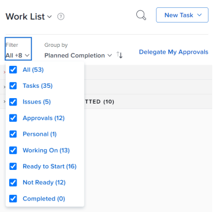
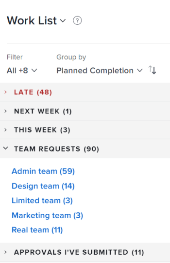
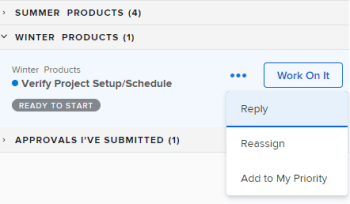
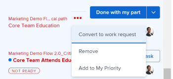

# Manage work and team requests in the Home area

The highlighted information on this page refers to functionality not yet generally available. It is available only in the Preview Sandbox environment.

When work tasks and issues&nbsp;are assigned to you, they are listed on the Work List in the Home area. You can view, reassign, reply to, work on, or remove a request. Work requests in the Home area are not limited to issues associated with request queues.

## Access requirements

You must have the following access to perform the steps in this article:

<table cellspacing="0"> 
 <col> 
 </col> 
 <col> 
 </col> 
 <tbody> 
  <tr> 
   <td role="rowheader"><em>Adobe Workfront</em> plan*</td> 
   <td> 
Any
 </td> 
  </tr> 
  <tr> 
   <td role="rowheader"><em>Adobe Workfront</em> license*</td> 
   <td> 
<em>Work</em> or higher
 </td> 
  </tr> 
  <tr> 
   <td role="rowheader">Access level configurations*</td> 
   <td> 
Edit access to Tasks and Issues
 
Note: If you still don't have access, ask your <em>Workfront administrator</em> if they set additional restrictions in your access level. For information on how a <em>Workfront administrator</em> can modify your access level, see <a href="../../../administration-and-setup/add-users/configure-and-grant-access/create-modify-access-levels.md" class="MCXref xref">Create or modify custom access levels</a>.
 </td> 
  </tr> 
  <tr> 
   <td role="rowheader">Object permissions</td> 
   <td> 
Contribute permissions or higher to the tasks and issues you need to work on
 
For information on requesting additional access, see <a href="../../../workfront-basics/grant-and-request-access-to-objects/request-access.md" class="MCXref xref">Request access to objects in Adobe Workfront</a>.
 </td> 
  </tr> 
 </tbody> 
</table>

&#42;To find out what plan, license type, or access you have, contact your *Workfront administrator*.

## View a work request

Work requests that are assigned to you are displayed in the left panel in Home. You can configure which requests are displayed in Home using the filter at the top of the Work List.

You can select filters that display items that are ready for you to work on, or items that you are currently working on already.

This article describes how to use the filters in the Home area to view items that you are currently working on or might consider starting to work on.&nbsp;For information about all filters in the Home area, see [Display items in the Work List in the Home area](../../../workfront-basics/using-home/using-the-home-area/display-items-in-home-work-list.md).

<ol> 
 <li value="1"> <draft-comment>
   
Click the Main Menu  in the upper-right corner, then click&nbsp;Home. 

  </draft-comment>
Click the Main Menu  in the upper-right corner, then click&nbsp;Home. 
 </li> 
 <li value="2"> 
Click the Filter <draft-comment>
    
   </draft-comment> drop-down menu.
 
  
 
 <draft-comment>
    
   </draft-comment> 
 </li> 
 <li value="3"> 
Click either or both of the following options <draft-comment>
    for tasks
   </draft-comment>for tasks:
 
Ready to Start: Displays only tasks and issues that are ready to start. Both of the following statements must be true:
 
  <ul> 
   <li> 
The tasks and their parents have no predecessors or task constraints preventing them from being worked on.
 </li> 
   <li> 
The Planned Start Date of the tasks or issues is in the past or up to two weeks in the future.
 </li> 
  </ul> 
<b>Not Ready</b>: Displays only tasks and issues that are not yet ready to start. Either one of the following statements must be true:
 
  <ul> 
   <li> 
The tasks and their parents might have predecessors or task constraints that prevent them from being worked on.
 </li> 
   <li> 
The tasks or issues have a Planned Start Date that is more than two weeks in the future.
 </li> 
  </ul> </li> 
 <li value="4"> 
Click Working On <draft-comment>
    under Tasks or Issues
   </draft-comment>under Tasks or Issues to display tasks and issues that you are currently working on. 
 </li> <draft-comment>
  <li class="preview" value="5" data-mc-conditions="QuicksilverOrClassic.Quicksilver,QuicksilverOrClassic.Draft mode"> 
Click Requested under Issues to display issues that have been requested from you (you are assigned to them), but you have not accepted to work on yet. 
 </li>
 </draft-comment>
 <li class="preview" value="5" data-mc-conditions="QuicksilverOrClassic.Quicksilver,QuicksilverOrClassic.Draft mode"> 
Click Requested under Issues to display issues that have been requested from you (you are assigned to them), but you have not accepted to work on yet. 
 </li> 
</ol>

## Access a team request

You can access a request assigned to your team directly from the Home area. For more information about team requests, see [Team requests overview](../../../people-teams-and-groups/work-with-team-requests/team-requests-overview.md).

<ol> 
 <li value="1"> <draft-comment>
   
Click the Main Menu  in the upper-right corner, then click&nbsp;Home. 

  </draft-comment>
Click the Main Menu  in the upper-right corner, then click&nbsp;Home. 
 </li> 
 <li value="2"> 
In the Work List&nbsp;area, click to expand the&nbsp;Team Requests&nbsp;grouping.
 
If there are no requests assigned to your team, the grouping does not display.
 
   
 
 <draft-comment>
    
   </draft-comment> 
 </li> 
 <li value="3">Click the team name. The Team Requests <draft-comment>
   <MadCap:conditionalText data-mc-conditions="QuicksilverOrClassic.Quicksilver">
    section
   </MadCap:conditionalText>
  </draft-comment><MadCap:conditionalText data-mc-conditions="QuicksilverOrClassic.Quicksilver">
   section
  </MadCap:conditionalText> displays and shows all requests assigned to your team. For more information about working with team requests, see <a href="../../../people-teams-and-groups/work-with-team-requests/manage-work-and-team-requests.md" class="MCXref xref">Manage work and team requests</a>.</li> 
</ol>

## Reassign a request

<ol> 
 <li value="1"> <draft-comment>
   
Click the Main Menu  in the upper-right corner, then click&nbsp;Home. 

  </draft-comment>
Click the Main Menu  in the upper-right corner, then click&nbsp;Home. 
 </li> 
 <li value="2">In the Work List area, select the request you want to reassign. </li> <draft-comment>
  <li value="3" data-mc-conditions="QuicksilverOrClassic.Quicksilver"> 
Click on the Assignments widget and remove yourself from the request, then type the name of the user you want to reassign the request to. 
 <note type="tip">
    If the work request is still in the Ready to Start or Not Ready state, you can use the 
    Reassign button in the 
    More menu in the Work List.
     
    
     
   </note> </li>
 </draft-comment>
 <li value="3" data-mc-conditions="QuicksilverOrClassic.Quicksilver"> 
Click on the Assignments widget and remove yourself from the request, then type the name of the user you want to reassign the request to. 
 <note type="tip">
   If the work request is still in the Ready to Start or Not Ready state, you can use the 
   Reassign button in the 
   More menu in the Work List.
    
   
    
  </note> </li> <note type="note">
  If a task's status is changed to New or In Progress after it was completed, you must unassign the user, save the task, then reassign the user in order for the task to reappear in their Home Work List.
 </note> 
</ol>

## Reply to a request

You can reply to a request to further clarify the request or to propose a new date.

<ol> 
 <li value="1"> <draft-comment>
   
Click the Main Menu  in the upper-right corner, then click&nbsp;Home. 

  </draft-comment>
Click the Main Menu  in the upper-right corner, then click&nbsp;Home. 
 </li> 
 <li value="2">In the Work List area, select the request you want to reply to.</li> <draft-comment>
  <li value="3" data-mc-conditions="QuicksilverOrClassic.Quicksilver"> 
Locate the individual who assigned the request to you.
 
You can find this information on the Updates tab of the task. Make sure the option to Show System Updates is enabled.
 </li>
 </draft-comment>
 <li value="3" data-mc-conditions="QuicksilverOrClassic.Quicksilver"> 
Locate the individual who assigned the request to you.
 
You can find this information on the Updates tab of the task. Make sure the option to Show System Updates is enabled.
 </li> <draft-comment>
  <li value="4" data-mc-conditions="QuicksilverOrClassic.Quicksilver">Click Start new update and begin typing your reply.</li>
 </draft-comment>
 <li value="4" data-mc-conditions="QuicksilverOrClassic.Quicksilver">Click Start new update and begin typing your reply.</li> <draft-comment>
  <li value="5" data-mc-conditions="QuicksilverOrClassic.Quicksilver"> 
Enter the name of the recipient in the Notify box, then click Update.
 <note type="tip">
    If the work request is still in the Ready to Start or Not Ready state, you can use the 
    Reply button in the 
    More menu in the Work List.
     
    
   </note> </li>
 </draft-comment>
 <li value="5" data-mc-conditions="QuicksilverOrClassic.Quicksilver"> 
Enter the name of the recipient in the Notify box, then click Update.
 <note type="tip">
   If the work request is still in the Ready to Start or Not Ready state, you can use the 
   Reply button in the 
   More menu in the Work List.
    
   
  </note> </li> 
</ol>

## Work on a request

When you click the Work On It button, you are indicating to the user who submitted the request and to any other user who might be assigned to the request that you are going to start working on the request. For more information about working on requests, see&nbsp; [Manage work and team requests](../../../people-teams-and-groups/work-with-team-requests/manage-work-and-team-requests.md).

<ol> 
 <li value="1"> <draft-comment>
   
Click the Main Menu  in the upper-right corner, then click&nbsp;Home. 

  </draft-comment>
Click the Main Menu  in the upper-right corner, then click&nbsp;Home. 
 </li> 
 <li value="2">In the Work List area, select the request you want to work on, then click Work On It. Information about the issue is displayed in the right panel.</li> 
</ol>

## Remove a request

If you decide that you should not be working on the request, you can either convert the task or issue back to a request or remove it from your list.

<ol> 
 <li value="1"> <draft-comment>
   
Click the Main Menu  in the upper-right corner, then click&nbsp;Home. 

  </draft-comment>
Click the Main Menu  in the upper-right corner, then click&nbsp;Home. 
 </li> 
 <li value="2">In the Work List, point to the item waiting to be worked on.</li> <draft-comment>
  <li value="3" data-mc-conditions="QuicksilverOrClassic.Quicksilver"> 
Click the Assignments widget and remove yourself. This removes the work item from your Work List. If the request is not assigned to anyone else or to another team or job role, the request is&nbsp;left unassigned.
 
Or
 
Click the More menu icon  to the right of the task or issue name in the Home Work List.
 
  
 </li>
 </draft-comment>
 <li value="3" data-mc-conditions="QuicksilverOrClassic.Quicksilver"> 
Click the Assignments widget and remove yourself. This removes the work item from your Work List. If the request is not assigned to anyone else or to another team or job role, the request is&nbsp;left unassigned.
 
Or
 
Click the More menu icon  to the right of the task or issue name in the Home Work List.
 
  
 </li> 
 <li value="4">Select from the following options:
  <ul>
   <li>Convert to work request:&nbsp;Select this option to convert the work item back to a work request.  The work item is transitioned back to a request, and you remain assigned to the request. You can accept the request at a later time by clicking Work on It again.</li>
   <li>Remove:&nbsp;Select this option&nbsp;to remove a request from your Work List. You are unassigned from the&nbsp;request and the&nbsp;request is&nbsp;no longer associated with your name in <em>Adobe Workfront</em>. If the request is not assigned to anyone else or to another team or job role, the request is&nbsp;left unassigned.</li>
  </ul></li> 
</ol>

&nbsp;
