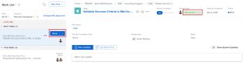
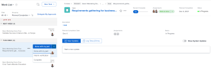

# Mark an item as Done in the Home area {#mark-an-item-as-done-in-the-home-area}

The highlighted information on this page refers to functionality not yet generally available. It is available only in the Preview Sandbox environment.

You can mark a task or issue as Done if you are the task or issue assignee. When you mark a task or issue as Done, the status of the task or issue is changed to Complete.

## Access requirements {#access-requirements}

You must have the following access to perform the steps in this article:

<table style="width: 100%;margin-left: 0;margin-right: auto;mc-table-style: url('../../../Resources/TableStyles/TableStyle-List-options-in-steps.css');" class="TableStyle-TableStyle-List-options-in-steps" cellspacing="0"> 
 <col class="TableStyle-TableStyle-List-options-in-steps-Column-Column1"> 
 </col> 
 <col class="TableStyle-TableStyle-List-options-in-steps-Column-Column2"> 
 </col> 
 <tbody> 
  <tr class="TableStyle-TableStyle-List-options-in-steps-Body-LightGray"> 
   <td class="TableStyle-TableStyle-List-options-in-steps-BodyE-Column1-LightGray" role="rowheader">Adobe Workfront plan*</td> 
   <td class="TableStyle-TableStyle-List-options-in-steps-BodyD-Column2-LightGray"> 
Any
 </td> 
  </tr> 
  <tr class="TableStyle-TableStyle-List-options-in-steps-Body-MediumGray"> 
   <td class="TableStyle-TableStyle-List-options-in-steps-BodyE-Column1-MediumGray" role="rowheader">Adobe Workfront license*</td> 
   <td class="TableStyle-TableStyle-List-options-in-steps-BodyD-Column2-MediumGray"> 
Work or higher
 </td> 
  </tr> 
  <tr class="TableStyle-TableStyle-List-options-in-steps-Body-LightGray"> 
   <td class="TableStyle-TableStyle-List-options-in-steps-BodyE-Column1-LightGray" role="rowheader">Access level configurations*</td> 
   <td class="TableStyle-TableStyle-List-options-in-steps-BodyD-Column2-LightGray"> 
Edit access to Tasks and Issues
 
Note: If you still don't have access, ask your Workfront administrator if they set additional restrictions in your access level. For information on how a Workfront administrator can modify your access level, see <a href="create-modify-access-levels.md" class="MCXref xref">Create or modify custom access levels</a>.
 </td> 
  </tr> 
  <tr class="TableStyle-TableStyle-List-options-in-steps-Body-MediumGray"> 
   <td class="TableStyle-TableStyle-List-options-in-steps-BodyB-Column1-MediumGray" role="rowheader">Object permissions</td> 
   <td class="TableStyle-TableStyle-List-options-in-steps-BodyA-Column2-MediumGray"> 
Contribute permissions or higher to the tasks and issues you need to work on
 
For information on requesting additional access, see <a href="request-access.md" class="MCXref xref">Request access to objects in Adobe Workfront</a>.
 </td> 
  </tr> 
 </tbody> 
</table>

&#42;To find out what plan, license type, or access you have, contact your *`Workfront administrator`*.

## Mark a task or issue as Done {#mark-a-task-or-issue-as-done}

Only the user assigned to the task or issue can mark it as Done. 

1.  Click the `Main Menu`  in the upper-right corner, then click  `Home`. 
1. In the `Work List`, locate any of the items waiting to be worked on.
1. Do either of the following:

* Click  `Done`&nbsp;on the work item.  
  See [Understand the options of the Done button](#options-of-done-button) for more detailed information about how this button might appear.

* Select the item you want to mark as done, then in the right panel, click  `Update Status`, then change the status of the item to a status that equates with Complete or Closed.&nbsp;

## Understand the options of the Done button {#understand-the-options-of-the-done-button}

By default, clicking the Done button on a work item changes the status of that item to Complete (for tasks) or Resolved (for issues).&nbsp;

Your *`Adobe Workfront administrator`* can customize what statuses are associated with the Done button, and apply those customizations to your Home Team.

Depending on how many statuses are associated with the Done button or how many resources are assigned to the task or the issue, the look of the Done button can change.&nbsp;

### Done button associated with one status {#done-button-associated-with-one-status}

When the Done button is associated with one status and the work item is assigned to you only, the button reads,  `Done`. When you click it,&nbsp;the status of the task or the issue is changed to the status associated with the Done button.  
  

   

To understand which status is associated with the Done button, check the Team Settings of your Home Team for the Done Button section, as described in [Edit team settings](edit-team-settings.md).

If you are not assigned to a Home Team,&nbsp;the default status is chosen when clicking Done, as described above in [Understand the options of the Done button](#options-of-done-button).

### Done button associated with multiple statuses {#done-button-associated-with-multiple-statuses}

When the Done button is associated with more than one status, the button shows the word  `Done` which is followed by a drop-down menu. In this scenario, you cannot simply click Done. You must select a status from the drop-down menu. Select the status that best fits the completion of the work item. By doing this, you are changing the status of the work item.

To understand how you can associate multiple&nbsp;statuses with the Done button, see&nbsp; [Configure the Done button for tasks](configure-the-done-button-for-tasks.md) and [Configure the Done button for issues](configure-the-done-button-for-issues.md).  

### Done button for items&nbsp;assigned to multiple resources {#done-button-for-items-assigned-to-multiple-resources}

When the task or the issue is assigned to more than one resource, the button shows the word `Done` which is followed by a drop-down menu. In the drop-down menu, you have the option to chose between `Done with my part` (which lets team members know you are complete with your portion of the task), or the status associated with the Done button (which completes the item). After you select `Done with my part`, the work item is removed from your Work List, but remains in the Work List of those still assigned to the work item.  
If the Done button is associated with multiple statuses, they are listed under `Done with my part`.  

Keep in mind that you do&nbsp;not see the Done&nbsp;button unless you are one of the resources assigned to the task or the issue.
