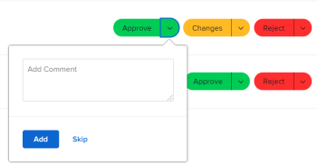

# Use the My Updates area {#use-the-my-updates-area}

The information on this page refers to functionality not yet generally available. It is available only in the Preview Sandbox environment.

You can use the My Updates area to quickly review the approvals waiting for your decision or the conversations you have been included in.<![CDATA[  ]]>

As a user with a Review license, you can find the My Updates area in the Main Menu by default. The My Updates area replaces Home as the landing page for Review users, unless they are assigned to a layout template where another landing area is defined. For information about *`Adobe Workfront`* licenses, see [Adobe Workfront licenses overview](wf-licenses.md). 

If you have a license type different than Review, the *`Workfront`* or *`Group administrator`* must add the My Updates area to your layout template to display it in the Main Menu. For information, see [Customize the Main Menu using a layout template](customize-main-menu.md). 

## Access requirements {#access-requirements}

You must have the following access to perform the steps in this article:

<table style="width: 100%;margin-left: 0;margin-right: auto;mc-table-style: url('../../../Resources/TableStyles/TableStyle-List-options-in-steps.css');" class="TableStyle-TableStyle-List-options-in-steps" cellspacing="0"> 
 <col class="TableStyle-TableStyle-List-options-in-steps-Column-Column1"> 
 <col class="TableStyle-TableStyle-List-options-in-steps-Column-Column2"> 
 <tbody> 
  <tr class="TableStyle-TableStyle-List-options-in-steps-Body-LightGray"> 
   <td class="TableStyle-TableStyle-List-options-in-steps-BodyE-Column1-LightGray" role="rowheader">Adobe Workfront plan*</td> 
   <td class="TableStyle-TableStyle-List-options-in-steps-BodyD-Column2-LightGray"> 
Any
 </td> 
  </tr> 
  <tr class="TableStyle-TableStyle-List-options-in-steps-Body-MediumGray"> 
   <td class="TableStyle-TableStyle-List-options-in-steps-BodyE-Column1-MediumGray" role="rowheader">Adobe Workfront license*</td> 
   <td class="TableStyle-TableStyle-List-options-in-steps-BodyD-Column2-MediumGray"> 
Request or higher
 </td> 
  </tr> 
  <tr class="TableStyle-TableStyle-List-options-in-steps-Body-LightGray"> 
   <td class="TableStyle-TableStyle-List-options-in-steps-BodyE-Column1-LightGray" role="rowheader">Access level configurations*</td> 
   <td class="TableStyle-TableStyle-List-options-in-steps-BodyD-Column2-LightGray"> 
View access or higher to any objects for which you are tagged in a conversation or need to resolve an approval (Projects,&nbsp;Tasks, Issues,&nbsp;Documents)
 
Note: If you still don't have access, ask your Workfront administrator if they set additional restrictions in your access level. For information on how a Workfront administrator can modify your access level, see <a href="create-modify-access-levels.md" class="MCXref xref">Create or modify custom access levels</a>.
 </td> 
  </tr> 
  <tr class="TableStyle-TableStyle-List-options-in-steps-Body-MediumGray"> 
   <td class="TableStyle-TableStyle-List-options-in-steps-BodyB-Column1-MediumGray" role="rowheader">Object permissions</td> 
   <td class="TableStyle-TableStyle-List-options-in-steps-BodyA-Column2-MediumGray"> 
View permissions or higher to projects, tasks, issues, documents where you are tagged in a conversation or need to resolve an approval
 
For information on requesting additional access, see <a href="request-access.md" class="MCXref xref">Request access to objects in Adobe Workfront</a>.
 </td> 
  </tr> 
 </tbody> 
</table>

&#42;To find out what plan, license type, or access you have, contact your *`Workfront administrator`*.

## Prerequisites {#prerequisites}

You must have the following before you begin:

*  If you have a *`Workfront`* license other than Review, your *`Workfront`* or *`Group administrator`* must add the My&nbsp;Updates area to the Main&nbsp;Menu using a layout template and assign you to that template. 

  Review-license users can view the My Updates area in their Main Menu by default. 

## Access the My Updates area {#access-the-my-updates-area}

1.  Click `My Updates` in the `Main Menu`.

   

   The My Updates area opens. 

   The approvals and requests for access that are assigned to you are listed in the first half of the page, under My Updates. 

   &nbsp;

   

1.  (Optional)&nbsp;Scroll to the bottom of the My&nbsp;Updates area and click right to display more approvals that display on additional pages. 

   >[!TIP] {type="tip"}
   >
   >The first five approvals or requests for access display by default. The remaining approvals display on additional pages. 

   

1.  (Optional) Expand the `Filter` drop-down menu  in the upper-right corner of the `My Updates` section and select from the following:

<table style="width: 100%;mc-table-style: url('../../../Resources/TableStyles/TableStyle-List-options-in-steps.css');" class="TableStyle-TableStyle-List-options-in-steps" cellspacing="0"> 
 <col class="TableStyle-TableStyle-List-options-in-steps-Column-Column1"> 
 </col> 
 <col class="TableStyle-TableStyle-List-options-in-steps-Column-Column2"> 
 </col> 
 <tbody> 
  <tr class="TableStyle-TableStyle-List-options-in-steps-Body-LightGray"> 
   <td class="TableStyle-TableStyle-List-options-in-steps-BodyE-Column1-LightGray" role="rowheader">All</td> 
   <td class="TableStyle-TableStyle-List-options-in-steps-BodyD-Column2-LightGray">Approvals that are submitted to you or delegated to you by another user. For information about delegating approvals, see <a href="delegate-approval-requests.md" class="MCXref xref">Delegate approval request</a>. </td> 
  </tr> 
  <tr class="TableStyle-TableStyle-List-options-in-steps-Body-MediumGray"> 
   <td class="TableStyle-TableStyle-List-options-in-steps-BodyE-Column1-MediumGray" role="rowheader">Delegated Approvals</td> 
   <td class="TableStyle-TableStyle-List-options-in-steps-BodyD-Column2-MediumGray">Approvals delegated to you by another user. </td> 
  </tr> 
  <tr class="TableStyle-TableStyle-List-options-in-steps-Body-LightGray"> 
   <td class="TableStyle-TableStyle-List-options-in-steps-BodyB-Column1-LightGray" role="rowheader">My Approvals</td> 
   <td class="TableStyle-TableStyle-List-options-in-steps-BodyA-Column2-LightGray"> 
Approvals submitted to you. 
 
For more information about approving items, see <a href="approving-work.md" class="MCXref xref">Approving work</a>.
 </td> 
  </tr> 
 </tbody> 
</table>

1.  To approve or reject an item or suggest changes to a document before approving do the following: 

    
    
    1.  (Optional) Click the `drop-down` icon  next to your approval decision ( `Approve`, `Changes`, `Reject`) and add a comment, then click  `Add`. 
    
    
       Or
    
    
       Click  `Skip` if you do not want to enter a comment. 
    
    
           
    

    
    
       >[!NOTE]
       >
       >The Changes option displays only for document approvals. 
    
    
       Depending on which drop-down icon you selected, the item is approved, rejected, or, in the case of a document approval, approved with a request to make additional changes. 
    
       ` `**Tip: **`` If you do not want to add a comment to your decision, you can click the `Approve`, `Reject`, or `Changes` button and the approval decision is granted immediately. 
    
    
           
    

       For more information about approving work, see [Approving work](approving-work.md). 
    
    
    

1.  Click `Grant access` to grant the access request submitted to you

   Or

   Expand the `Change access` drop-down menu to modify the access requested before you grant it. 

   

1.  (Optional) Click  `Ignore` to clear the access request from your approval list without granting it. 
1.  Click  `Delegate my approvals` to delegate the approvals submitted to you if you are unavailable to make approval decisions for some time. For more information about delegating approvals, see [Delegate approval request](delegate-approval-requests.md). 
1.  Scroll to the `Mentions` area underneath your approvals. Here, you can view all items where you have been included in a conversation.

   

1.  (Optional) Click  `Reply` to respond to a comment, enter your response, then click  `Reply` again. 

   For more information about updating items, see [Update work](update-work.md).

1.  (Optional) Click `Pin current page` to pin the My&nbsp;Updates area to your top navigation. 

