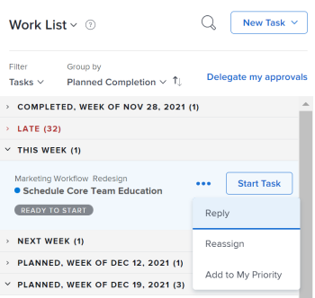
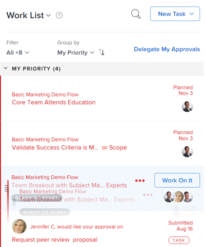
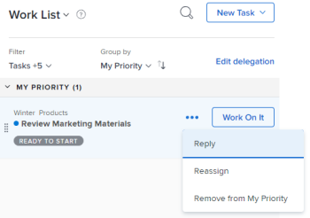

# Prioritize work in the Home Area

You can prioritize items from your Work List in Home.&nbsp;Items you add to My Priority are priorities for you only. They are not prioritized for anyone else, and no one can prioritize them for you. You can add up to 20 items under the My Priority Sort By option.

## Access requirements

You must have the following access to perform the steps in this article:

<table cellspacing="0"> 
 <col> 
 </col> 
 <col> 
 </col> 
 <tbody> 
  <tr> 
   <td role="rowheader"><em>Adobe Workfront</em> plan*</td> 
   <td> 
Any
 </td> 
  </tr> 
  <tr> 
   <td role="rowheader"><em>Adobe Workfront</em> license*</td> 
   <td> 
<em>Work</em> or higher
 </td> 
  </tr> 
  <tr> 
   <td role="rowheader">Access level configurations*</td> 
   <td> 
Edit access to Tasks and Issues
 
Note: If you still don't have access, ask your <em>Workfront administrator</em> if they set additional restrictions in your access level. For information on how a <em>Workfront administrator</em> can modify your access level, see <a href="../../../administration-and-setup/add-users/configure-and-grant-access/create-modify-access-levels.md" class="MCXref xref">Create or modify custom access levels</a>.
 </td> 
  </tr> 
  <tr> 
   <td role="rowheader">Object permissions</td> 
   <td> 
Contribute permissions or higher to the tasks and issues you want to prioritize
 
For information on requesting additional access, see <a href="../../../workfront-basics/grant-and-request-access-to-objects/request-access.md" class="MCXref xref">Request access to objects in Adobe Workfront</a>.
 </td> 
  </tr> 
 </tbody> 
</table>

&#42;To find out what plan, license type, or access you have, contact your *Workfront administrator*.

## Add items to My Priority

You can add any item assigned to you in your Work List to&nbsp;My Priority. New items are added at the bottom of the list.

<ol> 
 <li value="1"> <draft-comment>
   
Click the Main Menu  in the upper-right corner, then click&nbsp;Home. 

  </draft-comment>
Click the Main Menu  in the upper-right corner, then click&nbsp;Home. 
 </li> 
 <li value="2">In the left panel, ensure the <draft-comment>
   Group by
  </draft-comment>Group by drop-down menu is sorting by one of the following options: 
  <ul>
   <li>Planned Completion</li><draft-comment>
    <li data-mc-conditions="QuicksilverOrClassic.Quicksilver">Planned Start</li>
   </draft-comment>
   <li data-mc-conditions="QuicksilverOrClassic.Quicksilver">Planned Start</li>
   <li>Commit Date</li>
   <li>Project</li>
  </ul></li> 
 <li value="3">Hover over a work item, and click on the More icon.</li> 
 <li value="4"> 
Select Add to My Priority. 
 
&nbsp;
 
 <draft-comment>
    
   </draft-comment> 
 </li> 
</ol>

## Prioritize items in My Priority

You can prioritize your&nbsp;work in My Priority, placing the most important items at the top of the list. Priorities you set are visible only to you. No one else can prioritize work for you.

You must add work items to My Priority before you can begin prioritizing. For more information, see [Add items to My Priority](#adding-items) in this article.

<ol> 
 <li value="1"> <draft-comment>
   
Click the Main Menu  in the upper-right corner, then click&nbsp;Home. 

  </draft-comment>
Click the Main Menu  in the upper-right corner, then click&nbsp;Home. 
 </li> 
 <li value="2">In the left panel, click the <draft-comment>
   Group by 
  </draft-comment>Group by  drop-down menu, then select My Priority.</li> 
 <li value="3"> 
Select a work item and drag and drop it in the right place to prioritize&nbsp;it in your list.
 <draft-comment>
   
  

  </draft-comment>
  
 </li> 
</ol>

## Remove items from My Priority

You can remove items from My Priority by completing the work item or manually removing it using the More icon. If you are unassigned from a work item, it is also removed from My Priority.

<ol> 
 <li value="1"> <draft-comment>
   
Click the Main Menu  in the upper-right corner, then click&nbsp;Home. 

  </draft-comment>
Click the Main Menu  in the upper-right corner, then click&nbsp;Home. 
 </li> 
 <li value="2">In the left panel, click the More icon, then select Remove from My Priority. <draft-comment>
   
  </draft-comment></li> 
</ol>

