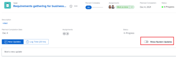

# Update or edit a work item in the Home area

You can view and add updates to a work item within the Home area in *Adobe Workfront*. You can also edit other data related to the work item if you have access to edit it.

## Access requirements

You must have the following access to perform the steps in this article:

<table cellspacing="0"> 
 <col> 
 </col> 
 <col> 
 </col> 
 <tbody> 
  <tr> 
   <td role="rowheader"><em>Adobe Workfront</em> plan*</td> 
   <td> 
Any
 </td> 
  </tr> 
  <tr> 
   <td role="rowheader"><em>Adobe Workfront</em> license*</td> 
   <td> 
<em>Work</em> or higher
 </td> 
  </tr> 
  <tr> 
   <td role="rowheader">Access level configurations*</td> 
   <td> 
Edit access to Tasks and Issues
 
Note: If you still don't have access, ask your <em>Workfront administrator</em> if they set additional restrictions in your access level. For information on how a <em>Workfront administrator</em> can modify your access level, see <a href="../../../administration-and-setup/add-users/configure-and-grant-access/create-modify-access-levels.md" class="MCXref xref">Create or modify custom access levels</a>.
 </td> 
  </tr> 
  <tr> 
   <td role="rowheader">Object permissions</td> 
   <td> 
Contribute permissions or higher to the tasks and issues you need to work on
 
For information on requesting additional access, see <a href="../../../workfront-basics/grant-and-request-access-to-objects/request-access.md" class="MCXref xref">Request access to objects in Adobe Workfront</a>.
 </td> 
  </tr> 
 </tbody> 
</table>

&#42;To find out what plan, license type, or access you have, contact your *Workfront administrator*.

## View updates on a work item

You can view updates on any work item in the Work List:

<ol> 
 <li value="1"> <draft-comment>
   
Click the Main Menu  in the upper-right corner, then click&nbsp;Home. 

  </draft-comment>
Click the Main Menu  in the upper-right corner, then click&nbsp;Home. 
 </li> 
 <li value="2">In the Work List area, select the item where you want to view updates. Updates are displayed in the right panel.</li> 
 <li value="3">(Optional) To filter system updates so only user updates are displayed, toggle&nbsp;Show System Updates to Off.  <draft-comment>
   
  </draft-comment></li> 
</ol>

## Provide updates on a work item

You can provide updates on any work item in the Work List:

<ol> 
 <li value="1"> <draft-comment>
   
Click the Main Menu  in the upper-right corner, then click&nbsp;Home. 

  </draft-comment>
Click the Main Menu  in the upper-right corner, then click&nbsp;Home. 
 </li> 
 <li value="2">In the Work List area, select the item where you want to provide an update.</li> 
 <li value="3"> 
In the right panel, click Update to display a text field. <draft-comment>
    
   </draft-comment>
 <draft-comment>
   
    

  </draft-comment>
    
 </li> 
 <li value="4">In the provided field, specify your update.</li> 
 <li value="5">(Optional) Specify any of the following information: Commit Date: Select a date from the date picker when you commit to complete the work item. How's it going?:&nbsp;Select a new condition for the task or issue. For more information about task and issue conditions, see <a href="../../../manage-work/projects/updating-work-in-a-project/update-condition-for-tasks-and-issues.md" class="MCXref xref">Update Condition for tasks and issues</a>. Status:&nbsp;Select a new status for the task or issue. For more information about task statuses, see <a href="../../../manage-work/projects/updating-work-in-a-project/update-task-status.md" class="MCXref xref">Update task status</a>. For more information about issue statuses, see <a href="../../../administration-and-setup/customize-workfront/creating-custom-status-and-priority-labels/issue-statuses.md" class="MCXref xref">Access the list of system issue statuses</a>. Completion Bar:&nbsp;Indicate the percentage of work completed by sliding the progress bar to the desired percentage. You can also double-click the completion bar and enter the percent complete. </li> 
 <li value="6">Click Update.</li> 
</ol>

## Edit a work item

You can edit any field on any work item that you have access to edit.

<ol> 
 <li value="1"> <draft-comment>
   
Click the Main Menu  in the upper-right corner, then click&nbsp;Home. 

  </draft-comment>
Click the Main Menu  in the upper-right corner, then click&nbsp;Home. 
 </li> 
 <li value="2">In the Work List area, select the item you want to edit. All fields you have access to view are displayed in the right panel.</li> 
 <li value="3"> 
In the right panel, hover over the field you want to edit. If you have rights to edit the field, the field is highlighted as you hover over it. 
 
   <draft-comment>
    
   </draft-comment> 
 </li> 
 <li value="4">Click the field you want to edit, then make your desired update. </li> 
 <li value="5">Click away from the field to save your changes.</li> 
</ol>

