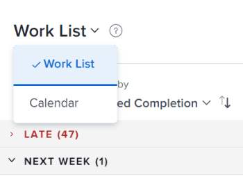
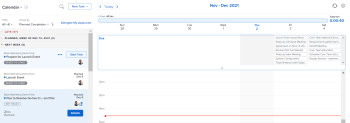

# View the Home Calendar

You can use the Calendar view in *Adobe Workfront* Home to manage all your assigned work items in one place. Your Home Calendar view is visible only to you, and only you can manage your Home Calendar.

To learn more about the Home Calendar, see [Home Calendar view](../../../workfront-basics/using-home/using-the-home-area/home-calendar-view.md).

## Access requirements

You must have the following access to perform the steps in this article:

<table cellspacing="0"> 
 <col> 
 </col> 
 <col> 
 </col> 
 <tbody> 
  <tr> 
   <td role="rowheader"><em>Adobe Workfront</em> plan*</td> 
   <td> 
Any
 </td> 
  </tr> 
  <tr> 
   <td role="rowheader"><em>Adobe Workfront</em> license*</td> 
   <td> 
<em>Work</em> or higher
 </td> 
  </tr> 
  <tr> 
   <td role="rowheader">Access level configurations*</td> 
   <td> 
Edit access to Tasks and Issues
 
Note: If you still don't have access, ask your <em>Workfront administrator</em> if they set additional restrictions in your access level. For information on how a <em>Workfront administrator</em> can modify your access level, see <a href="../../../administration-and-setup/add-users/configure-and-grant-access/create-modify-access-levels.md" class="MCXref xref">Create or modify custom access levels</a>.
 </td> 
  </tr> 
  <tr> 
   <td role="rowheader">Object permissions</td> 
   <td> 
Contribute permissions or higher to the tasks and issues you want to add to the calendar
 
For information on requesting additional access, see <a href="../../../workfront-basics/grant-and-request-access-to-objects/request-access.md" class="MCXref xref">Request access to objects in Adobe Workfront</a>.
 </td> 
  </tr> 
 </tbody> 
</table>

&#42;To find out what plan, license type, or access you have, contact your *Workfront administrator*.

## View the *Workfront* Home Calendar

<ol> <draft-comment>
  <li value="1" data-mc-conditions="QuicksilverOrClassic.Quicksilver"> 
   
 
    
Click the Home icon  in the upper-left corner of <em>Adobe Workfront</em>.
 <note type="note"> 
     
Your <em>Workfront administrator</em> might make the following changes to the Home icon in your environment:
 
     <ul> 
      <li> 
Replace it with an image customized to illustrate your organization. In this case, the icon will look different that shown in this article. 
 </li> 
      <li> 
Replace the page linked to it with a different page. In this case, click the Main Menu  in the upper-right corner of the page, then click Home.
 </li> 
     </ul> 
    </note> 
   
 </li>
 </draft-comment>
 <li value="1" data-mc-conditions="QuicksilverOrClassic.Quicksilver"> 
  
 
   
Click the Home icon  in the upper-left corner of <em>Adobe Workfront</em>.
 <note type="note"> 
    
Your <em>Workfront administrator</em> might make the following changes to the Home icon in your environment:
 
    <ul> 
     <li> 
Replace it with an image customized to illustrate your organization. In this case, the icon will look different that shown in this article. 
 </li> 
     <li> 
Replace the page linked to it with a different page. In this case, click the Main Menu  in the upper-right corner of the page, then click Home.
 </li> 
    </ul> 
   </note> 
  
 </li> 
 <li value="2"> 
Click Work List in the upper-left corner of Home, then click&nbsp;Calendar in the drop-down menu. 
 <draft-comment>
   
  

  </draft-comment>
  
 
The Home Calendar view displays.
 <draft-comment>
   
    

  </draft-comment>
    
 
All the work items assigned to you or assigned to your groups, teams, or roles display in the left panel. 
 
You can manage your workday by dragging and dropping tasks from the left panel to your calendar. To learn about how to populate your Home Calendar, see <a href="../../../workfront-basics/using-home/using-the-home-area/use-home-calendar-view.md" class="MCXref xref">Use the Home Calendar view</a>.
 </li> 
</ol>

