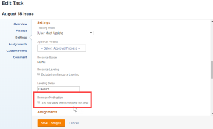

# Attach a reminder notification to an object {#attach-a-reminder-notification-to-an-object}

Reminder notifications can be associated with several different object types: Projects, Tasks, Issues, Timesheets, Templates, Template Tasks, and Recurring Timesheet Profiles.

Before you can attach reminder notifications to an object, an *`Adobe Workfront administrator`* must create the notification, as described in&nbsp; [Set up reminder notifications](set-up-reminder-notifications.md).&nbsp;

The steps to attach a reminder `notifications`&nbsp;are the same, regardless of the object type that you are attaching them to.

## Access requirements {#access-requirements}

You must have the following access to perform the steps in this article:

<table style="width: 100%;margin-left: 0;margin-right: auto;mc-table-style: url('../../Resources/TableStyles/TableStyle-List-options-in-steps.css');" class="TableStyle-TableStyle-List-options-in-steps" cellspacing="0"> 
 <col class="TableStyle-TableStyle-List-options-in-steps-Column-Column1"> 
 </col> 
 <col class="TableStyle-TableStyle-List-options-in-steps-Column-Column2"> 
 </col> 
 <tbody> 
  <tr class="TableStyle-TableStyle-List-options-in-steps-Body-LightGray"> 
   <td class="TableStyle-TableStyle-List-options-in-steps-BodyE-Column1-LightGray" role="rowheader">Adobe Workfront plan*</td> 
   <td class="TableStyle-TableStyle-List-options-in-steps-BodyD-Column2-LightGray"> 
Any
 </td> 
  </tr> 
  <tr class="TableStyle-TableStyle-List-options-in-steps-Body-MediumGray"> 
   <td class="TableStyle-TableStyle-List-options-in-steps-BodyE-Column1-MediumGray" role="rowheader">Adobe Workfront license*</td> 
   <td class="TableStyle-TableStyle-List-options-in-steps-BodyD-Column2-MediumGray"> 
Work 
 </td> 
  </tr> 
  <tr class="TableStyle-TableStyle-List-options-in-steps-Body-LightGray"> 
   <td class="TableStyle-TableStyle-List-options-in-steps-BodyE-Column1-LightGray" role="rowheader">Access level configurations*</td> 
   <td class="TableStyle-TableStyle-List-options-in-steps-BodyD-Column2-LightGray"> 
Worker or higher
 
Note: If you still don't have access, ask your Workfront administrator if they set additional restrictions in your access level. For information on how a Workfront administrator can modify your access level, see <a href="create-modify-access-levels.md" class="MCXref xref">Create or modify custom access levels</a>.
 </td> 
  </tr> 
  <tr class="TableStyle-TableStyle-List-options-in-steps-Body-MediumGray"> 
   <td class="TableStyle-TableStyle-List-options-in-steps-BodyB-Column1-MediumGray" role="rowheader">Object permissions</td> 
   <td class="TableStyle-TableStyle-List-options-in-steps-BodyA-Column2-MediumGray"> 
Manage access to the object
 
For information on requesting additional access, see <a href="request-access.md" class="MCXref xref">Request access to objects in Adobe Workfront</a>.
 </td> 
  </tr> 
 </tbody> 
</table>

&#42;To find out what plan, license type, or access you have, contact your *`Workfront administrator`*.

## Attach reminder notifications to an object {#attach-reminder-notifications-to-an-object}

1. Go to the object where you want to attach the reminder notification.
1. Click the Edit icon  near the upper-right corner of *`Workfront`*.

1. In the left panel of the **Edit** box that appears, click `Settings`.

1. Under `Reminder Notification`, select the notifications that you want to attach to the object.

   In this example, the object being edited is a task:

   

   If the *`Workfront administrator`* has created multiple reminder notifications, you can attach multiple notifications to a single object.

1.  Click `Save Changes`.

   If you need help testing the delivery of a reminder notification, see your *`Workfront administrator`*.

