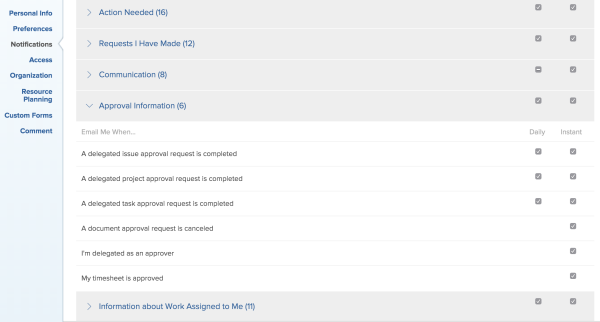

# Configure email notifications {#configure-email-notifications}

Your `Workfront administrator` configures which email notifications users receive when events occur in `Workfront` (as described in [Enable and disable event notifications](enable-and-disable-event-notification.md)). You can customize this further by configuring which notifications you receive.

For a complete list of email notifications that you can receive, see [Email notifications](workfront-notifications.md#email-notifications) in [Workfront notifications](workfront-notifications.md).

## Modify your email notification settings {#modify-your-email-notification-settings}

You can specify what types of notifications you want to receive. For a complete list of all notifications available in `Workfront`, see [Workfront notifications](workfront-notifications.md).

>[!NOTE]
>
>If you enable a notification type and then find that you are not receiving notifications of that type, it may be because that notification type does not apply for your role.

You can also choose whether you want to receive notifications as events happen or in one daily digest email (see [Email notifications](email-notifications.md)).

To view and modify your email notification settings:

1. Click the **Main Menu** icon  in the upper-right corner of `Workfront`, then click your user name next to your profile picture.

1. Click the **More** icon  , select **Edit**, then go to the **Notifications** section.

1.  Click a category to view the notification settings related to that category.  

   

1.  Select or deselect the check boxes on the right to specify whether you want to receive or not receive notifications instantly, daily, or both.

   You can also use the check boxes for a category to enable or deselect all notifications in that category.

   >[!NOTE]
   >
   >If you are a team member for a project, you continue to receive email notifications for it until you are removed from the team, even if you no longer have access to the project.

   For instructions on removing users from a team, see [Remove users from projects](remove-users-from-projects.md).

   For the **Communication** category, you can select individual notifications for instant delivery only. You must select all of the notifications to be delivered in a daily digest.

   If all email notifications for a given category are enabled, the box in the category title appears as selected. If all email notifications in a given category are disabled, the box is unselected. If some notifications are enabled and others are disabled, the category checkbox appears as a straight line.  
   When you modify a notification setting, the label **Edited** appears for that notification setting, to let you know that that notification setting has been modified.   
   For detailed information about each notification item, see [Configure email notifications](#notification-descriptions).

1.  If you selected any notifications to be sent as a daily digest, select the time of the day you want to receive it at the top of the **Notifications** section in the **Email Daily Digest after** menu.   

  

   The daily digest includes events that meet the criteria of the notifications 24 hours prior to the selected time. You receive one daily digest email for each type of notification. For more information about the notification types, see [Configure email notifications](#notification-descriptions).  
   The daily digest may arrive after the time you select, depending on how many emails are queued for delivery in the system. The time listed is your local time as specified in your browser settings.

1. Click **Save Changes**.

## Manage emails in the sandbox environment {#manage-emails-in-the-sandbox-environment}

`Workfront` disables all email communication from both the Preview and the Custom Refresh Sandbox environments. For information about the Preview Sandbox environment, see [The Workfront Preview Sandbox Environment](wf-preview-sandbox-environment.md). For information about the Custom Refresh Sandbox environment, see [The Workfront Custom Refresh Sandbox environment](wf-custom-refresh-sandbox-environment.md).

If you want to receive the following email notifications from the Preview Sandbox environment, you must enable this functionality in your user settings:

* Email notifications triggered by event notifications.
* Reminder notifications.
* Automatic late or early reminder notifications.
* Email invitations.

You can do this for yourself or for any user that you have access to edit. For more information about the access needed to edit users, see [Grant access to users](grant-access-other-users.md).

>[!NOTE]
>
>Report delivery and push notifications on the mobile app are always disabled for the Preview Sandbox environment. Neither you nor the `Workfront administrator` can enable report delivery or push notifications for the mobile app when you access the Preview Sandbox environment.
>
>
>For information about report deliveries, see [Set up report deliveries](set-up-report-deliveries.md).

To enable the delivery of emails from the Preview Sandbox environment: 

1.  Click your profile picture in the upper-right corner of `Workfront`. 

   Or

   Search for a user in `Workfront` and click their name, then click **Edit <User Name>'s Info**, in the upper-right corner of their profile page.

   Or

   For multiple users, Go to the **People** tab in the **People** area, select multiple users, then click **Edit**.

1. Click **Preferences**.
1. Click **Receive emails from this test environment**.
1. Click **Save Changes**.

## Receive Email Notifications {#receive-email-notifications}

For more information about receiving email notifications, see [Email notifications](email-notifications.md).
